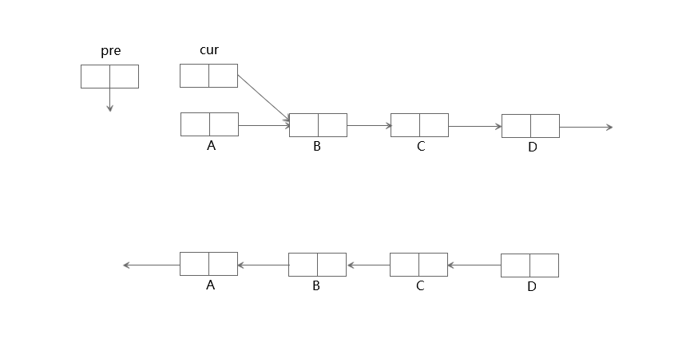

# 链表
### 1、反转单链表（LeetCode 206）
反转单链表<br/>
> Input: 1->2->3->4->5->NULL
> Output: 5->4->3->2->1->NULL

进阶：<br/>
你可以迭代或递归地反转链表。你能否用两种方法解决这道题？<br/>

基础：<br/>
```js
/**
 * Definition for singly-linked list.
 * function ListNode(val) {
 *     this.val = val;
 *     this.next = null;
 * }
 */
/**
 * @param {ListNode} head
 * @return {ListNode}
 */
var reverseList = function(head) {

};
```
实现：<br/>
1、迭代实现

```js
var reverseList = function(head) {
    let pre = null // 反转后待指向的第一个节点
    let cur = head // 未反转的第一个节点
    while(cur !== null) {
        // 记录反转节点原本指向，最后一个节点的下一个指向为空
        let temp = cur.next
        cur.next = pre // 未反转节点反转
        pre = cur // 第一个反转节点前移
        cur = temp // 第一个未反转节点后退
    }
    // 此时链表反转完毕，cur为空，pre为链表的头节点
    return pre
};
```
时间复杂度：O(n)
空间复杂度：O(1)

2、递归实现
```js
var reverseList = function(head) {
    if((head === null) || (head.next === null)) return head
    var reverseHead = reverseList(head.next)
    head.next.next = head
    head = null
    return reverseHead
};
```
时间复杂度：O(n)
空间复杂度：O(n)

### 2、环形链表（LeetCode 141）
给定一个链表，判断链表中是否有环。<br/>

为了表示给定链表中的环，我们使用整数 pos 来表示链表尾连接到链表中的位置（索引从 0 开始）。 如果 pos 是 -1，则在该链表中没有环。<br/>
