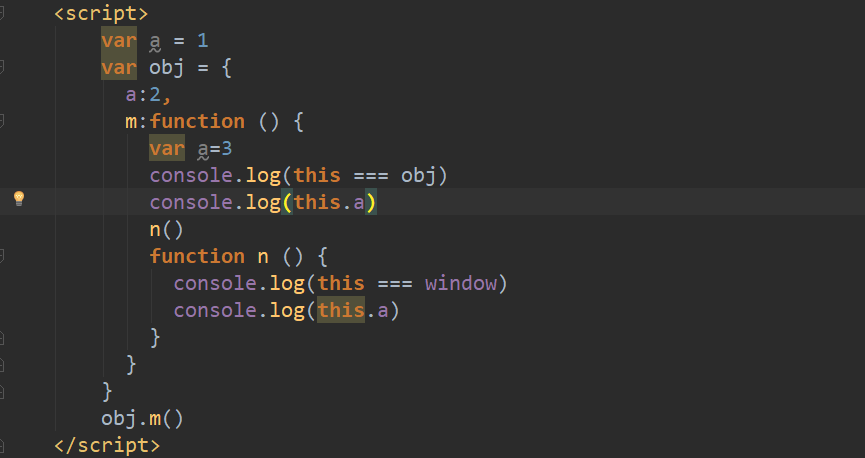

# JavaScript夯实基础系列（三）：this
&emsp;&emsp;在JavaScript中，函数的每次调用都会拥有一个调用的上下文，通过this关键字指向该上下文。函数中的代码在函数定义时不会执行，只有在函数被调用时才执行。函数调用的方式有四种：*作为函数调用*、*作为方法调用*、*作为构造函数调用*以及*间接调用*。确定**函数调用点**的规则跟函数调用的方式有关，而函数调用点是唯一决定this指向的因素。<br/>
### 一、作为函数的调用
&emsp;&emsp;**作为函数调用**是指函数独立执行，函数没有人为指定的执行上下文。**作为函数调用**的情况下this在严格模式下为undefined，在非严格模式下指向全局对象（在浏览器环境下为Window对象）如下代码所示：<br/>
```js
var a = 1;
function test1 () {
    var a = 2
    return this.a
}
test1() // 1
```
```js
'use strict'
var a = 1;
function test1 () {
    var a = 2
    return this.a
}
test1() // Uncaught TypeError
```
&emsp;&emsp;以函数调用形式的函数通常不使用this，但是可以根据this来判断当前是否是严格模式。如下代码所示，在严格模式下，this为undefined，strict为true;在非严格模式下，this为全局对象，strict为false。<br/>
```js
var strict = (function () {
    return !this
})()
```
&emsp;&emsp;在有些情况下，**作为函数调用**的形式具有迷惑性。比如第二节所说的通过对象调用的函数称为方法，但是通过对象找到方法并不执行属于**作为函数调用**的情况。如下代码所示：<br/>
```js
```
### 二、作为方法调用
### 三、作为构造函数调用
### 四、间接调用
### 五、规则的优先级
### 六、词法this
### 七、总结
* 作为函数调用
* 作为方法调用
* 作为构造函数
* 通过它们的call()和apply()方法间接调用


#### 2.作为方法调用
&emsp;&emsp;当函数挂载到一个对象上，作为对象的属性，则称该函数为对象的方法。如果通过对象来调用函数时，该对象就是本次调用的上下文，被调用函数的this也就是该对象。<br/>
&emsp;&emsp;上下文丢失的情况，通过对象执行方法、通过对象找到方法并不执行，后者会丢失原本的上下文环境。
#### 3.作为构造函数
#### 4.通过它们的call()和apply()方法间接调用

