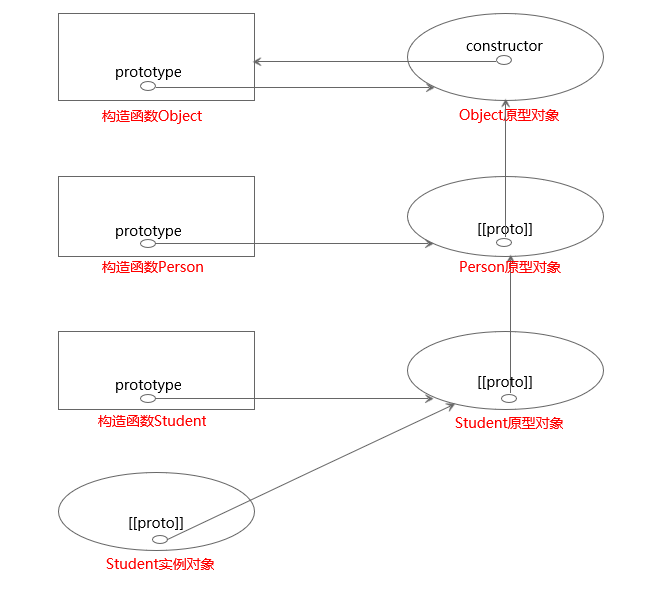

# JavaScript夯实基础系列（四）：原型
&emsp;&emsp;在JavaScript中有六种数据类型：number、string、boolean、null、undefined以及对象，ES6加入了一种新的数据类型symbol。其中对象称为引用类型，其他数据类型称为基础类型。在面向对象编程的语言中，对象一般是由类实例化出来的，但是在JavaScript中并没有类，对象是以与类完全不同的设计模式产生的。<br/>
### 一、创建对象
&emsp;&emsp;最常用来创建的方式是通过**对象字面量**的方式，简单便捷。但是该方式为**单例模式**，如果创建类似的对象会产生过多重复的代码，如下代码所示：<br/>
```js
var person1 = {
    name: 'LiLei',
    age: 18,
    sayName: function () {
        console.log(this.name)
    }
}
var person2 = {
    name: 'HanMeiMei',
    age: 18,
    sayName: function () {
        console.log(this.name)
    }
}
person1.sayName() // LiLei
person2.sayName() // HanMeiMei
```
&emsp;&emsp;使用**工厂模式**能够避免产生重复代码，但是工厂模式的弊端在于不能很好的将产生的对象分类。如下代码所示：<br/>
```js
function person (name, age) {
    var obj = new Object()
    obj.name = name
    obj.age = age
    obj.sayName = function () {
        console.log(this.name)
    }
    return obj
}
        
var person1 = person('LiLei',18)
var person2 = person('HanMeiMei',18)

person1.sayName() // LiLei
person2.sayName() // HanMeiMei
```
#### 1、构造函数模式
&emsp;&emsp;**构造函数模式**能够将实例化出来的对象很好的分类，如下代码所示：<br/>
```js
function Person (name, age) {
    this.name = name
    this.age = age
    this.sayName = function () {
        console.log(this.name)
    }
}

var person1 = new Person('LiLei',18)
var person2 = new Person('HanMeiMei',18)

person1.sayName() // LiLei
person2.sayName() // HanMeiMei
```
&emsp;&emsp;首先要说明的是，在JavaScript中并不存在构造函数的语法，有的仅仅是函数的**构造调用**。构造函数与普通的函数没有什么不同，当函数通过关键字new来调用时才称为构造函数。用来作为构造函数调用的函数名以大写字母开头也是一种书写规范，JavaScript语言层面没有这种约束。通过new关键字来调用构造函数经历了以下四个阶段：<br>
> 1、创造一个空对象。  
> 2、对象的[[proto]]属性指向构造函数prototype属性指向的对象。  
> 3、以新建的空对象为执行上下文，通过构造函数内部的代码初始化空对象。  
> 4、如果构造函数有返回值且是对象，则返回该对象。否则，返回新建的对象。  

&emsp;&emsp;对比工厂模式来说，构造函数模式能够清楚的将对象分类；对比单例模式来说，构造函数不会产生大量重复的代码。但是也不是完全没有产生重复代码，如上代码所示：person1对象和person2对象是可以共享一个sayName方法的。只使用构造函数模式，每个对象都有各自新的方法，彼此之间不能共享，为了克服这种缺陷，**原型模式**应运而生。
#### 2、原型模式
&emsp;&emsp;每一个函数在创建时会拥有一个prototype属性，该属性指向同时创建的该函数的原型对象，在这个原型对象中拥有一个不可枚举的属性constructor，该属性指向原型对应的函数。<br/>
&emsp;&emsp;通过构造函数生成的实例对象拥有一个指向该构造函数原型对象的的指针，在ES5中被称为[[proto]]，ES6中称为__proto__。在通过构造函数创建对象的过程中，实质上就做了两件事：1、将实例对象的[[proto]]属性指向构造函数prototype属性指向的对象；2、将实例对象作为构造函数的执行上下文，执行构造函数完成初始化。一旦实例对象构建完毕，跟原有的构造函数不再有什么关系，即使可以将实例对象以构造函数名称分类也是通过原型对象来判定的。<br/>
&emsp;&emsp;在实例对象中查找属性时，先在对象自身上查找，如果没有找到会通过[[proto]]来在原型链上查找。<br/>
&emsp;&emsp;构造函数、原型对象、实例对象三者的关系如下图所示：<br/>

&emsp;&emsp;原型模式本质上就是共享，所有[[proto]]指针指向原型对象的实例对象，都可以访问该原型对象上的属性。实例对象上如果有跟原型对象同名的属性，就会形成“遮蔽”，访问该属性时就会访问实例对象上的值，而不是原型对象上的值。**不能通过实例对象来修改原型上的属性值**，但是这个性质就跟ES6中定义常量的关键字const一样，不可以改变的是这个属性的地址，如果原型对象上的属性是引用类型的话，引用类型的地址不可以改变，引用指向的对象却可以通过实例对象来改变。如下代码所示：<br/>
```js
function Student () {}
Student.prototype.score = 60
Student.prototype.course = ['语文','数学']

let LiLei = new Student()
let HanMeiMei = new Student()

console.log(LiLei.score) // 60
console.log(HanMeiMei.score) // 60

LiLei.score = 90
console.log(LiLei.score) // 90
console.log(HanMeiMei.score) // 60

LiLei.course.push('英语')
console.log(LiLei.course) // ['语文','数学','英语']
console.log(HanMeiMei.course) // ['语文','数学','英语']
```
&emsp;&emsp;原型模式基本上不单独使用，因为原型模式产生的对象都一样，不能像构造函数那样通过传递参数来完成各自的初始化。罗素说过：“参差多态才是幸福的源泉”，面向对象编程很大程度上是模拟现实世界，所以这句话在编程世界里同样适用。<br/>
#### 3、构造函数与原型模式组合使用
&emsp;&emsp;组合使用构造函数和原型模式是创建自定义对象最常见的方式。通过构造函数传参使对象拥有实例属性，通过原型对象来使同一类型的对象共享属性。一般来说，引用对象属于实例属性，原型对象上没有除了函数以外的引用对象，防止一个对象修改原型对象上的引用对象影响其它对象。如下代码所示：<br/>
```js
function Student (name,age) {
    this.name = name
    this.age = age
}
Student.prototype.score = 60

let LiLei = new Student('LiLei',18)
let HanMeiMei = new Student('HanMeiMei',16)

console.log(LiLei.name) // LiLei
console.log(LiLei.age) // 18
console.log(LiLei.score) // 60
console.log(HanMeiMei.name) // HanMeiMei
console.log(HanMeiMei.age) // 16
console.log(HanMeiMei.score) // 60
```
#### 4、修改原型对象
&emsp;&emsp;在向构造函数的原型中添加属性或者函数时，逐个添加有时候显得比较繁琐，因此很多时候是直接更改构造函数的原型对象。如下代码所示：<br/>
```js
function Student (name,age) {
    this.name = name
    this.age = age
}

Student.prototype = {
    score: 60,
    sayName: function () {
        console.log(this.name)
    },
    sayAge: function () {
        console.log(this.age)
    }
}

let LiLei = new Student('LiLei',18)
LiLei.sayName() // LiLei
```
&emsp;&emsp;在这里有两点需要注意，第一点是这种方式废弃构造函数原有的原型对象，新建一个对象来作为构造函数的原型对象。这就导致了一个问题：如果在添加新原型对象之前就通过构造函数创建对象，那么创建的对象的[[proto]]属性指向的依然是老的原型对象，新原型对象上的一切属性与该对象无关。第二点是函数创建时自动生成的原型对象中有一个不可枚举的属性constructor，该属性是一个指向函数的指针。在新创建的对象中没有这个属性，如果要用到该属性来判定对象的类别，那么可以自行添加。如下代码所示：<br/>
```js
function Student (name,age) {
    this.name = name
    this.age = age
}
Student.prototype.score = 80
let HanMeiMei = new Student('HanMeiMei',16)

Student.prototype = {
    score: 60,
    sayName: function () {
        console.log(this.name)
    }
}
Object.defineProperty(Student.prototype,'constructor',{
    value: Student,
    enumerable: false
})

let LiLei = new Student('LiLei',18)
console.log(LiLei.score) // 60
LiLei.sayName() // LiLei

console.log(HanMeiMei.score) // 80
HanMeiMei.sayName() // TypeError
```
### 二、继承
&emsp;&emsp;继承是面向对象编程中的一个重要概念，在JavaScript中继承是通过原型链来实现的。<br/>
#### 1、原型继承
&emsp;&emsp;原型继承的思路是子对象的原型是父对象的实例，几乎所有的对象都继承自Object，这里说几乎是因为可以通过Object.create()方法来创建不继承自任何对象的对象。<br/>
```js
function Person () {
    this.name = 'person'
}
Person.prototype.sayName = function () {
    console.log(this.name)
}

function Student () {
    this.id = '001'
}
Student.prototype = new Person()
Student.prototype.sayId = function () {
    console.log(this.id)
}

let LiLei = new Student()
LiLei.sayId() // 001
LiLei.sayName() // person
console.log(LiLei.toString()) // [object Object]
```
&emsp;&emsp;如上代码所示，函数Student的原型对象是Person函数的实例，所以对象LiLei可以使用Person原型对象上的属性。而函数Person的原型对象是Object函数的实例，所以对象LiLei可以使用Object.prototype.toString()方法。如下图所示：<br/>

&emsp;&emsp;对象查找属性的规则是：先在对象自身上查找，若查找到则停止，否则沿着原型链继续查找。即查找[[proto]]指针指向的对象，查找到则停止，查询不到则查找该对象[[proto]]指针指向的对象，直到Object.prototype为止。<br/>
&emsp;&emsp;对象添加属性的情况却比较复杂：对象自身有要添加的属性时，只是修改自身的值；当要添加的属性不在对象自身上，而在对象原型链上能够找到时分三种情况，以向对象obj上添加属性add为例：<br/>
> 1、在原型链上找到的add属性是数据属性且不是只读属性，则add添加到obj上，形成**遮蔽**。<br/>
> 2、在原型链上找到的add属性是数据属性且是只读属性，则add属性添加失败，obj对象自身不会有add属性。<br/>
> 3、在原型链上找到的add属性是一个setter，这个setter会被调用，add属性添加失败。<br/>

&emsp;&emsp;上述描述的后两种情况都是属性添加失败，这两种情况下想要强制添加属性可以用Object.defineProperty()方法。<br/>
#### 2、组合继承
&emsp;&emsp;在使用原型模式创建对象的时候有两个问题：一是引用类型不适合放在原型对象上，二是没办法通过传参来初始化对象。使用原型继承依然会存在这两方面的问题，上述代码将父构造函数的实例作为子构造函数的原型，那么在很多时候子构造函数的原型中拥有引用类型的属性，而且还不能向父构造函数中传递参数。为消除单独使用原型继承的弊端，一般都是使用**借用构造函数**和**原型继承**的组合来实现继承的。<br/>
&emsp;&emsp;函数通过new来构造调用时执行上下文默认是新创建的对象，但是在JavaScript中可以通过apply()和call()方法来给函数任意指定执行上下文，所谓**借用构造函数**就是使用这条性质，来使用父构造函数完成对子构造函数实例对象的初始化。如下代码所示：<br/>
#### 3、抛开构造函数
#### 4、优化组合继承
### 三、对象的类型