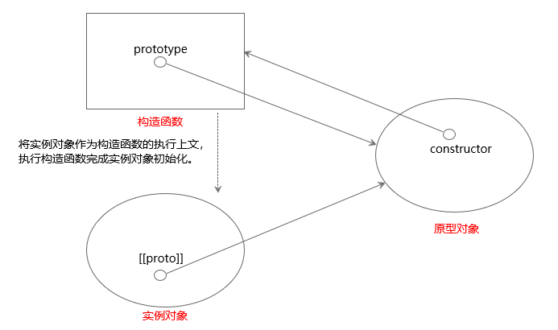

# JavaScript夯实基础系列（四）：原型
&emsp;&emsp;在JavaScript中有六种数据类型：number、string、boolean、null、undefined以及对象，ES6加入了一种新的数据类型symbol。其中对象称为引用类型，其他数据类型称为基础类型。在面向对象编程的语言中，对象一般是由类实例化出来的，但是在JavaScript中并没有类，对象是以与类完全不同的设计模式产生的。<br/>
### 一、创建对象
&emsp;&emsp;最常用来创建的方式是通过**对象字面量**的方式，简单便捷。但是该方式为**单例模式**，如果创建类似的对象会产生过多重复的代码，如下代码所示：<br/>
```js
var person1 = {
    name: 'LiLei',
    age: 18,
    sayName: function () {
        console.log(this.name)
    }
}
var person2 = {
    name: 'HanMeiMei',
    age: 18,
    sayName: function () {
        console.log(this.name)
    }
}
person1.sayName() // LiLei
person2.sayName() // HanMeiMei
```
&emsp;&emsp;使用**工厂模式**能够避免产生重复代码，但是工厂模式的弊端在于不能很好的将产生的对象分类。如下代码所示：<br/>
```js
function person (name, age) {
    var obj = new Object()
    obj.name = name
    obj.age = age
    obj.sayName = function () {
        console.log(this.name)
    }
    return obj
}
        
var person1 = person('LiLei',18)
var person2 = person('HanMeiMei',18)

person1.sayName() // LiLei
person2.sayName() // HanMeiMei
```
#### 1、构造函数模式
&emsp;&emsp;**构造函数模式**能够将实例化出来的对象很好的分类，如下代码所示：<br/>
```js
function Person (name, age) {
    this.name = name
    this.age = age
    this.sayName = function () {
        console.log(this.name)
    }
}

var person1 = new Person('LiLei',18)
var person2 = new Person('HanMeiMei',18)

person1.sayName() // LiLei
person2.sayName() // HanMeiMei
```
&emsp;&emsp;首先要说明的是，在JavaScript中并不存在构造函数的语法，有的仅仅是函数的**构造调用**。构造函数与普通的函数没有什么不同，当函数通过关键字new来调用时才称为构造函数。用来作为构造函数调用的函数名以大写字母开头也是一种书写规范，JavaScript语言层面没有这种约束。通过new关键字来调用构造函数经历了以下四个阶段：<br>
> 1、创造一个空对象。  
> 2、对象的[[proto]]属性指向构造函数prototype属性指向的对象。  
> 3、以新建的空对象为执行上下文，通过构造函数内部的代码初始化空对象。  
> 4、如果构造函数有返回值且是对象，则返回该对象。否则，返回新建的对象。  

&emsp;&emsp;对比工厂模式来说，构造函数模式能够清楚的将对象分类；对比单例模式来说，构造函数不会产生大量重复的代码。但是也不是完全没有产生重复代码，如上代码所示：person1对象和person2对象可以共享一个sayName方法的。只使用构造函数模式，每个对象都有各自新的方法，彼此之间不能共享，为了克服这种缺陷，**原型模式**应运而生。
#### 2、原型模式
&emsp;&emsp;每一个函数在创建时会拥有一个prototype属性，该属性指向同时创建的该函数的原型对象，在这个原型对象中拥有一个不可枚举的属性constructor，该属性指向原型对应的函数。<br/>
&emsp;&emsp;通过构造函数生成的实例对象拥有一个指向该构造函数原型对象的的指针，在ES5中被称为[[proto]]，ES6中称为__proto__。在通过构造函数创建对象的过程中，实质上就做了两件事：1、将实例对象的[[proto]]属性指向构造函数prototype属性指向的对象；2、将实例对象作为构造函数的执行上下文，执行构造函数完成初始化。一旦实例对象构建完毕，跟原有的构造函数不再有什么关系，即使可以将实例对象以构造函数名称分类也是通过原型对象来判定的。<br/>
&emsp;&emsp;在实例对象中查找属性时，先在对象自身上查找，如果没有找到会通过[[proto]]来在原型链上查找。<br/>
&emsp;&emsp;构造函数、原型对象、实例对象三者的关系如下图所示：<br/>

&emsp;&emsp;原型模式本质上就是共享，所有[[proto]]指针指向原型对象的实例对象，都可以访问该原型对象上的属性。实例对象上如果有跟原型对象同名的属性，就会形成“遮蔽”，访问该属性时就会访问实例对象上的值，而不是原型对象上的值。**不能通过实例对象来修改原型上的属性值**，但是这个性质就跟ES6中定义常量的关键字const一样，不可以改变的事这个属性的地址，如果原型对象上的属性是引用类型的话，引用类型的地址不可以改变，引用指向的的对象却可以通过实例对象来改变。如下代码所示：<br/>
```js
function Student () {}
Student.prototype.score = 60
Student.prototype.course = ['语文','数学']

let LiLei = new Student()
let HanMeiMei = new Student()

console.log(LiLei.score) // 60
console.log(HanMeiMei.score) // 60

LiLei.score = 90
console.log(LiLei.score) // 90
console.log(HanMeiMei.score) // 60

LiLei.course.push('英语')
console.log(LiLei.course) // ['语文','数学','英语']
console.log(HanMeiMei.course) // ['语文','数学','英语']
```
#### 3、构造函数与原型模式组合使用
### 二、继承
### 三、对象的类型