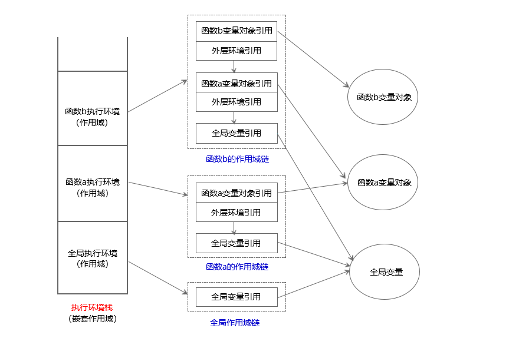

# JavaScript夯实基础系列（一）：词法作用域
&emsp;&emsp;作用域是一组规则，规定了引擎如何通过标识符名称来查询一个变量。作用域模型有两种：**词法作用域**和**动态作用域**。词法作用域是在编写时就已经确定的：通过阅读包含变量定义的数行源码就能知道变量的作用域。JavaScript采用的是**词法作用域**，也称为**执行环境**。动态作用域不是在代码编写时静态决定的，而是在执行过程中被确定。JavaScript实际上没有动态作用域，但是*this*的用法有些像动态作用域。静态作用域关心函数在何处被声明，而动态作用域关心函数在何处被调用。
### 一、作用域链
&emsp;&emsp;在ES6之前，一般认为JavaScript只有全局作用域以及基于函数的作用域，没有块级作用域（有两种特殊情况：*with*以及*try/catch*中的*catch*块，*with*在严格模式下不能使用，基本已废弃，不推荐使用。*catch*的块级作用域性质不常用，可用来ES6块级作用域的Polyfill）。ES规范强制规定全局变量是全局对象的属性，但是对于局部变量没有类似的规定。局部变量基本是函数内的变量（没有使用*var*、*let*或者*const*声明的变量为全局变量）以及函数参数。一般认为，局部变量是一个跟所在函数关联的变量对象的属性。这个变量对象在ES3中叫**调用对象**，在ES5中叫**声明上下文对象**，该对象对我们是透明的，不可见。全局对象我们可以通过*this*关键字来引用。<br/>
&emsp;&emsp;当程序执行到函数中时，会产生一个跟该函数相关的作用域链，并把作用域链赋值给函数的一个特殊的内部属性（即[[Scope]]），**作用域链**是一个对象列表或者链表。拿作用域链的链表实现来说，链表的尾结点是全局对象，嵌套函数的每一层函数对应链表上的一个节点，该节点包含两个指针，分别指向函数对应的变量对象和包含函数对应的节点。注意：每一个执行中得函数都有一个作用域链，包含函数与被包含函数并不是在同一个作用域链上。可以想象，当程序从包含函数流进被包含函数时，被包含函数的作用域链生成过程是：先复制包含函数的作用域链，然后生成一个节点，该节点包含一个指向自身函数对应的变量对象，最后以**前插法**的方式将该节点插入到新生成链表的头部，所有链表的尾部节点都是指向全局对象。<br/>
&emsp;&emsp;JavaScript在查找一个变量时，即**变量解析**，会从对应作用域链的头部开始查，如果在头部指针指向的变量对象中找到该变量，则停止查询，采用找到的该变量的值。如果没有找到，则沿着链表逐级查询，直到查询到链表尾部节点对应的变量对象，即**全局对象**，如果最终没有查询到变量，则会报*ReferenceError*的错误。<br/>
&emsp;&emsp;例如：下面代码的作用域链如下图所示。全局变量的作用域链只包含指向全局对象的指针；函数a的作用域链有两个节点，分别指向函数a对应的变量对象和全局对象；函数b的作用域链有三个节点，分别对应指向b对应的变量对象、指向a对应的变量对象和全局对象。函数a不能访问函数b中的变量*test3*，因为在函数a的作用域链中并不包括函数b对应的变量对象。如果在函数a中使用*test3*，解析变量*test3*时，首先从a的作用域链头部开始，查询a对应的变量对象，然后查询全局对象，都没有找到，程序会提示引用错误。
```javaScript
var test1 = 'global' // 全局变量
a()

function a () {
    var test2 = 'a' // 函数a的局部变量
    console.log(test2)
    b()

    function b () {
        var test3 = 'b' // 函数b的局部变量
        console.log(test2 + test3)
    }
}
```

&emsp;&emsp;有一种特殊情况需要注意，函数的变量对象上存在两个特殊的变量：*this*和*arguments*，函数搜索这两个变量时只会在对应的变量对象上搜索，不会沿着作用域链搜索外层环境的变量对象。<br/>
### 二、延长作用域链
&emsp;&emsp;JavaScript中有两种方式可以延长作用域链，ES3之前的*with*以及ES3添加的*try/catch*。程序执行到这两个语句时，会在作用域链的最前端添加一个指向新变量对象的节点，该变量对象会在程序执行完毕后被移除。<br/>
#### 1、with
&emsp;&emsp;当我们多次使用一个对象的属性时，每次都需要在需要调用的属性前加上对象，写法相对繁琐，使用*with*可以减少所写代码量。
```javaScript
function getUrl () {
    var obj = {}
    obj.a = location.hash
    obj.b = location.href
    return obj
}

// 使用 with 改写
function useWith () {
    var obj = {}
    with(location) {
        obj.a = hash
        obj.b = href
    }
    return obj
}
```
&emsp;&emsp;*with*会将指定的对象添加到作用域链中。值得注意的事，在查询变量的时候才会用到作用域链，创建新变量的时候不使用。因此在使用*with*时，有些时候会遇到一些奇怪的情况。如下代码所示：
```javaScript
function test(obj) {
    with (obj) {
        a = 2;
    }
}

var obj1 = { a: 3 };
var obj2 = { b: 3 };

test( obj1 );
console.log( obj1.a ); // 2

test( obj2 );
console.log( obj2.a ); // undefined
console.log( a ); // 2 ---全局作用域被泄漏了！
```
&emsp;&emsp;在函数*test*()执行时，*with*语句延长了函数*test*的作用域链，对象*obj*将被添加到作用域链中。分别将*obj1*和*obj2*作为参数传递给函数时，JavaScript引擎会沿着作用域链查询变量。当参数是*obj1*时，引擎查找到其拥有该变量，因此给*obj1*的*a*属性复制为2。当参数是*obj2*时，引擎没有在*obj2*中找到该变量，接着在函数*test*的变量对象上查询，仍然没有找到该变量，最后在全局对象上查询。在都没有找到情况下，*a=2*语句分两步执行，首先创建一个新的全局变量*a*，然后从作用域链重新执行一遍查找，最终在全局对象上找到变量*a*，执行赋值操作，导致全局作用域被泄漏。<br/>
&emsp;&emsp;*with*语句在严格模式下不能使用，在非严格模式下也不提倡使用，该语句被废弃的原因主要是性能问题。JavaScript引擎在编译阶段会做很多性能优化的工作，优化的方法之一就是在词法分析的时候静态的分析代码，提前决定变量和函数声明在什么位置，执行的时候能够更快速。*with*语句可以添加指定对象到作用域链，JavaScript引擎没办法提前分析你会往这个作用域链的顶端放什么样的变量对象，因此在词法分析时通过分析代码来决定变量和函数声明位置的结果将被全部推翻，使得优化变的毫无意义，没有经过优化的代码肯定比优化过的代码慢。
#### 2、try/catch
&emsp;&emsp;*try/catch/finally*语句是JavaScript的异常处理机制。*try*从句定义了需要处理的异常所在的代码块，当*try*块代码出现异常时，就会调用*catch*块中的的代码。不论*try*块中的代码是否出现异常，*finally*块内的代码必定执行。
```javaScript
try {
    undefined(); // 用非法的操作强制产生一个异常！
}
catch (e) {
    e = 1
    console.log(e); // 1
}

console.log(e); // ReferenceError: `err` not found
```
&emsp;&emsp;*catch*块会创建一个新的变量对象，将变量对象添加到作用域链顶端。换而言之，*catch*块中定义的变量拥有块级作用域。上面代码显示的变量*e*只存在于*catch*块，在外部引用会报错。*catch*块的块级作用域性质可以shim ES6中新添加的*let*和*const*等块级作用域。在IE8以及之前的版本中，*catch*块捕获的变量对象会添加到所在函数的变量对象上，如果不被函数包裹，则会添加到全局对象上。
### 三、动态声明变量
&emsp;&emsp;eval()是全局对象的一个函数属性，eval()函数会将传入的字符串当做JavaScript代码执行，这种动态生成代码的方式有能力修改词法作用域。如下代码：
```javaScript
function test(str) {
    eval( str );
    console.log( a ); // 2
}

test( "var a = 2" );
```
&emsp;&emsp;在严格模式下，传入eval()的代码不能在调用程序的上下文中声明变量和定义函数，变量和函数的定义是在eval()创建的新作用域中，这个作用域在eval()返回时就弃用了。如下代码：
```javaScript
"use strict"
function test(str) {
    eval( str );
    console.log( a ); // ReferenceError: a is not defined
}

test( "var a = 2" );
```
&emsp;&emsp;另外，setTimeout()和setInterval()的第一个参数以及Function()的第最后一个参数都是接收一个字符串来动态生成代码。<br/>
&emsp;&emsp;动态生成代码会使JavaScript引擎在编译阶段几乎不能通过做词法分析来进行优化，因此使用动态生成代码会导致很差的性能，一般不提倡使用。
### 四、块级作用域
&emsp;&emsp;ES6新增了块级作用域，let和const可以用来声明块级变量。<br/>
#### 1、let
&emsp;&emsp;let关键字将变量声明附着在所在的块作用域，使得变量只在所在的块有定义。如下代码所示：
```javaScript
var test = true
if(test){
    let a = 1
    var b = 2
}
console.log(a) // ReferenceError: a is not defined
console.log(b) // 2
```
&emsp;&emsp;与var关键字不同，let不存在变量提升，let关键字声明的变量一定要在声明之后再使用。如下代码中可以看到var声明的变量在声明前就可以使用，let声明的则不然。
```javaScript
console.log(a) // undefined
var a = 1

console.log(b) // ReferenceError: b is not defined
let b = 2
```
&emsp;&emsp;let关键字会产生一种叫做**暂时性死区**的情况。简而言之，在代码块中，使用let关键字声明变量之前，该变量都是不可用的。如下代码所示：
```javaScript
var a = 1
{
    console.log(a) // ReferenceError: a is not defined
    let a =2
}
```
&emsp;&emsp;let关键字不允许在相同作用域内重复声明变量。如下代码所示：
```javaScript
let a = 1
let a = 1  // Uncaught SyntaxError: Identifier 'a' has already been declared
```
&emsp;&emsp;let在循环中会与var有很大的区别，形如for (let x...)的循环在每次迭代时都为x创建新的绑定，改善了循环内变量过度共享的情况。如下代码所示：
```javaScript
var a = [];
var b = [];

for (var i = 0; i < 10; i++) {
    a[i] = function () {
        console.log(i);
    };
}
for (let j = 0; j < 10; j++) {
    b[j] = function () {
        console.log(j);
    };
}

a[6](); // 10
b[6](); // 6
```
&emsp;&emsp;另外，let还有一个很重要的特性。在JavaScript中顶层变量的属性跟全局变量挂钩。**顶层对象**，在浏览器环境指的是window对象，在 Node 指的是global对象。ES6规定：let关键字、const关键字、class关键字声明的全局变量，不属于顶层对象的属性。也就是说，从 ES6 开始，全局变量将逐步与顶层对象的属性脱钩。
#### 2、const
&emsp;&emsp;const关键字拥有上述let关键字的全部特性。此外，const关键字声明变量时，必须赋值。如下代码则会报错：
```javaScript
const a
console.log(a)  // Uncaught SyntaxError: Missing initializer in const declaration
```
&emsp;&emsp;const关键字声明的变量一旦赋值后不能改变，实际是指该变量指向的内存地址不变。简单数据类型，值就保存在指向的内存地址中，而对于对象类型，该变量指向的内存地址中存放的是一个指针，该指针指向存储在堆内存中的对象。const关键字保证了变量指向的内存地址不变，但是不能保证堆内存中对象的数据结构不发生变化。如下代码所示：
```javaScript
const a = 0
a = 1
console.log(a) // Uncaught TypeError: Assignment to constant variable.

const b = {}
b.val = 1
console.log(b) // {val:1}
```
### 五、总结
&emsp;&emsp;JavaScript中变量分为局部变量和全局变量，局部变量是在函数使用关键字声明的变量，全局变量是指在全局环境下声明或者在函数中没有通过关键字声明的变量。局部变量是所在函数对应的变量对象上的属性，全局变量是全局变量对象的属性，ES规范规定全局变量对象为全局对象。每个执行中的函数都有一个对应的作用域链，作用域链最前端是该函数对应的变量对象，其次是嵌套函数的变量对象，最后是全局对象。JavaScript引擎查询变量时，会沿着作用域链查询，从所处函数的变量对象开始，直至全局对象。在查询过程中，找到要该的变量后查询就会停止，如果直到全局对象都没查询到该变量，则该变量不存在。<br/>
&emsp;&emsp;通过*with*语句和*try/catch*语句中的*catch*可以延长作用域链，这两条语句都是在作用域链最前端添加一个新的变量对象。eval()函数在非严格模式下可以动态声明变量来修改作用域，类似的还有setTimeout()、setInterval()以及Function()函数。延长作用域链以及动态声明变量来修改作用域链都会导致性能的降低，词法作用域规则本质上是静态的，JavaScript引擎在编译代码时能通过确定变量在什么位置来进行优化，一旦动态修改作用域链，优化工作很难进行。<br/>
&emsp;&emsp;ES6新增*let*和*const*来声明块级作用域变量。与*var*相比，*let*与*const*不能重复定义，不存在变量提升，存在**暂时性死区**。在*for*循环的时候，*var*关键字声明的计数变量会被共享，*let*则不会。*const*关键字声明变量的时候必须赋值，如果值为基本类型则值不能改变，引用类型则引用类型的地址不能改变。
