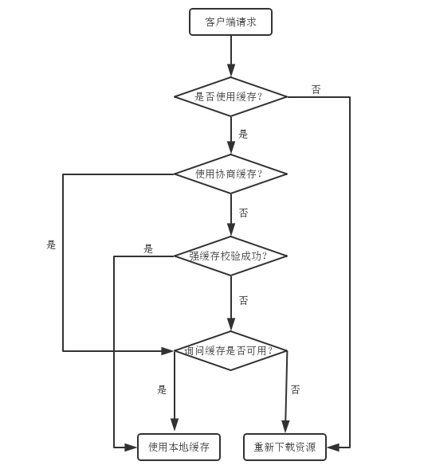

# 网络学习笔记（三）：HTTP缓存
&emsp;&emsp;HTTP缓存是一种保存资源副本并在下次请求时直接使用该副本的技术，合理的使用缓存可以有效的提升web性能。<br/>
&emsp;&emsp;浏览器将js文件、css文件、图片等资源缓存，当下次请求这些资源时，可以不发送网络请求直接从缓存中取出，称为**缓存命中**；或者发送网络请求验证缓存而不是重新接收该资源，称为**再验证命中**。这两种情况都能够减少冗余数据传输、降低对服务器的要求、提高web性能。在缓存中没有找到副本，直接发送请求给服务器称为**缓存未命中**。<br/>
&emsp;&emsp;缓存空间有限，不可能将全部资源全部缓存，因此选择请求频率高的资源进行缓存很有必要。另外，当服务器上的资源发生可以忽略的改变时，希望能够继续使用缓存而不是重新请求资源；当资源发生需要客户端知晓的改变时，能够准确的更新缓存内容。这些都需要合理的使用缓存机制。<br/>
## 一、与缓存有关的首部字段
&emsp;&emsp;HTTP报文由**起始行**、**首部**和**实体**组成，缓存机制是由首部中的字段控制，下面分别介绍与缓存有关的首部字段。<br/>
### 1、Pragma与Expires
&emsp;&emsp;Pragma 与 Expires 字段是HTTP/1.0规定的首部，用来向后兼容只支持 HTTP/1.0 协议的缓存服务器。<br/>
&emsp;&emsp;Pragma 是通用首部，只有一个值 no-cache ，与 HTTP/1.1 的 Cache-Control: no-cache 效果一致，强制要求缓存在返回缓存的版本之前将请求提交到源头服务器进行验证。<br/>
&emsp;&emsp;Expires 是响应首部，其值是一个GMT（格林尼治时间），表示资源在该时刻之后过期。这个值是相对服务器上的日期而言的，如果浏览器和服务器上的日期不通，则通过这种方式缓存会产生预期之外的情况。<br/>
&emsp;&emsp;需要注意的是： Pragma 的优先级很高。当 Pragma 与 Expires 同时存在时，不管资源有没有过期，都会发起验证请求。当 Pragma 与 Cache-Control 同时存在时，也会发起验证请求。<br/>
### 2、Last-Modified、If-Modified-Since与If-Unmodified-Since
&emsp;&emsp;Last-Modified 是响应首部，其值是一个GMT，表示服务器认定的资源做出修改的时间。包含有 If-Modified-Since 或 If-Unmodified-Since 首部的条件请求会使用该字段。Last-Modified 的时间精确到秒，因此无法识别一秒内进行多次修改的情况。<br/>
&emsp;&emsp;If-Modified-Since 是条件式请求首部，其值是上次响应中 Last-Modified 的值。如果服务器在该时间之后修改了资源，则会返回该资源，状态码为200 ；若在该时间之后没有修改资源，则会返回不带主体的响应，状态码是 304 。该请求首部只能用于 GET 或 HEAD 请求中。当与 If-None-Match 同时出现时，只要服务器支持 If-None-Match ，If-Modified-Since 的值就会被忽略。<br/>
&emsp;&emsp;If-Unmodified-Since 是条件式请求首部，如果所请求的资源在指定的时间之后发生了修改，那么会返回 412 错误；当资源在指定的时间之后没有进行过修改的情况下，服务器会返回请求的资源。<br/>
### 3、ETag、If-None-Match与If-Match
&emsp;&emsp;ETag 是响应首部，其值是资源的特定版本的标识符，可以在标识符之前添加弱验证器标识 W/ ，HTTP 协议默认使用强验证类型。示例如下：<br/>
> ETag: "33a64df551425fcc55e4d42a148795d9f25f89d4"
> ETag: W/"0815"

&emsp;&emsp;强验证类型应用于需要逐个字节相对应的情况，很难有效地生成。弱验证类型应用于用户代理只需要确认资源内容相同即可。即便是有细微差别也可以接受，比如显示的广告不同，或者是页脚的时间不同。弱验证器很容易生成，但不利于比较。<br/>
&emsp;&emsp;If-None-Match 是条件式请求首部，其值是ETag值。如果服务器能匹配对应的ETag，这就意味着资源没有改变，服务器便会发送回一个极短的响应，包含HTTP “304 未修改”的状态。304状态告诉客户端，它的缓存版本是最新的，并应该使用它。<br/>
&emsp;&emsp;If-Match 是条件式请求首部，只有在服务器的资源与 If-Match中指定的 ETag 匹配的时候, 才允许操作。不匹配的话, 服务器返回412状态码。<br/>
### 4、Cache-Control
&emsp;&emsp;Cache-Control 是通用首部，其值较多，能够灵活的控制缓存。<br/>
&emsp;&emsp;public：响应可以被客户端以及代理服务器缓存。<br/>
&emsp;&emsp;private：响应可以被客户端缓存，不能被代理服务器缓存。<br/>
&emsp;&emsp;no-cache: 不建议使用缓存，使用之前要提交服务器验证。<br/>
&emsp;&emsp;no-store: 禁止使用缓存。<br/>
&emsp;&emsp;max-age=\<seconds\>：设置缓存存储的最大周期，超过这个时间缓存被认为过期(单位秒)。与Expires相反，时间是相对于请求的时间。<br/>
&emsp;&emsp;s-maxage=\<seconds\>:共享缓存存储的最大周期，覆盖max-age或者Expires头，但是仅适用于共享缓存(比如各个代理)，私有缓存会忽略它。<br/>
&emsp;&emsp;must-revalidate: 经常跟no-cache混淆，其准确含义是本地副本过期前，可以使用本地副本；本地副本一旦过期，必须去源服务器进行有效性校验。<br/>
&emsp;&emsp;max-stale=\<seconds\>：表明客户端愿意接收一个已经过期的资源。可以设置一个可选的秒数，表示响应不能已经过时超过该给定的时间。<br/>
## 二、缓存步骤分析
&emsp;&emsp;**缓存**是在已经访问过服务器资源而再次访问时的一种优化策略。因为网络请求会占用网络资源、花费时间，所以使用**缓存**来进行优化。最理想的情况是再次访问时不需要发网络请求而直接使用缓存资源；其次发网络请求确认缓存是否可用，而不用重新下载资源。<br/>
&emsp;&emsp;浏览器缓存分为**强缓存**、**协商缓存**，其中**强缓存**直接使用本地缓存，不发请求到服务器。**协商缓存**会将缓存资源的信息发送到服务器，由服务器来判定是否使用本地缓存。<br/>

&emsp;&emsp;客户端是否使用本地缓存的规则如图所示，下面分别介绍：<br/>
### 1、缓存策略确定
&emsp;&emsp;缓存策略确定的第一步是根据上次访问资源时响应首部**判断是否使用缓存**。如果响应首部中有以下两种的任一种则不使用缓存，重新发起网络请求来下载资源。<br/>
```js
Pragma: no-cache
Cache-Control: no-store
```
&emsp;&emsp;如果判断可以使用缓存，第二步是**确定是否使用协商缓存，而不是直接使用强缓存**。如果响应首部中有以下两种的任一种则将资源信息放入首部发起网络请求，若服务器判定缓存资源可用则返回 304 状态码，告诉客户端直接使用缓存资源。若判定资源不可用则返回 200 状态码，并重新发送资源。<br/>
```js
Cache-Control：max-age=0
Cache-Control: no-cache
```
&emsp;&emsp;如果可以使用缓存，且不必直接使用协商缓存，则执行第三步：**校验缓存资源新鲜度**。如果资源未过期则使用强缓存。资源过期不代表一定不采用，经过服务器确认后资源若未改变则使用该资源，会根据响应头部来增加资源的新鲜度。<br/>
### 2、强缓存
&emsp;&emsp;服务器通过以下两个首部字段来为资源设置“过期日期”，在过期日期之前可以任意使用该资源而不用发送网络请求。<br/>
```js
Cache-Control：max-age=<seconds>
Expires: <http-date>
```
&emsp;&emsp;max-age 的值是一个相对于请求的时间，客户端发起请求时会根据上次请求的时间加上max-age 来判断资源是否过期。<br/>
&emsp;&emsp;Expires的优先级低于 max-age，如果在Cache-Control响应头设置了 "max-age" 或者 "s-max-age" 指令，那么 Expires 头会被忽略。<br/>
&emsp;&emsp;有一点需要注意：**Last-Modified 首部字段能够计算出一个缓存时间**。如果允许使用强缓存，且 max-age 和 expires 属性都没有，若存在 Last-Modified 属性，则可以计算出一个类似 max-age 的相对“过期日期”。计算公式为 响应首部中 Date 的值减去 Last-Modified 的值乘以 10% 。<br/>
### 3、协商缓存
&emsp;&emsp;协商缓存的主要根据是响应首部中的两个属性：Last-Modified、ETag。Last-Modified 是从时间维度来判定资源是否改变，ETag是从资源id是否改变来判断资源是否改变的。<br/>
&emsp;&emsp;Last-Modified 表明服务器认定的资源做出修改的日期及时间。进行协商缓存时，客户端请求首部中会加入 If-Modified-Since 属性，其值为响应首部的 Last-Modified 属性。服务器判断该时间之后是否修改了资源，如果资源被修改，则会返回该资源，状态码为200 ；若没有修改资源，则返回不带主体的响应，状态码是 304 。<br/>
&emsp;&emsp;响应首部中有ETag属性时，在进行协商缓存时请求首部中会添加 If-None-Match 属性。**ETag 的优先级要高于 Last-Modified**，也就是说服务器优先根据 ETag 来判断资源是否被修改。如果ETag不匹配，则直接返回新的资源，状态码为 200；如果ETag匹配，则说明资源未被修改，返回 304 状态码，通知客户端继续使用缓存资源。<br/>
## 三、面试题
&emsp;&emsp;<br/>
## 四、缓存在实践中的应用
&emsp;&emsp;<br/>
## 五、浏览器刷新
&emsp;&emsp;<br/>
## 六、总结
&emsp;&emsp;<br/>

## 参考资料
***
[彻底弄懂 Http 缓存机制 - 基于缓存策略三要素分解法](https://mp.weixin.qq.com/s/qOMO0LIdA47j3RjhbCWUEQ)
[MDN-HTTP缓存](https://developer.mozilla.org/zh-CN/docs/Web/HTTP/Caching_FAQ)
[HTTP缓存控制小结](https://imweb.io/topic/5795dcb6fb312541492eda8c)
[Browser: F5 vs Ctrl+F5](https://mocheng.wordpress.com/2007/11/30/browser-f5-vs-ctrlf5/)

Cache-Control: public private no-cache no-store
1、该不该发出网络请求
2、发出网络请求后，服务器是重传报文还是发送304

第一步：服务器响应首部定义缓存策略（是否使用缓存，缓存对比策略是什么样的
（ETag还是Last-Modified））
第二步：需要再次请求资源时，客户端根据响应首部来决定是发送请求还是从浏览器缓存中读取。
第三步：如果客户端发送请求，服务器决定是发送全部资源并且状态码200，还是仅仅发送首部，状态码304