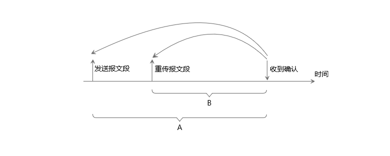

# 网络学习笔记（二）：TCP可靠传输原理
&emsp;&emsp;TCP数据段作为IP数据报的数据部分来传输的，IP层提供尽最大努力服务，却不保证数据可靠传输。TCP想要提供可靠传输，需要采取一定的措施来让不可靠的传输信道提供可靠传输服务。比如：出现差错时，让发送方重传数据；接收方来不及处理数据时，让发送方降低传输速度。 
### 一、数据流传输方式
&emsp;&emsp;TCP传输的数据一般分为两类：交互数据、成块数据。交互数据一般较小，比如发送1个字节的交互数据，加上TCP数据段首部以及IP数据报首部，至少需要41个字节。在广域网，数量众多的交互数据会增加拥塞出现的可能。而成块数据的报文段基本上都是满长度的。 
&emsp;&emsp;根据不同情况，两种数据流采用不同的传输方式。 
#### 1、交互数据流传输
&emsp;&emsp;在互联网早期，通信链路并不可靠，因此在链路层传输数据时要采用可靠的传输协议，其中最简答的协议叫“**停止等待协议**”。在运输层并不使用**停止等待协议**，只是传输交互数据流传输时采用的nagle算法和该协议的原理很类似。 
##### （一）、停止等待ARQ协议
&emsp;&emsp;“停止等待”是指每发送完一个分组就停止发送，等待对方确认，在收到对方确认后再发送下一个分组。发送方在一定时间没有收到确认，则会重传分组。 

&emsp;&emsp;如上图所示，发送方发送数据分组A，接收方接收到A后，向发送方发送确认数据；发送方在收到A的确认后，继续发送数据分组B。 
&emsp;&emsp;数组分组在传输过程中发生错误时有两种情况：
> 1、当接收方收到错误数据分组时，会直接丢弃分组。 
> 2、如果数组分组在传输的过程中丢失。 

&emsp;&emsp;在这两种情况下，接收方都不会发送任何信息。发送方在一定时间内没有收到确认，就认为分组丢失，然后重传该数据分组，这就叫**超时重传**。 
&emsp;&emsp;**停止等待ARQ协议**就是通过这种确认和重传的机制，在不可靠的网络上实现可靠通信。 
##### （二）、nagle算法
&emsp;&emsp;在传输交互数据流时，一般采用nagle算法。nagle算法要求在一个TCP连接上最多只能有一个未被确认的小分组，在该分组的确认到达之前不能发送其他分组。值得注意的是：并不是在收到确认之后立刻发送其他分组，TCP连接上允许不存在数据分组。具体的nagle算法发送分组的规则如下： 
> 1、缓存中的数据长度达到**最大报文长度**时，则允许发送。 
> 2、缓存中的数据长度达到**发送窗口**大小的一半时，则允许发送。 
> 3、报文段首部FIN标志位置为1，则允许发送。 
> 4、报文段首部设置了TCP_NODELAY选项，则允许发送； 
> 5、发生了超时（一般为200ms），则立即发送。 

&emsp;&emsp;TCP在未收到确认时收集这些零散的数据，当确认到达的时候，可以以一个报文段发送出去。确认到达的越快，数据发送的也就越快。 
&emsp;&emsp;nagle算法能够有效解决交互类的小数据过多的问题，降低网络拥塞出现的可能。但是由于不是将缓存中收到的数据立刻发送出去，因此会产生一定的时延。另外，接收方一般会**延迟确认**，以便将确认报文与要送的数据相结合起来，一般延迟时间为200ms。 
&emsp;&emsp;对于一些实时应用程序来说，nagle算法带来的延迟是不能够接受的。TCP标准规定，必须实现nagle算法，但也必须提供一种可以关闭nagle算法的方法。上述nagle算法规则中第四条说的TCP_NODELAY选项就是nagle算法被关闭的标志。 
#### 2、成块数据流传输
&emsp;&emsp;成块数据往往超过最大报文长度，要进行拆分之后再发送，交互数据碎片化的问题不会出现。成块数据是通过基于**滑动窗口协议来**的**连续ARQ协议**完成的。 
##### （一）、滑动窗口协议
&emsp;&emsp;使用基于**停止等待协议**的nagle算法的缺点是信道利用率太低。如下图所示： 

&emsp;&emsp;如果使用流水线传输，那么信道利用率会大幅提升。TCP采用**滑动窗口协议**来实现流水线传输。 

&emsp;&emsp;**滑动窗户协议**是指数据发送方有一个发送窗口，发送窗口范围内的数据允许发送，随着接收方传来的确认信息以及通知的接收窗口的大小来动态调整发送窗口的起始位置以及大小。 

&emsp;&emsp;如图所示：序号1-4的数据是已经发送过并且被确认的数据，TCP可以将这些数据清出缓存；序号5-11是在窗口范围内的数据，允许发送；序号12-16的数据在缓存中不允许发送。 
&emsp;&emsp;窗口后沿是由接收方发送的确认序号决定的，窗口前沿是由确认序号与发送窗口大小共同决定的。而发送窗口大小并一定等于接收方提供的接收窗口的大小，发送方会根据网络拥塞情况来动态调整发送窗口大小，前提是发送方发送窗口大小一定不大于接收方接收窗口大小。 
&emsp;&emsp;窗口的滑动有三种情况： 
> 1、前沿向右移动，这种情况发生在数据发送并被确认时。 
> 2、后沿向右移动，允许发送更多数据。这种情况发生在接收窗口增大或者网络拥塞情况缓解时。 
> 3、后沿向左移动，这种情况发生在接收方希望发送窗口缩小时，TCP标准强烈不建议出现这种情况。因为发送方在收到缩小窗口的通知时，可能已经发送了一些缩小部分的数据，容易造成错误。 

&emsp;&emsp;窗口前沿无法向左移动，因为TCP会将窗口之外已经收到确认的数据清除出缓存。 
&emsp;&emsp;TCP要求接收方有累计确认功能，接收方不必立刻对收到的数据进行确认，这样可以减少传输开销。另外，在发送确认时也可以捎带上接收方要发送的数据。TCP标准规定确认推迟的时间不能超过0.5秒，如果收到一个具有最大报文长度的报文段，则必须隔一个报文段就发送一个确认。 
&emsp;&emsp;累积确认功能使得接收方只对按序到达的最后一个分组发送确认，表示这个分组之前的分组已经全部到达。接收方不能够准确的通知发送方已经发送到接收方的数据分组。 
&emsp;&emsp;例如，上图中序号5、6、7、9、10分组到达接收方，接收方发送的确认序号是8，即接收方没有收到序号8的分组，希望下次收到序号8的分组。而序号9、10分组虽然已经到达的事实，发送方并不知晓。 
&emsp;&emsp;这会导致一个问题：一旦发生超时重传的情况，发送方是否需要再次发送已经到达的数据？如果不需要，又该如何获知具体哪些数据已经到达？ 
&emsp;&emsp;**滑动窗口协议** 与 **自动重传请求**技术结合形成**连续ARQ协议**。**连续ARQ协议**根据超时重发数据方式的不同分为**后退N帧ARQ协议**和**选择重发ARQ协议**。 
##### （二）、后退N帧ARQ协议
&emsp;&emsp;在发生超时重传时，**后退N帧ARQ协议**不考虑确认序号之后的分组是否已经发送到接收方，直接从确认序号开始重传之后的数据。 

&emsp;&emsp;如上图所示：序号5、6、7、9、10分组到达接收方，确认序号为8。假如窗口大小不变，则窗口向右滑动，序号8-14在发送窗口中。超时重传时不考虑序号9、10是否到达接收方，重传序号8之后的全部在发送窗口的数据。 
##### （三）、选择重传ARQ协议
&emsp;&emsp;**选择重传ARQ协议**是指在接收方收到未按序排列的数据流时，通知发送方重传缺失的数据，而不是重传全部数据。TCP数据段首部中添加选择确认选项SACK可以实现该目的。 

&emsp;&emsp;如图所示，假设上述分组都在发送窗口中，收到三个不连续的分组。三个分组的边界分别为：[4000,5001]、[6000,7001]、[8000,9001]。在建立TCP连接时，连接双方先商定好，在首部选项中加入“允许SACK”的选项。在之后的TCP报文段中增加SACk选项，以便接收方向发送方报告不连续的字节块的边界。 
&emsp;&emsp;因为序号是32位，因此指明一个边界需要4个字节，说明一个字节块的边界需要8个字节。另外需要一个字节指明是SACK选项，一个字节指明这个选项的大小。TCP报文段首部选项最大为40个字节，因此最多指明4个字节块的边界信息。 
&emsp;&emsp;TCP标准并未指明发送方应该如何响应SACK，因此大多数实现还是重传所有未被确认的数据分组。 
### 二、超时重传时间
&emsp;&emsp;对于每一个连接，TCP管理这4个不同的定时器： 
> 1、重传定时器：决定何时重传未被确认的数据分组。 
> 2、坚持定时器：使窗口大小信息保持不断流动。 
> 3、保活定时器：检测空闲连接的另一端是否崩溃或重启。 
> 4、2MSL定时器：测量一个连接处于TIME_WAIT状态的时间。 

&emsp;&emsp;在超时重传的情况下，如果将超时重传的时间设置的太短，会出现很多不必要的重传，增大网络负荷；如果设置的时间太长，则使网络的空闲时间增大，降低传输效率。TCP采用一种自适应的算法来动态计算超时重传的时间。 
#### 1、报文段往返时间
&emsp;&emsp;一个报文段发出的时间与收到确认的时间只差就是**报文段的往返时间RTT**。**平滑的往返时间RTT_S**是RTT的加权平均值。第一次测量时，RTT_S等于RTT的值，之后测量到新的RTT值时按以下公式计算： 
> 新的RTT_S = （1 - α）×（旧的RTT_S）+ α ×（新的RTT样本） 

&emsp;&emsp;TCP标准推荐α的值为0.125。 
&emsp;&emsp;RTT偏差的加权平均值RTT_D，与RTT_S和新的RTT样本之差有关。第一次测量时，RTT_D的值取RTT的一半，之后的测量中采用如下公式： 
> 新的RTT_D = （1 - β）×（旧的RTT_D）+ β × |RTT_S - 新的RTT样本| 

&emsp;&emsp;TCP标准推荐β的值为0.25。 
&emsp;&emsp;超时计时器设置的**超时重传时间RTO**由如下公式求得： 
> RTO = RTT_S + 4 × RTT_D 
#### 2、Karn算法
&emsp;&emsp;在实际测量报文段往返时间RTT时会遇到一些问题，如下图所示： 

&emsp;&emsp;发送报文段后，在一定时间内没有收到确认。重传该报文段，之后收到确认报文。那么怎么确定确认报文是对哪个报文的确认？因为重传的报文和原报文完全相同，收到的确认报文也相同。那么报文段往返时间RTT是A还是B呢？ 
&emsp;&emsp;在上述情况下，Karn提出一个算法：**在计算加权平均RTT_S时，只要报文段重传了，就不采用其往返时间样本**。这样的到的加权平均RTT_S和RTO就比较准确。 
&emsp;&emsp;Karn算法也存在问题：当报文段的时延突然增大很多时，在原重传时间内不会收到确认报文，于是重传该报文段。根据Karn算法，重传的报文段往返时间不会被采用，因此超时重传时间就无法更新。 
&emsp;&emsp;因此要对Karn算法进行修正：报文重传时，就把超时重传时间RTO增大一些。典型的做法是重传时间变成原来的两倍。当不再发生重传时，再根据计算公式算出超时重传时间。 
### 三、流量控制
&emsp;&emsp;通过TCP连接发送数据，如果发送方发送数据很慢，容易造成资源浪费；如果发送方发送数据过快，接收方来不及接收会造成数据丢失。**流量控制**就是指在接收方能够接收的范围内，合理而又快速的发送数据。 
#### 1、基于滑动窗口的流量控制
&emsp;&emsp;利用滑动窗口机制可以实现对发送方的流量控制。在TCP连接建立时，接收方会在确认报文段中给出自己接收窗口的大小。在每次发送确认报文时能够根据情况动态调整接收窗口的大小，并将告知发送方。如下图所示： 

&emsp;&emsp;发送方发送序号从1开始的100字节的数据，接收方在确认报文中声明自身的接收窗口大小为300字节。之后发送方发送300字节数据，接收方在确认报文中声明自身接收窗口大小调整为50字节。发送方再发送50字节数据之后，收到接收方传来的确认报文，在该报文中声明接收窗口为0。 
&emsp;&emsp;在接收方接收窗口为0时，发送方不再发送数据，直到接收方发送确认报文表明窗口大小发生改变。可是这个确认报文不一定能够被发送方接收到，如果一旦该确认报文丢失，双方都将处于等待中，形成死锁。为防止这种情况出现，TCP规定在收到对方接受窗口为0时，启动一个坚持定时器周期性的发送**探测报文**，以确定对方接收窗口为0的状态是否改变。 
&emsp;&emsp;另外，TCP标准规定：接收方接收窗口为0时，不再接收正常数据，但是可以接收**零窗口探测报文段**、**确认报文段**、**携带紧急数据的报文段**。 
#### 2、糊涂窗口综合症
&emsp;&emsp;**糊涂窗口综合症**是指仅仅有少量数据通过连接进行交换，而不是满长度的报文段。这样会导致网络传输的效率很低。 
&emsp;&emsp;如果接收缓存已经存满，此时接收方的应用程序每次只从接收缓存中读取少量数据，则接收方的接收窗口会一直保持在一个较低的值，导致发送方每次只能发送少量数据，会导致**糊涂窗口综合症**。 
&emsp;&emsp;如果发送方应用程序每次向发送缓存中写入少量数据，TCP选择每次收到数据之后立即发送，也会导致**糊涂窗口综合症**。 
&emsp;&emsp;避免**糊涂窗口综合症**可以从两端采取解决措施： 
> 1、接收方不通告小窗口。通常的算法是接收方不通告一个比当前窗口大的窗口（可以为0），除非窗口可以增加一个报文段大小（也就是将要接收的MSS）或者可以增加接收方缓存空间
的一半，不论实际有多少。 
> 2、 发送方在存在满长度的报文段或者接收方通告窗口大小一半报文时才发送。 
### 四、MSS
&emsp;&emsp;**最大报文段长度MSS**是指每一个TCP报文段中数据字段的最大长度。数据字段长度加上首部长度就等于TCP报文段的长度。 
&emsp;&emsp;MSS是在建立TCP连接时通信双方协商确定的。第一次握手时，发送方可以在首部中增加MSS选项，如果没有MSS选项，则MSS默认为1460字节。第二次握手时，接收方也可以在选项中增加MSS选项，最终MSS的值取连接双方声明的MSS中最小值。 
&emsp;&emsp;如果数据链路层使用以太网的话，**最大传输单元MTU**为1500字节，IP数据报首部最少为20字节，TCP数据段首部至少为20字节，那么MSS最大为1460字节。如果数据链路层使用互联网，那么MTU=576字节，MSS最大为536字节。 
&emsp;&emsp;在网络层，如果传输的数据大于MTU，则会在发送端进行数据**分片**，然后再接收端的网络层进行组合。如果其中任何一个分片产生错误，都会导致整个TCP报文段重传。因此TCP会对数据进行**分段**，分段之后的数据往下交付不会超过MTU，可以避免网络层对数据进行分片。在传输层，UDP不像TCP那样进行数据分段，UDP会将应用程序交付下来的整个数据封成一个数据报，如果数据报大小超过MTU，则由网络层进行分片。 
### 五、拥塞控制
&emsp;&emsp;**拥塞控制**是指防止过多的数据注入网络中，这样可以使网络中路由器或者链路不致过载。现在通信线路的传输质量一般都很好，因传输出现差错丢弃分组的概率很小。因此，判断网络拥塞的依据就是出现了**超时**。 
&emsp;&emsp;TCP进行拥塞控制常用的算法有四种：**慢启动**、**拥塞避免**、**快重传**、**快恢复**。 
#### 1、慢启动
&emsp;&emsp;TCP为发送方维持一个**拥塞窗口**，记为cwnd。**拥塞窗口**是发送方使用的流量控制，接收方声明的**接收窗口**是接收方使用的流量控制。发送方的**发送窗口**大小等于这两个窗口中的最小值。 
&emsp;&emsp;**拥塞窗口**的值跟SMSS有关，SMSS为发送的**最大报文段长度**。旧的规定是**拥塞窗口**的初始值为1至2个SMSS，RFC 5681规定**拥塞窗口**的初始值不超过2至4个SMSS。具体规定如下： 
> 1、若SMSS>2190字节，则cwnd=2×SMSS字节，且不得超过2个报文段。  
> 2、若2190≥SMSS>1095字节，则cwnd=3×SMSS字节，且不得超过3个报文段。 
> 3、若SMSS≥1095字节，则cwnd=4×SMSS字节，且不得超过4个报文段。 

&emsp;&emsp;**慢启动**算法规定：拥塞窗口初始化后，每收到一个对新报文的确认，拥塞窗口就加一个SMSS的大小。拥塞窗口以字节为单位，但是慢启动以SMSS大小为单位增加。按照慢启动算法，经过一轮传输，拥塞窗口就增大一倍，这是一种**指数增长**的关系。 
#### 2、拥塞避免
&emsp;&emsp;**慢启动**算法除了维持**拥塞窗口**cwnd变量之外，还维持另一个变量**慢启动门限**ssthresh。当cwnd以指数增长的形式增长到大于或等于ssthresh时，就不再采用**慢启动**算法，而是采用**拥塞避免**算法来进行拥塞控制。 
&emsp;&emsp;**拥塞避免**算法规定：每次收到一个确认时将cwnd增加1/cwnd个SMSS。即不再是像慢启动算法那样经过一轮传输cwnd翻倍了，而是经过一轮传输增加一个SMSS。这是一种**加性增长**的关系。 
&emsp;&emsp;当拥塞发生时（超时或收到重复确认），cwnd被设置为1个SMSS。ssthresh被设置为当前窗口大小的一半，但最少为 2个报文段。 
&emsp;&emsp;例如：假设TCP的ssthresh的初始值为 8 SMSS。当拥塞窗口上升到 12 SMSS时网络发生了超时，TCP使用慢开始和拥塞避免。拥塞窗口大小如下图所示： 

#### 3、快重传
&emsp;&emsp;如果个别报文段在网络中丢失，网络并没有发生拥塞，这种情况下发送方收不到确认报文，在超时之后会重传该报文。发送方误以为网络发生拥塞，错误的启动慢开始算法，降低了传输效率。 
&emsp;&emsp;采用**快重传**算法可以让发送方尽早知道个别报文段的丢失。**快重传**算法要求接收方不要延时发送确认，即使收到失序的报文段也要立刻发送对已收到报文的重复确认。如下图所示： 

&emsp;&emsp;接收方收到M1之后发送对M1的确认报文，M2报文丢失，之后接收方收到M3、M4、M5时每次都发送对M1报文的重复确认。**快重传**算法规定当收到三次重复确认后，发送方就认为M2报文段丢失，立即重传M2报文段，而不用等待超时时再重传，这样可以避免发送方误认为网络发生拥塞。使用快重传可以使整个网络的吞吐量提高约20%。 
#### 4、快恢复
&emsp;&emsp;在**快重传**算法执行后，发送方知道只是丢失个别报文，而不是网络发生拥塞。之后并不会执行**慢启动**算法，而是执行**快恢复**算法：调整门限值ssthresh = cwnd/2，同时设置cwnd = ssthresh + 3 SMSS。这种设置门限值为当前拥塞窗口的一般，同时根据门限值调整拥塞窗口的形式称为**乘法减小**。 
&emsp;&emsp;为什么要设置拥塞窗口的值为门限值加3个报文段，而不是直接等于门限值？这是因为发送方收到三个确认报文，就认为有三个分组已经离开网络到达接收方的缓存，这三个确认报文不再占用网络资源，可以适当增大拥塞窗口的大小。 
### 六、总结
&emsp;&emsp;TCP数据流传输方式分为：交互数据流、成块数据流。交互数据流采用**nagle算法**来控制流量，成块数据流通过基于**滑动窗口协议**的**连续ARQ协议**完成的。**连续ARQ协议**根据超时重传时是重传全部数据还是选择性的重传而分为：**后退N帧ARQ协议**、**选择重传ARQ协议**。 
&emsp;&emsp;超时重传的时间是动态确定的，根据报文段往返时间经过改进后的Karn算法来计算的。 
&emsp;&emsp;流量控制就是指在接收方能够接收的范围内，合理而又快速的发送数据。发送方与接收方都要采取措施来防止**糊涂窗口综合症**情况的发生。 
&emsp;&emsp;最大报文段长度MSS是在建立连接时由双方协商确定的，TCP数据报的MSS受限于网络层的最大传输单元MTU。TCP会将应用程序交付的数据进行分段，每个报文段加上TCP报文段首部以及IP数据报首部不会超过MTU，这样网络层就不会对TCP数据段进行分片。UDP会将应用程序交付的数据打包成一个UDP数据报，分片任务由网络层来完成。 
&emsp;&emsp;TCP进行拥塞控制常用的算法有四种：**慢启动**、**拥塞避免**、**快重传**、**快恢复**。这四种算法一般都不是孤立使用的，**慢启动**和**拥塞避免**之间会根据拥塞窗口是否达到ssthresh以及是否发生重传来切换；**快重传**算法之后紧跟着使用**快恢复**算法。 