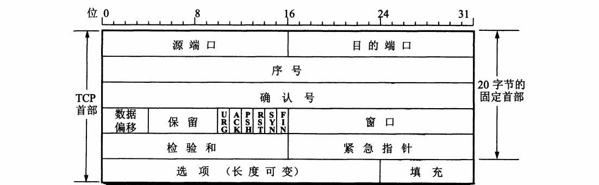
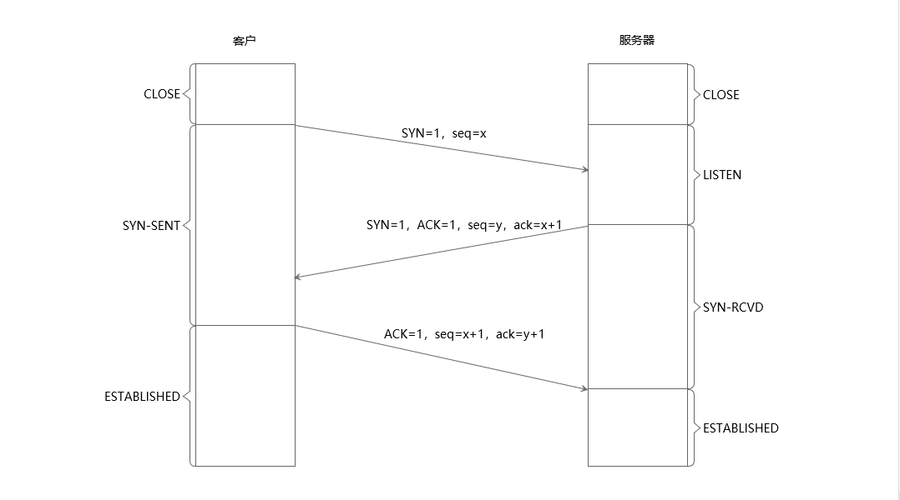

# 网络学习笔记（一）：TCP连接的建立与关闭
&emsp;&emsp;五层网络模型分为：物理层、数据链路层、网络层、传输层、应用层。其中，传输层有两种主要协议：面向连接的TCP（Transmission Control Protocol 传输控制协议）、无连接的UDP（User Datagram Protocol 用户数据报协议）。 
&emsp;&emsp;TCP是面向连接的传输层协议，提供点对点的可靠交付服务。TCP是面向字节流的，提供全双工通信，允许连接双方任何时候都能发送数据。 
### 一、TCP数据段
&emsp;&emsp;TCP传送的数据单元是**报文段**，TCP报文段分为首部与数据两部分，首部的各字段能体现TCP的全部功能。TCP数据报被封在IP数据报里。 
&emsp;&emsp;TCP数据段首部格式如下图所示： 

&emsp;&emsp;**源端口**和**目的端口**各占2个字节。网络通信的端点应该是主机中的进程而不是主机，通过网络层提供的IP地址和传输层提供的端口号能够确定唯一的进程。 
&emsp;&emsp;**序号**占4个字节。TCP是以**数据字节流**的形式传输数据的，字节流中的每一个字节都按顺序进行编号。数据段首部中的序号是指要发送数据字节流中第一个字节的序号。32位的序号可以对4GB的数据进行编号，一般编号是可以复用的，新序号发送时，相同序号的旧数据早已到达终点。 
&emsp;&emsp;**确认序号**占4个字节。是指期望收到对方下一个报文段第一个数据字节的序号。 
&emsp;&emsp;**数据偏移**占4位。数据偏移是指数据段中的数据起始位置距离数据段的起始位置有多远，简而言之，就是数据段首部的长度。一般数据报的首部是20字节，但是可以添加选项，导致首部的长度不确定。**数据偏移**的单位是32位，4位长度最大表示的数值是15，因此首部最大为60字节。由此可知，首部中选项最大为40字节。 
&emsp;&emsp;**保留**占6位，当前应置为0。 
&emsp;&emsp;**标志位**占6位，用来说明报文段的性质。 
> 1、URG：置为1时，表明紧急指针有效。 
> 2、ACK：置为1时，表明确认序号有效。 
> 3、PSH：置为1时，接收方应该尽快将报文段交给应用层。 
> 4、RST：置为1时，表明重建连接。 
> 5、SYN：建立连接时，用来同步序号。占一个序号。 
> 6、FIN：释放一个连接。占一个序号。 

&emsp;&emsp;**窗口**占2个字节。窗口是指发送方表明自己能接收对方发送的数据量。流量控制通过声明窗口大小来完成。 
&emsp;&emsp;**校验和**占2个字节，校验的范围包括首部和数据两个部分。 
&emsp;&emsp;**紧急指针**占2个字节。只有当URG标志位置为1时才有效。紧急指针是一个正的偏移量，与序号字段一起确定紧急数据最后一个字节的序号，该序号之后的数据就是普通数据。当窗口值为0时，依然可以发送紧急数据。  
&emsp;&emsp;**选项**最长为40字节，如果没有选项，则报文段首部为20字节。最初规定的只有一个选项：**最大报文段长度 MSS**，之后又陆续添加了**窗口扩大**选项、**时间戳**选项、**选择确认**选项等。  
### 二、建立连接
&emsp;&emsp;TCP是面向连接的协议，在传输数据之前要先建立连接，在数据传输完毕之后要断开连接。TCP连接的建立采取客户服务器方式，主动发起连接的应用程序叫**客户**，被动等待建立连接的应用程序叫**服务器**。 
&emsp;&emsp;TCP连接的建立需要经过**三次握手**，即在客户与服务器之间交换三个TCP报文段。建立连接的过程如下图所示： 

&emsp;&emsp;最初客户进程与服务器进程都处于CLOSE（关闭）状态，然后服务器的TCP进程创建**传输控制块TCB**，服务器进程处于LISTEN（收听）状态。传输控制块中存储着连接中的一些重要信息，比如：当前的发送和接收序号、TCP连接表、指向发送和接收缓存的指针等。 
&emsp;&emsp;客户进程发起连接之前创建**传输控制块TCB**。建立连接时向服务器发送请求报文，发送初始序号seq=x，同时将SYN标志位置为1。根据TCP规定，SYN数据报不能携带数据，但是要消耗掉一个序号。此时，客户进程处于SYN-SENT（同步已发送）状态。 
&emsp;&emsp;服务器进程收到连接请求报文后，如果同意建立间接，则向客户进程发送确认报文。确认报文中的SYN与ACK标志位都置为1。其中首部中的**确认序号**表示的是期望对方下一个报文段第一个数据字节的序号，因为客户进程发送SYN报文消耗掉一个序号，因此确认报文首部中的确认序号应该是接收到的SYN报文中的序号加1，即ack=x+1。同时发送自身的序号seq=y。此时，服务器进程处于SYN-RCVD（同步收到）状态。 
&emsp;&emsp;客户进程收到确认报文后还要向服务器进程发送确认报文。ACK标志位置为1，seq=x+1，ack=y+1。TCP标准规定，ACK报文段可以携带数据，但是不携带数据的话不消耗序号。此时，TCP连接已经建立，客户进程处于ESTABLISHED（已建立连接）状态。 
&emsp;&emsp;服务器进程收到客户进程的确认报文后进入ESTABLISHED（已建立连接）状态。 
&emsp;&emsp;之所以需要客户再次发送确认报文，主要是为了防止失效的连接请求报文突然又发送到服务器进程。比如：用户发送请求报文A，因网络原因长期滞留了。超时之后用户重新发送请求报文B，顺利建立连接。之后报文A到达服务器进程，服务器进程发送确认报文，但是用户认为并没有发送连接请求，因此不予理会。此时如果没有第三次握手的机制，服务器进程就会认为连接已经建立，并且一直等待客户进程发来数据，白白浪费很多资源。 
### 三、关闭连接
&emsp;&emsp; 
### 四、总结