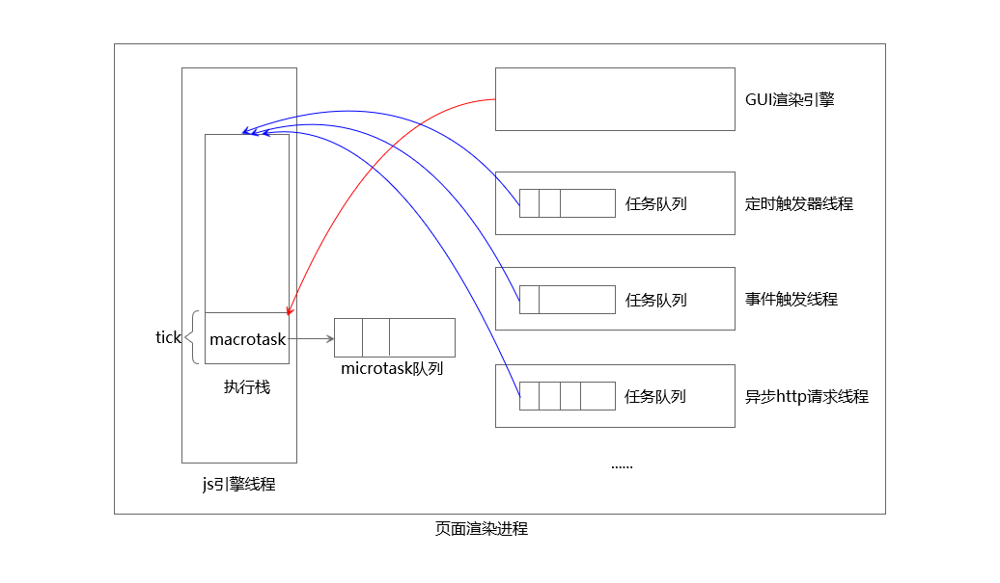
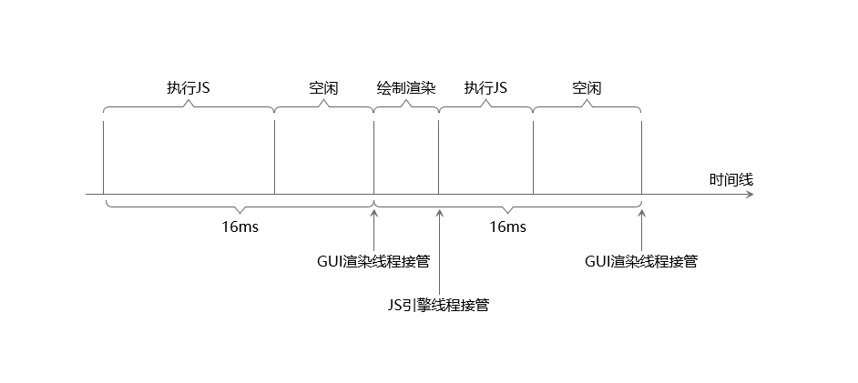
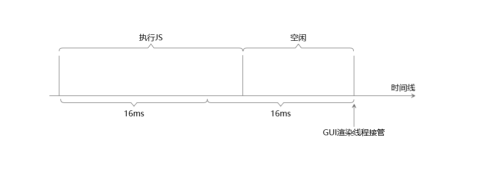

# Vue2.0源码阅读笔记（四）：nextTick
&emsp;&emsp;在阅读 nextTick 的源码之前，要先弄明白 JS 执行环境运行机制，介绍 JS 执行环境的**事件循环**机制的文章很多，大部分都阐述的比较笼统，甚至有些文章说的是错误的，以下为个人理解，如有错误，欢迎指正。 
## 一、JS 执行环境运行机制
### 1、浏览器中的进程与线程
&emsp;&emsp;以 chorme 浏览器为例，浏览器中的每个页面都是一个独立的进程，在该进程中拥有多个线程，通常有以下几个常驻线程： 
> 1、GUI 渲染线程 
> 2、JavaScript引擎线程 
> 3、定时触发器线程 
> 4、事件触发线程 
> 5、异步http请求线程 

&emsp;&emsp;**GUI 渲染线程**解析 html 生成 DOM 树，解析 css 生成 CSSOM 树，然后将两棵树合并成渲染树，最后根据渲染树画出界面。当 DOM 的修改导致了样式非几何属性的变化时，渲染线程重新绘制新的样式，称为“重绘”；当 DOM 的修改导致了样式几何属性的变化，渲染线程会重新计算元素的集合属性，然后将结果绘制出来，称为“回流”。 
&emsp;&emsp;**JS 引擎线程**负责处理Javascript脚本程序，且与GUI 渲染线程是互斥的，因为 js 是可以操控 DOM 的，如果这两个线程并行会导致错误。JS 引擎线程与其他可以并行的线程配合来实现称为**Event Loop**的 javaScript 执行环境运行机制。 
&emsp;&emsp;JS 的运行环境是单线程的，在代码中如果调用形如 setTimeout() 这样的计时功能的 API ，JS 引擎线程会将该任务交给**定时触发器线程**。定时触发器线程在定时结束之后会将任务放入任务队列中，等待 JS 引擎线程读取。 
&emsp;&emsp;JS 与 HTML 之间的交互是通过**事件**来实现的。在 JS 代码中使用**侦听器**来预定事件，以便事件发生时执行相应的代码，该代码称为**事件处理程序**或者**事件侦听器**。例如点击事件的事件侦听器是 onclick 。**JS 引擎线程**在执行侦听 DOM 元素的代码时，会将该任务交给**事件触发线程**处理，当事件被触发时，**事件触发线程**会将任务放入任务队列中，等待 JS 引擎线程读取。 
&emsp;&emsp;JS 代码中通过 XMLHttpRequest 发起 ajax 请求时，会使用**异步http请求线程**来管理，在状态改变时，该线程会将对应的回调放入任务队列中，等待 JS 引擎线程读取。 
### 2、Event Loop
&emsp;&emsp;Javascript 任务分为**同步任务**和**异步任务**，同步任务是指调用之后立刻得到结果的任务；异步任务是指调用之后无法立刻得到结果，需要进行额外操作的任务。 
&emsp;&emsp;JS 引擎线程顺序执行**执行栈**中的任务，**执行栈中只有同步任务**，遇到异步任务就交给相应的线程处理。例如在代码块中有 setTimeout() 方法的调用，则将其交由**定时触发器线程**处理，定时结束之后**定时触发器线程**将方法的回调放入自身的任务队列中，当执行栈中的任务处理完之后会读取各线程中任务队列中的事件。 
&emsp;&emsp;前面是从同步异步的角度来划分任务的，从执行顺序来说，任务也分为两种：macrotask（宏任务）、microtask（微任务）。异步的 macrotask 执行完之后返回的事件会放在各线程的任务队列中，microtask 执行完之后返回的事件会放在微任务队列中。 
> macrotask包括：script（JS文件）、MessageChannel、setTimeout、setInterval、setImmediate、I/O、ajax、eventListener、UI rendering。 
> microtask包括：Promise、MutationObserver、已废弃的Object.observe()、Node中的process.nextTick 

&emsp;&emsp;其中需要注意的是**GUI 渲染线程**去渲染页面也是以 macrotask 的形式进行的，这个之后详谈。 

&emsp;&emsp;JS 执行环境运行机制——Event Loop（事件循环）的过程如上图所示： 
1、**JS 引擎线程**顺序执行**执行栈**中的任务，以一个 macrotask 为单位，在单个宏任务没有处理完之前，**JS 引擎线程**不会将程序交由**GUI 渲染线程**接管。也就是说耗时的任务会阻塞渲染，导致页面卡顿的情况发生。典型浏览器一般1秒钟插入60个渲染帧，也就是说16ms进行一次渲染，单个任务超过16ms，如果渲染树发生改变将得不到及时更新渲染。 
&emsp;&emsp;流畅的页面中一般任务执行情况如下所示： 

&emsp;&emsp;单个任务耗时较多，则会发生丢帧的情况： 

2、**JS 引擎线程**在执行 macrotask 时，会将遇到的异步任务交给指定的线程处理。当异步任务为 macrotask 时，对应线程处理完毕之后**放入线程自身的任务队列中**；若异步任务为 microtask 时，对应线程处理完毕之后**放入微任务队列中**。macrotask 执行完之后会遍历微任务队列中的任务加以执行，清空微任务队列。 
3、当**执行栈**中的任务执行完毕后，会读取各个线程中的任务队列，将各任务队列中的事件添加到**执行栈**中开始执行。从读取各任务队列中的事件放入**执行栈**中到清空微任务队列的过程称为一个“tick”。JS引擎线程会循环不断地读取任务、处理任务，这个就称为**Event Loop**（事件循环）机制。 
## 二、Vue中nextTick的实现
&emsp;&emsp;？？？需要异步更新队列，Vue是数据驱动的框架，最好的情况是在页面重新渲染前完成数据的更新。从前面的讲述中可以知道，首先执行 macrotask，然后执行 microtask ，清空微任务队列后，再从各线程的任务队列中读取新的事件之前，GUI 渲染线程有可能接管程序，完成页面重新渲染。 
### 1、使用 MutationObserver 实现的版本
&emsp;&emsp; 
&emsp;&emsp; 
&emsp;&emsp; 
### 2、使用 MessageChannel 实现的版本
&emsp;&emsp; 
&emsp;&emsp; 
&emsp;&emsp; 
## 三、异步更新队列
&emsp;&emsp; 
&emsp;&emsp; 
&emsp;&emsp; 
## 四、总结
&emsp;&emsp; 
&emsp;&emsp; 
&emsp;&emsp; 
