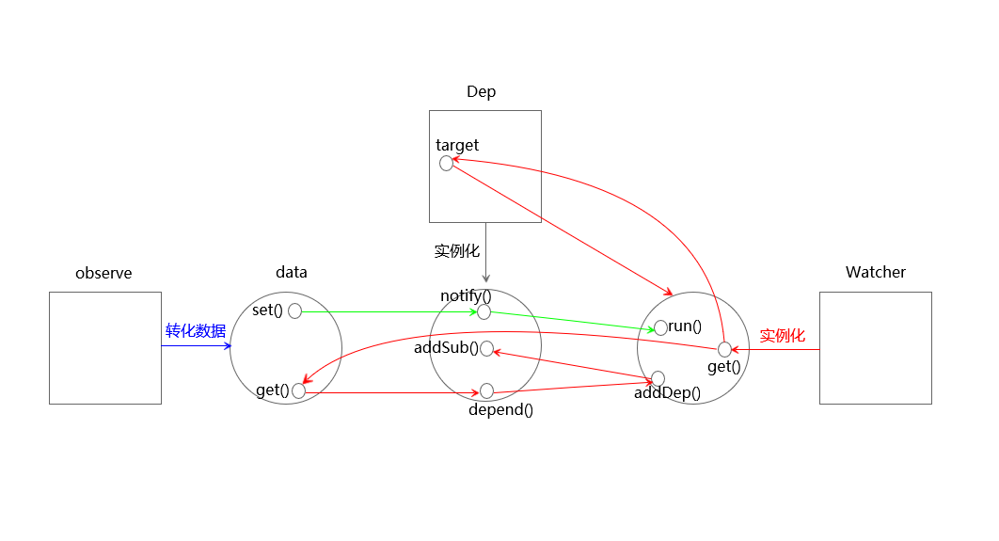

# Vue2.0源码阅读笔记（二）：响应式原理
&emsp;&emsp;Vue是数据驱动的框架，在修改数据时，视图会进行更新。数据响应式系统使得状态管理变的简单直接，在开发过程中减少与DOM元素的接触。而深入学习其中的原理十分有必要，能够回避一些常见的问题，使开发变的更为高效。<br/>
## 一、实现简单的数据响应式系统
&emsp;&emsp;Vue使用**观察者模式**（又称**发布-订阅模式**）加**数据劫持**的方式实现数据响应式系统，劫持数据时使用 Object.defineProperty 方法将**数据属性** b 变成**访问器属性**。Object.defineProperty 是 ES5 中一个无法 shim 的特性，因此Vue 不支持 IE8 以及更低版本浏览器。<br/>
&emsp;&emsp;Vue源码中对数据响应式系统的实现比较复杂，在深入学习这部分源码之前，先实现一个较为简单的版本更有助于后续的理解。代码如下所示：<br/>
```js
// 容器id，防止重复收集依赖
let uid = 0 

// 容器构造函数
function Dep() {
    // 收集观察者的容器
    this.subs = []
    this.id = uid++
}

Dep.prototype = {
    // 将当前观察者收集到容器中
    addSub: function(sub) {
        this.subs.push(sub)
    },

    // 收集依赖，调用观察者的addDep方法
    depend: function() {
        if(Dep.target){
            Dep.target.addDep(this)
        }
    },

    // 遍历执行容器中各观察者的run方法，以执行回调
    notify: function() {
        this.subs.forEach(sub => {
            sub.run()
        })
    }
}

// 初始化当前观察者对象为空
Dep.target = null

// 数据劫持函数
function observe(data) {
    // 防止重复对数据做劫持处理
    if(data.__ob__) return
    let keys = Object.keys(data)
    keys.forEach(key => {
        let val = data[key]
        let dep = new Dep()

        Object.defineProperty(data, key, {
            enumerable: true,
            configurable: true,
            get: function() {
                dep.depend()
                return val
            },
            set: function(newValue) {
                if((newValue !== newValue) || (newValue === val)){
                    return
                } else {
                    val = newValue
                    dep.notify()
                }
            }
        })
    });
    // 在被劫持的数据上定义一个不可遍历的内部属性
    Object.defineProperty(data, '__ob__',{
        configurable: true,
        enumerable: false,
        value: true,
        writable: true
    })
}

// 观察者构造函数
function Watcher(data, exp, callback) {
    this.cb = callback
    this.deps = {}
    this.exp = exp
    // 获取得到数据的函数
    this.getter = this.parseExp(exp.trim())
    this.data = data
    this.value = this.get()
}

Watcher.prototype = {
    run: function() {
        let value = this.get()
        let oldValue = this.value

        if(value !== oldValue){
            this.value = value
            this.cb.call(null, value, oldValue)
        }
    },

    addDep: function(dep) {
        // 防止收集重复数据
        if(!this.deps.hasOwnProperty(dep.id)){
            dep.addSub(this)
            this.deps[dep.id] = dep
        }
    },

    get: function() {
        // 将实例对象变为当前观察者对象
        Dep.target = this
        // 读取数据，从而触发数据get方法
        let value = this.getter.call(this.data, this.data)
        // 依赖收集完毕，当前观察者对象置为空
        Dep.target = null

        return value
    },

    // 通过形如‘a.b’的字符串形式获取数据值
    parseExp: function(exp) {
        if(/[^\w.$]/.test(exp)) return

        let exps = exp.split('.')

        return function(obj) {
            return obj[exps[1]]
        }
    }
}

// 监测函数
function $watch(data, exp, cb) {
    observe(data)
    new Watcher(data, exp, cb)
}
```
&emsp;&emsp;首先使用监测函数 $watch 来测试一下，代码如下：<br/>
```js
let a = {
    b: 100,
    c: 200
}

const callback = function(newValue, oldValue) {
    console.log(`新值为：${newValue}，旧值为：${oldValue}`)
}

$watch(a, 'a.b', callback)
$watch(a, 'a.c', callback)

a.b = 101 
a.c = 201
```
&emsp;&emsp;输出结果：<br/>
```js
新值为：101，旧值为：100
新值为：201，旧值为：200
```
&emsp;&emsp;上述代码的逻辑结构图如下所示：<br/>

&emsp;&emsp;响应式系统可以分为三个阶段：数据劫持（图中蓝线表示）、收集依赖（图中红线表示）、触发依赖（图中绿线表示）。<br/>
### 1、数据劫持
&emsp;&emsp;在数据劫持函数 observe 中，首先检测对象中是否存在不可遍历的属性 __ob__ 。如果存在，则表示该对象已经转化为响应式的；如果不存在，在数据转化之后添加上 __ob__ 属性。<br/>
&emsp;&emsp;然后循环遍历对象的属性，将数据属性变成访问器属性，每个访问器属性通过闭包引用一个 Dep 实例 dep 。在读取属性时，会触发 get 方法，然后调用 dep.depend() ，收集依赖。在为属性设置新值时，会触发 set 方法，然后调用 dep.notify() ，触发依赖。通过 observe 方法仅仅是改造对象属性，对象属性的 get 和 set 此时并没有触发。<br/>
### 2、收集依赖
&emsp;&emsp;通过 Watcher 函数为响应式数据添加依赖。所谓依赖，是指当数据变更时需要触发的回调函数，该回调函数作为参数传递到 Watcher 函数。<br/>
&emsp;&emsp;<br/>
&emsp;&emsp;<br/>
&emsp;&emsp;<br/>
### 3、触发依赖
&emsp;&emsp;<br/>
## 二、observe
### 1、处理纯对象
### 2、处理数组
## 三、Dep
&emsp;&emsp;<br/>
## 四、Watcher
&emsp;&emsp;<br/>
## 五、总结
&emsp;&emsp;<br/>