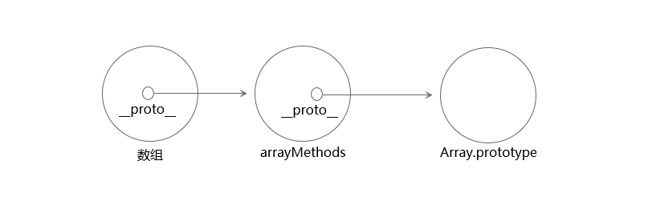

# Vue2.0源码阅读笔记（二）：响应式原理
&emsp;&emsp;Vue是数据驱动的框架，在修改数据时，视图会进行更新。数据响应式系统使得状态管理变的简单直接，在开发过程中减少与DOM元素的接触。而深入学习其中的原理十分有必要，能够回避一些常见的问题，使开发变的更为高效。<br/>
## 一、实现简单的数据响应式系统
&emsp;&emsp;Vue使用**观察者模式**（又称**发布-订阅模式**）加**数据劫持**的方式实现数据响应式系统，劫持数据时使用 Object.defineProperty 方法将**数据属性**变成**访问器属性**。Object.defineProperty 是 ES5 中一个无法 shim 的特性，因此Vue 不支持 IE8 以及更低版本浏览器。<br/>
&emsp;&emsp;Vue源码中对数据响应式系统的实现比较复杂，在深入学习这部分源码之前，先实现一个较为简单的版本更有助于后续的理解。代码如下所示：<br/>
```js
let uid = 0 

// 容器构造函数
function Dep() {
    // 收集观察者的容器
    this.subs = []
    this.id = uid++
}

Dep.prototype = {
    // 将当前观察者收集到容器中
    addSub: function(sub) {
        this.subs.push(sub)
    },

    // 收集依赖，调用观察者的addDep方法
    depend: function() {
        if(Dep.target){
            Dep.target.addDep(this)
        }
    },

    // 遍历执行容器中各观察者的run方法，以执行回调
    notify: function() {
        this.subs.forEach(sub => {
            sub.run()
        })
    }
}

// 初始化当前观察者对象为空
Dep.target = null

// 数据劫持函数
function observe(data) {
    // 防止重复对数据做劫持处理
    if(data.__ob__) return
    let keys = Object.keys(data)
    keys.forEach(key => {
        let val = data[key]
        let dep = new Dep()

        Object.defineProperty(data, key, {
            enumerable: true,
            configurable: true,
            get: function() {
                dep.depend()
                return val
            },
            set: function(newValue) {
                if((newValue !== newValue) || (newValue === val)){
                    return
                } else {
                    val = newValue
                    dep.notify()
                }
            }
        })
    });
    // 在被劫持的数据上定义一个不可遍历的内部属性
    Object.defineProperty(data, '__ob__',{
        configurable: true,
        enumerable: false,
        value: true,
        writable: true
    })
}

// 观察者构造函数
function Watcher(data, exp, callback) {
    this.cb = callback
    this.deps = {}
    this.exp = exp
    // 获取得到数据的函数
    this.getter = this.parseExp(exp.trim())
    this.data = data
    this.value = this.get()
}

Watcher.prototype = {
    run: function() {
        let value = this.get()
        let oldValue = this.value

        if(value !== oldValue){
            this.value = value
            this.cb.call(null, value, oldValue)
        }
    },

    addDep: function(dep) {
        // 防止收集重复数据
        if(!this.deps.hasOwnProperty(dep.id)){
            dep.addSub(this)
            this.deps[dep.id] = dep
        }
    },

    get: function() {
        // 将实例对象变为当前观察者对象
        Dep.target = this
        // 读取数据，从而触发数据get方法
        let value = this.getter.call(this.data, this.data)
        // 依赖收集完毕，当前观察者对象置为空
        Dep.target = null

        return value
    },

    // 通过形如‘a.b’的字符串形式获取数据值
    parseExp: function(exp) {
        if(/[^\w.$]/.test(exp)) return

        let exps = exp.split('.')

        return function(obj) {
            return obj[exps[1]]
        }
    }
}

// 监测函数
function $watch(data, exp, cb) {
    observe(data)
    new Watcher(data, exp, cb)
}
```
&emsp;&emsp;首先使用监测函数 $watch 来测试一下，代码如下：<br/>
```js
let a = {
    b: 100,
    c: 200
}

const callback = function(newValue, oldValue) {
    console.log(`新值为：${newValue}，旧值为：${oldValue}`)
}

$watch(a, 'a.b', callback)
$watch(a, 'a.c', callback)

a.b = 101 
a.c = 201
```
&emsp;&emsp;输出结果：<br/>
```js
新值为：101，旧值为：100
新值为：201，旧值为：200
```
&emsp;&emsp;上述代码的逻辑结构图如下所示：<br/>

&emsp;&emsp;响应式系统可以分为三个阶段：数据劫持（图中蓝线表示）、收集依赖（图中红线表示）、触发依赖（图中绿线表示）。<br/>
### 1、数据劫持
&emsp;&emsp;在数据劫持函数 observe 中，首先检测对象中是否存在不可遍历的属性 \_\_ob\_\_ 。如果存在，则表示该对象已经转化为响应式的；如果不存在，在数据转化之后添加上 \_\_ob\_\_ 属性。<br/>
&emsp;&emsp;然后循环遍历对象的属性，将数据属性变成访问器属性，每个访问器属性通过闭包引用一个 Dep 实例 dep 。在读取属性时，会触发 get 方法，然后调用 dep.depend() ，收集依赖。在为属性设置新值时，会触发 set 方法，然后调用 dep.notify() ，触发依赖。通过 observe 方法仅仅是改造对象属性，对象属性的 get 和 set 此时并没有触发。<br/>
### 2、收集依赖
&emsp;&emsp;通过 Watcher 函数为响应式数据添加依赖。所谓依赖，是指当数据变更时需要触发的回调函数。<br/>
&emsp;&emsp;Watcher 函数实例化时通过调用 get() 方法先将实例对象设置成当前观察者对象，然后读取数据，数据的 get 方法被调用，接着调用数据闭包引用的数据 dep 的 depend() 方法。<br/>
&emsp;&emsp;在 depend() 中，会将 dep 传入当前观察者的 addDep() 方法。在 addDep() 方法中，首先防止重复收集依赖，然后调用 dep.addSub() 方法将当前观察者添加到 dep 的subs 属性中，完成依赖的收集。<br/>
### 3、触发依赖
&emsp;&emsp;触发依赖是指在数据发生改变时，将数据闭包引用的变量 dep 中存储的观察者对象的回调依次执行。<br/>
&emsp;&emsp;当数据改变时，会调用 set 方法，然后执行 dep.notify() 方法，该方法遍历数组 dep.subs ，执行数组中每个观察者对象的 run() 方法。Watcher 实例的 run() 方法将数据改变前、改变后的值传入回调函数中执行，完成依赖的触发。<br/>
### 4、存在的问题
&emsp;&emsp;上述代码实现了一个最简单的数据响应式系统，但是存在很多的问题，比如：如果数据类型为数组怎么办？如果对象的属性本身就是访问器属性呢？删除对象属性怎么触发依赖？等等问题。<br/>
&emsp;&emsp;2019年Vue作者尤雨溪接受访问时说：<br/>
> “我当时一方面是想自己实现一个简单的框架练练手，另一方面是想尝试一下用 ES5 的Object.defineProperty 实现数据变动侦测。”

&emsp;&emsp;随着时间的推移，Vue功能越来越完善，早已不是当初那用来练手的框架了。在了解最基础的实现思路之后，让我们深入Vue源码中关于数据响应式系统的实现。<br/>
## 二、observe
&emsp;&emsp;observe 函数的功能是**劫持数据，改造数据，使数据被访问时能够收集依赖，数据改变时能够触发依赖**。<br/>
&emsp;&emsp;observe 函数代码如下所示：<br/>
```js
function observe (value: any, asRootData: ?boolean): Observer | void {
  if (!isObject(value) || value instanceof VNode) {
    return
  }
  let ob: Observer | void
  if (hasOwn(value, '__ob__') && value.__ob__ instanceof Observer) {
    ob = value.__ob__
  } else if (
    shouldObserve && !isServerRendering() &&
    (Array.isArray(value) || isPlainObject(value)) &&
    Object.isExtensible(value) && !value._isVue
  ) {
    ob = new Observer(value)
  }
  if (asRootData && ob) {
    ob.vmCount++
  }
  return ob
}
```
&emsp;&emsp;首先，保证处理的数据类型是对象；如果数据对象上有 \_\_ob\_\_ 属性，且该属性是 Observer 的实例，说明数据已经是响应式的，不再重复处理数据，直接返回该属性。<br/>
&emsp;&emsp;然后判断是否符合以下五个条件：shouldObserve 变量为 true、不是服务器端渲染、数据是纯对象或者数组、数据是可扩展的、数据不是 Vue 实例。同时满足这五个条件，会通过函数 Observer 处理数据，并返回同样的值。也就是说函数 observe 要么返回 undefined ，要么返回 Observer 的实例。<br/>
&emsp;&emsp;Observer 函数的 constructor 方法源码如下所示：<br/>
```js
constructor (value: any) {
  this.value = value
  this.dep = new Dep()
  this.vmCount = 0
  def(value, '__ob__', this)
  if (Array.isArray(value)) {
    const augment = hasProto ? protoAugment : copyAugment
    augment(value, arrayMethods, arrayKeys)
    this.observeArray(value)
  } else {
    this.walk(value)
  }
}
```
&emsp;&emsp;Observer 的实例对象上有三个属性：Dep的实例属性dep、指向被劫持数据的属性value、vmCount。而被劫持数据上会添加 \_\_ob\_\_ 属性，该属性指向 Observer 的实例对象，该实例对象与被劫持数据为循环引用。<br/>
&emsp;&emsp;observe 函数处理的数据分为两种：纯对象、数组。虽然数组也是对象，但是有它的特殊性：数组的索引是非响应式的。observe 函数对这两种类型数据有不同的处理方式。<br/>
### 1、处理纯对象
&emsp;&emsp;如果被劫持数据为纯对象，则经过 walk 方法处理。<br/>
```js
walk (obj: Object) {
  const keys = Object.keys(obj)
  for (let i = 0; i < keys.length; i++) {
    defineReactive(obj, keys[i])
  }
}
```
&emsp;&emsp;方法 walk 是将对象上每个属性都调用 defineReactive 方法处理。<br/>
```js
export function defineReactive ( obj: Object, key: string,
  val: any, customSetter?: ?Function, shallow?: boolean
) {
  const dep = new Dep()

  const property = Object.getOwnPropertyDescriptor(obj, key)
  if (property && property.configurable === false) {
    return
  }

  // cater for pre-defined getter/setters
  const getter = property && property.get
  if (!getter && arguments.length === 2) {
    val = obj[key]
  }
  const setter = property && property.set

  let childOb = !shallow && observe(val)
  Object.defineProperty(obj, key, {
    enumerable: true,
    configurable: true,
    get: function reactiveGetter () {
      const value = getter ? getter.call(obj) : val
      if (Dep.target) {
        dep.depend()
        if (childOb) {
          childOb.dep.depend()
          if (Array.isArray(value)) {
            dependArray(value)
          }
        }
      }
      return value
    },
    set: function reactiveSetter (newVal) {
      const value = getter ? getter.call(obj) : val
      /* eslint-disable no-self-compare */
      if (newVal === value || (newVal !== newVal && value !== value)) {
        return
      }
      /* eslint-enable no-self-compare */
      if (process.env.NODE_ENV !== 'production' && customSetter) {
        customSetter()
      }
      if (setter) {
        setter.call(obj, newVal)
      } else {
        val = newVal
      }
      childOb = !shallow && observe(newVal)
      dep.notify()
    }
  })
}
```
#### （一）、纯对象数据劫持原理
&emsp;&emsp;从 defineReactive 方法的代码可以看到：劫持数据的原理就是**将数据属性转变成访问器属性，如果数据本身就是访问器属性，则在重写的 get、set 方法中调用之前对应的 get、set 方法。**<br/>
&emsp;&emsp;每个属性闭包引用一个 Dep 的实例 dep ，在 get 方法中通过 dep.depend() 来收集依赖，在 set 方法中通过 dep.notify() 来触发依赖。<br/>
#### （二）、如果数据属性值为纯对象或者数组
&emsp;&emsp;如果纯对象数据的属性值为纯对象或者数组该怎么处理？想要弄清楚这个问题首先要明白下面代码中的 childOb 值到底是什么。<br/>
```js
let childOb = !shallow && observe(val)
```
&emsp;&emsp;shallow 是 defineReactive 方法的形参，含义为是否深度观测数据，当不传该参数时，默认为深度观测。<br/>
&emsp;&emsp;observe 方法处理数据为非对象时返回 undefined ，处理对象时返回 Observer 的实例。childOb 的值存在，则表明处理的属性值 val 为纯对象或者数组，且childOb 为 *Observer(val)* 的实例。因为循环引用的存在，childOb 与 val.\_\_ob\_\_ 相等。<br/>
&emsp;&emsp;在属性值为对象的情况下，当触发依赖时处理比较简单，仅仅只是将新值通过 observe 方法递归处理，使其变成响应式数据。<br/>
&emsp;&emsp;而在 get 方法中收集依赖则比较麻烦，首先执行如下代码：<br/>
```js
childOb.dep.depend()
```
&emsp;&emsp;也就是执行下列代码：<br/>
```js
val.__ob__.dep.depend()
```
&emsp;&emsp;前面说过，属性依赖的收集是存储在闭包引用的 dep 变量中的，那么每个对象数据的 \_\_ob\_\_ 属性的 dep 是用来做什么的？这里为什么会重复收集一遍依赖呢？其实，主要是因为这两个dep 触发的时机不同，闭包引用的 dep 是在属性值改变时使用的，对象\_\_ob\_\_ 属性的 dep 是在对象引用改变时使用的。在下面讲 Vue.set 与 Vue.delete 的原理时将详细说明。<br/>
### 2、处理数组
&emsp;&emsp;数组中有七种实例方法会改变数组自身的值：push、pop、shift、unshift、splice、sort 与 reverse。在对象类型是数组的情况下，在数组被读取时收集依赖，在用户使用这七种方法改变数组时触发依赖。<br/>
#### （一）、收集依赖
&emsp;&emsp;数组无法将索引变成访问器属性，所以不能像纯对象一样利用每个属性的闭包来收集和触发依赖。在处理数组时，会先通过 observe() 处理，这样数组上就添加了 \_\_ob\_\_ 属性，指向 Observer 的实例对象。在 \_\_ob\_\_.dep 中收集依赖。<br/>
&emsp;&emsp;有一点比较特殊，在数组收集依赖时有如下代码：<br/>
```js
if (Array.isArray(value)) {
    dependArray(value)
}
```
&emsp;&emsp;dependArray 递归函数代码如下所示：<br/>
```js
function dependArray (value: Array<any>) {
  for (let e, i = 0, l = value.length; i < l; i++) {
    e = value[i]
    e && e.__ob__ && e.__ob__.dep.depend()
    if (Array.isArray(e)) {
      dependArray(e)
    }
  }
}
```
&emsp;&emsp;这段代码的功能是：**在数组中有纯对象、数组时，除了将依赖收集到数组的 \_\_ob\_\_.dep 属性中，还要递归的收集到包含的纯对象、数组的 \_\_ob\_\_.dep 属性中**。<br/>
&emsp;&emsp;为什么要这样处理？这是因为这样一个前提：**数组中任何值的改变都算作是数组的改变，只要依赖了该数组，就等价于依赖了数组中的每一个元素。**<br/>
```js
{
  a:[ {b: 1} , [1], 2 ]
}
```
&emsp;&emsp;如上面的例子所示，在访问数组 a 时会添加 \_\_ob\_\_ 属性，在 a.\_\_ob\_\_.dep 中存储对 a 的依赖。当通过改变数组自身的实例方法操作 a 时，会调用 a.\_\_ob\_\_.dep.notify() 来触发依赖；当通过 Vue.set() 来改变 a 的某个值时，会转化成实例方法调用的形式，然后调用 a.\_\_ob\_\_.dep.notify() 来触发依赖；。<br/>
&emsp;&emsp;但是，如果改变 a[0].b 的值，由于在对象 a[0] 中并没有收集对数组 a 的依赖，则无法触发 a 的依赖。这就违背了**数组中任何值的改变都算作是数组的改变**这一前提。<br/>
&emsp;&emsp;因此 Vue 通过递归调用 dependArray 方法来将对数组依赖收集到数组包含的每一个对象中，这样数组中任何数值的改变都会触发该数组的依赖。<br/>
#### （二）、触发依赖
&emsp;&emsp;为了能够在通过实例方法改变数组时能够触发依赖，Vue重写了可以改变数组自身的方法。如下代码所示：<br/>
```js
const arrayProto = Array.prototype
export const arrayMethods = Object.create(arrayProto)

const methodsToPatch = ['push','pop','shift','unshift','splice','sort','reverse']

methodsToPatch.forEach(function (method) {
  const original = arrayProto[method]
  def(arrayMethods, method, function mutator (...args) {
    const result = original.apply(this, args)
    const ob = this.__ob__
    let inserted
    switch (method) {
      case 'push':
      case 'unshift':
        inserted = args
        break
      case 'splice':
        inserted = args.slice(2)
        break
    }
    if (inserted) ob.observeArray(inserted)
    ob.dep.notify()
    return result
  })
})
```
&emsp;&emsp;arrayMethods 对象的原型 为 Array.prototype ，在该对象上添加经过处理后的这七种方法。重写的实例方法主要包含三个功能：<br/>
>1、调用原生实例方法。<br/>
>2、当通过push、unshift、splice添加数据时，将新添加的数据变成响应式的。<br/>
>3、当数组改变时，触发依赖。<br/>

&emsp;&emsp;其中，触发依赖的原理需要注意一下，与之前说对象引用改变时触发自身属性中的 dep 一样，数组自身发生改变，触发的也是通过自身 \_\_ob\_\_ 属性的 dep 的 notify() 来触发依赖的。<br/>
&emsp;&emsp;ES6新增了对象的 \_\_proto\_\_ 属性，用来读取或设置当前对象的prototype对象，兼容到IE11。Vue在处理数组时，如果数组拥有 \_\_proto\_\_ 属性，则直接将该属性指向 arrayMethods 对象，即修改数组的原型对象。这样调用七种改变数组本身的方法时，会调用 arrayMethods 对象的方法，从而实现触发依赖的功能。如下图所示：<br/>

&emsp;&emsp;Vue框架兼容到 IE9 ，对于 IE9 和 IE10 浏览器来说，对象中没有 \_\_ob\_\_ 属性。Vue对于这种情况的处理方式是：直接将 arrayMethods 对象上的方法拷贝到数组自身上，且这七种方法是不可枚举的。如下代码所示：<br/>
```js
function copyAugment (target: Object, src: Object, keys: Array<string>) {
  for (let i = 0, l = keys.length; i < l; i++) {
    const key = keys[i]
    def(target, key, src[key])
  }
}
```
### 3、Vue.set与Vue.delete
&emsp;&emsp;总结上面讲述的依赖收集和触发的情况如下：<br/>
>1、如果是对象，将对象的属性转化为访问器属性，访问属性时收集依赖存储到属性闭包引用的变量 dep 中，更改属性时触发闭包引用的变量 dep 中的依赖。<br/>
>2、如果是数组，在读取数组时添加 \_\_ob\_\_ 对象属性，在该对象的 dep 属性中收集依赖。然后重写能够改变自身的七种实例方法，在调用这些实例方法时，触发 \_\_ob\_\_.dep 中存储的依赖。<br/>

&emsp;&emsp;这两种情况就导致了官网**列表渲染**中 *注意事项* 提到的问题：<br/>
>由于 JavaScript 的限制，Vue 不能检测以下变动的数组：<br/>
>1、当你利用索引直接设置一个项时，例如：vm.items[indexOfItem] = newValue<br/>
>2、当你修改数组的长度时，例如：vm.items.length = newLength<br/>
>
>还是由于 JavaScript 的限制，Vue 不能检测对象属性的添加或删除。<br/>

&emsp;&emsp;Vue 提供 Vue.set()、Vue.delete() 两个全局 API 以及 vm.$set()、vm.$delete() 两个实例方法来解决上述问题。<br/>
#### （一）、Vue.set
&emsp;&emsp;Vue.set() 与 vm.$set() 都是调用 *src/core/observer/index.js* 中的 set 方法。<br/>
```js
export function set (target: Array<any> | Object, key: any, val: any): any {
  if (process.env.NODE_ENV !== 'production' &&
    (isUndef(target) || isPrimitive(target))
  ) {
    warn(`Cannot set reactive property on undefined, null, or primitive value: ${(target: any)}`)
  }
  if (Array.isArray(target) && isValidArrayIndex(key)) {
    target.length = Math.max(target.length, key)
    target.splice(key, 1, val)
    return val
  }
  if (key in target && !(key in Object.prototype)) {
    target[key] = val
    return val
  }
  const ob = (target: any).__ob__
  if (target._isVue || (ob && ob.vmCount)) {
    process.env.NODE_ENV !== 'production' && warn(
      'Avoid adding reactive properties to a Vue instance or its root $data ' +
      'at runtime - declare it upfront in the data option.'
    )
    return val
  }
  if (!ob) {
    target[key] = val
    return val
  }
  defineReactive(ob.value, key, val)
  ob.dep.notify()
  return val
}
```
&emsp;&emsp;由上述代码可知，set 方法的功能如下：<br/>
>1、若target为数组，key为有效索引，则先判断是否调整数组大小，再调用splice方法触发依赖。<br/>
>2、若target为纯对象，key是对象是存在的属性，则直接改变key值，进而调用属性set方法触发依赖。<br/>
>3、若target不是响应式的，则直接往对象上添加key属性，target上有key属性则直接覆盖。<br/>
>4、若target是响应式的，且本身没有key属性，则通过defineReactive方法将值转成响应式的添加到target上，然后通过target.\_\_ob\_\_.dep.notify()触发依赖。<br/>
#### （二）、Vue.delete
&emsp;&emsp;Vue.delete() 与 vm.$delete() 都是调用 *src/core/observer/index.js* 中的 del 方法。<br/>
```js
export function del (target: Array<any> | Object, key: any) {
  if (process.env.NODE_ENV !== 'production' &&
    (isUndef(target) || isPrimitive(target))
  ) {
    warn(`Cannot delete reactive property on undefined, null, or primitive value: ${(target: any)}`)
  }
  if (Array.isArray(target) && isValidArrayIndex(key)) {
    target.splice(key, 1)
    return
  }
  const ob = (target: any).__ob__
  if (target._isVue || (ob && ob.vmCount)) {
    process.env.NODE_ENV !== 'production' && warn(
      'Avoid deleting properties on a Vue instance or its root $data ' +
      '- just set it to null.'
    )
    return
  }
  if (!hasOwn(target, key)) {
    return
  }
  delete target[key]
  if (!ob) {
    return
  }
  ob.dep.notify()
}
```
&emsp;&emsp;由上述代码可知，del 方法的功能如下：<br/>
>1、若target为数组，key为有效索引，则调用splice方法完成删除操作，并且触发依赖。<br/>
>2、若target为纯对象，key属性不存在，则不执行删除操作，直接返回undefined。<br/>
>3、若target为纯对象，key属性存在，则删除该属性，然后通过target.\_\_ob\_\_.dep.notify()触发依赖。<br/>
## 三、Dep
&emsp;&emsp;Dep 函数的主要功能是**生成被观察数据存放观察者的容器，其静态属性target指向当前要收集的观察者**。<br/>
&emsp;&emsp;Dep 函数如下所示：<br/>
```js
export default class Dep {
  constructor () {
    this.id = uid++
    this.subs = []
  }

  addSub (sub: Watcher) { this.subs.push(sub) }

  removeSub (sub: Watcher) { remove(this.subs, sub) }

  depend () {
    if (Dep.target) { Dep.target.addDep(this)}
  }

  notify () {
    const subs = this.subs.slice()
    for (let i = 0, l = subs.length; i < l; i++) {
      subs[i].update()
    }
  }
}
Dep.target = null
const targetStack = []

export function pushTarget (_target: ?Watcher) {
  if (Dep.target) targetStack.push(Dep.target)
  Dep.target = _target
}

export function popTarget () {
  Dep.target = targetStack.pop()
}
```
&emsp;&emsp;实例属性subs为存放观察者的数组，depend()收集依赖、notify()触发依赖。有一点需要注意：depend 方法调用当前观察者对象的 addDep 方法，addDep 方法又调用 Dep 实例的 addSub 方法来将 Dep.target 存入 subs 中，为什么不直接将当前要收集的观察者 Dep.target push到subs中？<br/>
&emsp;&emsp;这样做的原因主要有三点：避免重复收集依赖、方便记录被观察数据变化前后的值、观察者对象中保存观察数据的数量。如果仅仅是为了避免重复收集依赖，可以利用观察者对象的id，来删除重复观察者实现。<br/>
&emsp;&emsp;另外，Dep.target 的值不是简单的将当前观察者赋值完成的，而是由 pushTarget 来实现，在赋值之前先存储原本观察者，当前观察者被数据收集之后，通过  popTarget 来将 Dep.target 的值恢复到原本的观察者。<br/>
## 四、Watcher
&emsp;&emsp;Watcher 函数的主要功能是**为被观察的数据提供依赖（回调函数）**。<br/>
&emsp;&emsp;观察者函数观察数据的方式是读取数据，数据经过 observe 函数处理后变成响应式的，在被读取的过程中能够存储 Watcher 实例对象的引用，这就是**收集依赖**的过程。<br/>
&emsp;&emsp;当被观察数据发生改变时，数据会遍历存储的 Watcher 实例对象引用，来分别执行各 Watcher 实例对象上回调函数，这就是**触发依赖**的过程。<br/>
### 1、概述
&emsp;&emsp;Watcher 函数的 constructor 方法源码如下所示：<br/>
```js
constructor (vm: Component, expOrFn: string | Function,
    cb: Function, options?: ?Object, isRenderWatcher?: boolean
  ) {
    this.vm = vm
    if (isRenderWatcher) { vm._watcher = this }
    vm._watchers.push(this)
    // options
    if (options) {
      this.deep = !!options.deep
      this.user = !!options.user
      this.lazy = !!options.lazy
      this.sync = !!options.sync
      this.before = options.before
    } else {
      this.deep = this.user = this.lazy = this.sync = false
    }
    this.cb = cb
    this.id = ++uid // uid for batching
    this.active = true
    this.dirty = this.lazy // for lazy watchers
    this.deps = []
    this.newDeps = []
    this.depIds = new Set()
    this.newDepIds = new Set()
    this.expression = process.env.NODE_ENV !== 'production'
      ? expOrFn.toString()
      : ''
    // parse expression for getter
    if (typeof expOrFn === 'function') {
      this.getter = expOrFn
    } else {
      this.getter = parsePath(expOrFn)
      if (!this.getter) {
        this.getter = noop
        process.env.NODE_ENV !== 'production' && warn(
          `Failed watching path: "${expOrFn}" ` +
          'Watcher only accepts simple dot-delimited paths. ' +
          'For full control, use a function instead.',
          vm
        )
      }
    }
    this.value = this.lazy ? undefined : this.get()
  }
```
&emsp;&emsp;Watcher 函数接收五个参数：当前组件实例对象、被观察的目标、被观察数据发生改变后的回调函数、传递的选项、是否为渲染函数的标识。<br/>
&emsp;&emsp;观察者对象的 vm 属性指向当前组件的实例对象，组件实例对象上的 \_watcher 属性指向渲染函数的观察者，而 \_watchers 属性则包含当前实例对象上的全部观察者对象。<br/>
&emsp;&emsp;根据传入选项 options 的值来初始化观察者对象上的五个值，其含义分别为：<br/>
>属性deep：是否深度观测数据，默认为 false 。<br/>
>属性user：观察者是否由开发者定义的，默认为 false 。<br/>
>属性lazy：观察者是否惰性求值，是内部为实现计算属性功能创建的观察者，默认为 false 。<br/>
>属性sync：数据变化时是否同步求值，默认为 false 。<br/>
>属性before：钩子函数，在数据变化之后、触发更新之前调用。<br/>

&emsp;&emsp;观察者对象的 getter 方法是根据传入 expOrFn 参数的类型来确定的。如果传入函数，getter 方法直接等于该函数；如果传入字符串，getter 方法为返回目标值的函数。getter 方法的功能就是能够读取目标数据。<br/>
&emsp;&emsp;<br/>
&emsp;&emsp;<br/>
### 2、避免收集重复依赖
&emsp;&emsp;<br/>
### 3、异步更新队列
&emsp;&emsp;<br/>
### 4、观察者类型
#### （一）、渲染函数的观察者
#### （二）、计算属性的观察者
#### （三）、选项watch以及vm.$watch的观察者
&emsp;&emsp;<br/>
## 五、总结
&emsp;&emsp;<br/>