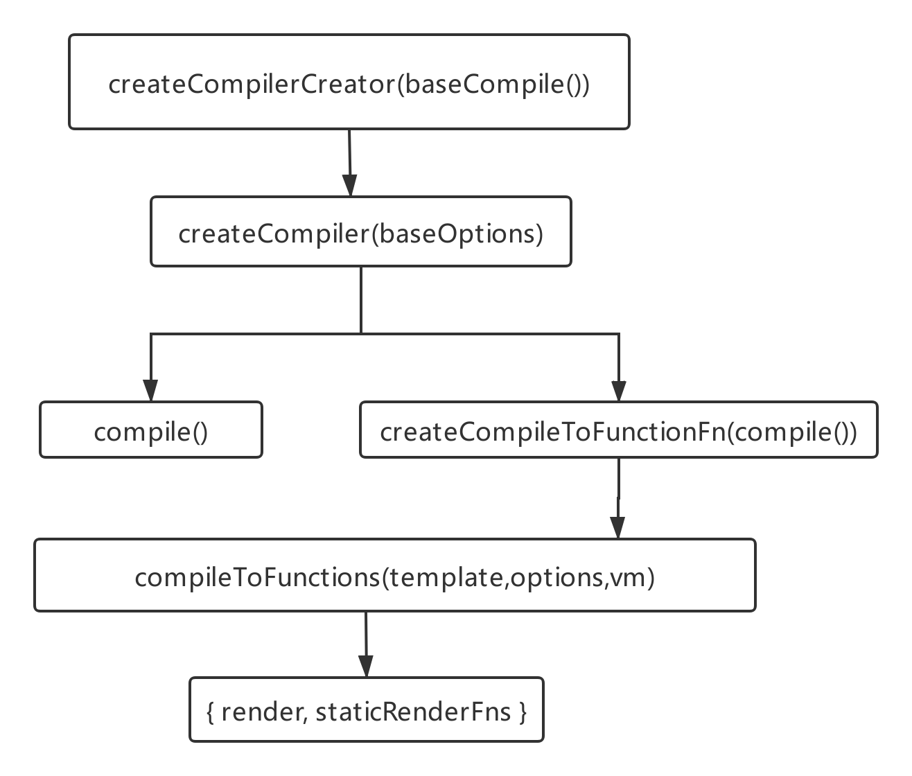
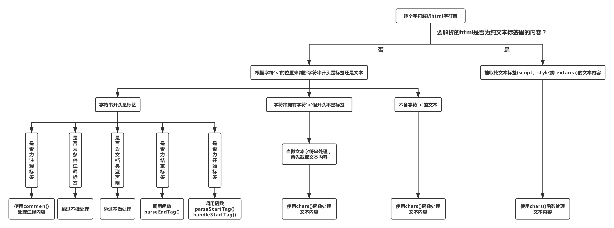

# Vue2.0源码阅读笔记（五）：模板编译
&emsp;&emsp;在使用Vue进行实际开发的过程中，大多数时候使用模板来创建HTML，模板功能强大且简洁直观，最终模板会编译成渲染函数，本文主要介绍模板编译的具体过程。<br/>
## 一、编译入口
&emsp;&emsp;Vue从能否处理 template 选项的角度分为两个版本：**运行时+编译器**、**只包含运行时**。**运行时+编译器**版本也被称为**完整版**。**只包含运行时**比**完整版**体积小30%左右，使用**只包含运行时**版本需要借助 *vue-loader* 或 *vueify* 等工具编译模板。<br/>
&emsp;&emsp;本文从 web 平台的编译入口开始探究 Vue 完整版的模板编译过程。在 *src/platforms/web/entry-runtime-with-compiler.js* 文件下的 *$mount* 方法中通过 *compileToFunctions* 方法将模板编译成渲染函数。编译方法的生成过程如下如所示：<br/>

&emsp;&emsp;__首先，向 *createCompilerCreator()* 函数传入 *baseCompile()* 函数，返回值为 *createCompiler()* 函数。__<br/>
&emsp;&emsp;基础编译函数 *baseCompile* 代码如下所示：<br/>
```js
function baseCompile (template, options){
  const ast = parse(template.trim(), options)
  if (options.optimize !== false) {
    optimize(ast, options)
  }
  const code = generate(ast, options)
  return {
    ast,
    render: code.render,
    staticRenderFns: code.staticRenderFns
  }
}
```
&emsp;&emsp;这几行代码是Vue模板编译的核心，由以上代码可以看出，编译的第一步是将模板通过 *parse* 函数解析成 **AST（抽象语法树）**，第二步优化AST，第三步根据优化后的抽象语法树生成包含渲染函数的对象。<br/>
&emsp;&emsp;**其次，向*createCompiler()* 函数传入基本配置对象 *baseOptions*，返回包含函数属性 *compile* 与 *compileToFunctions* 的对象。**<br/>
&emsp;&emsp;*compile* 函数接收两个参数：模板字符串以及编译选项。另外还通过闭包引用了前面传入的基础编译函数 *baseCompile* 与基本编译配置对象  *baseOptions*。该函数的功能主要有三点：<br/>
>1、合并基础配置选项与传入的编译选项，生成 finalOptions。<br/>
>2、收集编译过程中的错误。<br/>
>3、调用基础编译函数 baseCompile。<br/>

&emsp;&emsp;*compileToFunctions* 函数是将 *compile* 函数作为参数传入 *createCompileToFunctionFn()* 函数生成的返回值。*createCompileToFunctionFn* 函数定义一个缓存变量 *cache*，然后返回函数 *compileToFunctions*。模板字符串的编译比较费时，使用缓存变量 *cache* 是为了防止重复编译，从而提升性能。<br/>
&emsp;&emsp;*compileToFunctions* 函数接受三个参数：模板字符串、编译选项、Vue实例。该函数的主要作用有以下五点：<br/>
>1、缓存编译结果，防止重复编译。<br/>
>2、检测内容安全策略，保证 *new Function()* 能够使用。<br/>
>3、调用 compile 函数将模板字符串转成渲染函数字符串<br/>
>4、调用 createFunction 函数将渲染函数字符串转成真正的渲染函数<br/>
>5、打印编译错误。<br/>

&emsp;&emsp;**最后，将要编译的模板字符串、编译选项与 Vue 的实例对象传入 *compileToFunctions* 函数，返回包含函数属性 *render* 与 *staticRenderFns* 的对象。**<br/>
&emsp;&emsp;*render* 方法为最终的生成的渲染函数，*staticRenderFns* 方法为静态渲染函数，在优化渲染时使用。<br/>
&emsp;&emsp;Vue利用函数**柯里化**的技巧生成编译模板的方法，在初读代码的时候让人感觉十分繁琐，实际却是设计的十分巧妙。<br/>
&emsp;&emsp;这样设计的原因是因为 Vue 能够在不同平台运行，比如在服务器端做SSR，也可以在weex下使用。不同平台都会有编译过程，所依赖的基本编译选项 baseOptions 会有所不同。Vue 将基础的编译过程抽离出来，并且可以在多处添加编译器选项，然后将添加的编译器选项和基本编译选项合并起来，最终灵活实现在不同平台下编译的目的。<br/>
## 二、生成AST
&emsp;&emsp;关于 AST 的概念参照如下维基百科的描述：<br/>
>&emsp;&emsp;在计算机科学中，抽象语法树（Abstract Syntax Tree，AST），是源代码语法结构的一种抽象表示。它以树状的形式表现编程语言的语法结构，树上的每个节点都表示源代码中的一种结构。之所以说语法是“抽象”的，是因为这里的语法并不会表示出真实语法中出现的每个细节。<br/>
>&emsp;&emsp;在源代码的翻译和编译过程中，语法分析器创建出分析树，然后从分析树生成AST。一旦AST被创建出来，在后续的处理过程中，比如语义分析阶段，会添加一些信息。<br/>

&emsp;&emsp;Vue 编译过程的核心的第一步是调用 *parse* 方法将模板字符串解析为 AST 。<br/>
```js
const ast = parse(template.trim(), options)
```
&emsp;&emsp;生成AST的过程分为两步：**词法分析**、**句法分析**。*parse* 函数中实现的功能主要是**句法分析**，**词法分析**功能由 *parse* 内部调用的 *parseHTML* 函数来完成。我们首先分析模板字符串做词法分析的过程。<br/>
### 1、词法分析函数 parseHTML
&emsp;&emsp;*parseHTML* 函数的省略具体细节的代码如下所示：<br/>
```js
export function parseHTML (html, options) {
  const stack = []
  let last, lastTag
  /*省略。。。*/
  while (html) {
    last = html
    if (!lastTag || !isPlainTextElement(lastTag)) {
      let textEnd = html.indexOf('<')

      if (textEnd === 0) {/*省略具体实现*/}

      let text, rest, next

      if (textEnd >= 0) {/*省略具体实现*/}
      if (textEnd < 0) { text = html }

      if (text) { advance(text.length) }

      if (options.chars && text) {
        options.chars(text, index - text.length, index)
      }
    } else {
      /*省略具体实现*/
    }

    if (html === last) {/*省略具体实现*/}
  }

  parseEndTag()

  function advance (n) {
    index += n
    html = html.substring(n)
  }

  function parseStartTag () {/*省略具体实现*/}

  function handleStartTag (match) {/*省略具体实现*/}

  function parseEndTag (tagName, start, end) {/*省略具体实现*/}
}
```
####（一）、整体流程分析
&emsp;&emsp;*parseHTML* 函数的具体功能如下图所示：<br/>

&emsp;&emsp;*parseHTML* 逐个字符解析模板字符串。在 *while* 循环中，每次解析完一段字符串后都调用 *advance* 函数删除已解析的字符串。<br/>
&emsp;&emsp;在了解具体流程之前，先要弄明白一个问题：**如何判断一个非一元标签是否缺少结束标签呢**？即如何检测出像以下例子中发生错误的情况：<br/>
```html
<div><span></div>
```
&emsp;&emsp;*parseHTML* 函数利用栈的数据结构来实现的：解析到开始标签时，将开始标签推入到数组 *stack* 中，变量 *lastTag* 始终指向栈顶元素。当解析到结束标签时，会与栈顶的开始元素相匹配，如果是一对非一元标签，则将栈顶开始标签推出栈，同时继续向前解析。如果匹配失败或者解析完毕后栈中仍有开始标签，则表示非一元标签未闭合。<br/>
&emsp;&emsp;如上例所示，先将 *\<div\>* 推入数组 *stack* 中，继续解析后将 *\<span\>* 也推入栈中，此时栈顶标签为 *\<span\>*，解析到结束标签 *\</div\>* 时会与栈顶标签对比，*\<span\>* 与 *\</div\>* 不是一对非一元便签，则说明模板字符串缺少 *\<span\>* 的结束标签。<br/>
&emsp;&emsp;*parseHTML* 函数首先判断将要解析的字符串是不是在纯文本标签里的内容，纯文本标签是指 *\<script\>*、*\<style\>*、*\<textarea\>* ，如果为纯文本标签的内容，则抽取纯文本标签里的内容，直接使用传入的 *chars()* 进行处理。<br/>
&emsp;&emsp;如果不是在纯文本标签里的内容，则根据字符 '*<*' 的位置来判断要解析的字符串开头是标签还是文本。如果是文本，则使用传入的 *chars()* 进行处理。<br/>
&emsp;&emsp;如果是标签，则有五种可能性：<br/>
> 1、若是注释标签 \<!----\>，则使用传入的 *comment()* 方法处理注释内容。<br/>
> 2、若是条件注释标签\<!--[]\>，则不做任何处理，直接跳过。<br/>
> 3、若是文档类型声明\<!DOCTYPE\>，则不做任何处理，直接跳过。<br/>
> 4、若是结束标签，则调用 *parseEndTag()* 函数处理。<br/>
> 5、若是开始标签，则调用 *parseStartTag()* 与 *handleStartTag()* 函数进行处理。<br/>

&emsp;&emsp;总之，*parseHTML* 函数解析到**文本**调用 *chars()* 方法处理，解析到**注释标签**调用 *comment()* 方法处理，解析到**条件注释标签**与**文档类型声明**跳过不做处理， *chars()* 与 *comment()* 作为传入的方法将会在讲解 *parse()* 方法时加以讲解。<br/>
&emsp;&emsp;对开始标签与结束标签的处理相对麻烦一些，在调用传入的处理开始标签与结束标签的函数之前，*parseHTML* 函数会先对其做一些处理。<br/>
####（二）、对开始标签的处理
&emsp;&emsp;解析开始标签是会首先调用 *parseStartTag()* 函数，然后将函数返回值作为参数传入 *handleStartTag()* 函数进行处理。<br/>
&emsp;&emsp;*parseStartTag()* 函数利用正则表达式来解析开始标签，各项解析结果作为 *match* 对象的属性。<br/>
```js
match = {
  tagName: '', // 开始标签的标签名
  attrs: [], // 标签中各属性的信息数组
  start: startIndex, // 标签开始下标
  unarySlash: undefined || '/', // 判断标签是否为一元标签
  end: endIndex // 标签结束下标
}
```
&emsp;&emsp;*handleStartTag()* 函数接收 *match* 对象作为参数。主要有以下五个功能：<br/>
>1、*stack* 栈顶标签为 \<p\>，且当前解析的开始标签为**段落式内容**模型时，调用 *parseEndTag()* 方法闭合 \<p\>。<br/>
>2、当前解析标签可以省略结束标签，且与栈顶标签相同，则调用 *parseEndTag()* 方法关闭当前解析标签然后给出警告。<br/>
>3、格式化 *match.attrs* 存储属性数组，格式化后 *attrs* 为对象数组，每个对象有两个属性：name(属性名)、value(解码后的属性值)。<br/>
>4、将当前解析标签的信息推入到 *stack* 中，并将变量 *lastTag* 的值改成栈顶标签名称。<br/>
>5、调用传入的 *start* 函数，参数为当前解析标签的信息。<br/>
####（三）、对结束标签的处理
&emsp;&emsp;解析结束标签是会调用 *parseEndTag()* 函数。该函数主要有以下四个功能：<br/>
>1、检测是否缺少闭合标签。<br/>
>2、处理 *stack* 栈中剩余的标签。<br/>
>3、处理 *\</br\>* 与 *\</p\>* 标签。<br/>
>4、调用传入的 *end()* 方法处理结束标签。<br/>

&emsp;&emsp;在 *handleStartTag()* 函数中有讲到遇到 *\<p\>* 调用 *parseEndTag()* 函数的情况。以下是 *\<p\>* 标签MDN的介绍：<br/>
```html
  起始标签是必需的，结束标签在以下情形中可以省略。
<p>元素后紧跟<address>, <article>, <aside>, <blockquote>, 
<div>, <dl>, <fieldset>, <footer>, <form>, <h1>, <h2>, <h3>, 
<h4>, <h5>, <h6>, <header>, <hr>, <menu>, <nav>, <ol>, <pre>, 
<section>, <table>, <ul>或另一个<p>元素；
或者父元素中没有其他内容了，而且父元素不是<a>元素。
```
&emsp;&emsp;如果 *\<p\>* 后面跟以上元素，*parseEndTag()* 函数会模拟浏览器的行为，自动补全 *\<p\>* 标签。如下所示：<br/>
```html
<p><h5></h5></p>
```
&emsp;&emsp;上述html代码会被解析成如下代码：<br/>
```html
<p></p><h5></h5><p></p>
```
&emsp;&emsp;在 *handleStartTag()* 函数中讲到：当前解析标签可以省略结束标签，且与栈顶标签相同，则调用 *parseEndTag()* 方法。 *parseEndTag()* 会闭合第二个标签，并因第一个标签未闭合而发出警告。<br/>
```html
<li>123<li>456
```
&emsp;&emsp;上述html代码会被解析成如下代码，并警告第一个标签未闭合。<br/>
```html
<li>123<li></li>456
```
&emsp;&emsp;另外，仅仅写下闭合标签 *\</p\>* 与 *\</br\>* 时，浏览器会将 *\</p\>* 转化成 *\<p\>\</p\>*，将 *\</br\>* 转化成 *\<br\>* 。Vue在转换模板字符串的时候与浏览器保持一致，在 *handleStartTag()* 函数中将这两个闭合标签进行转换处理。<br/>
### 2、句法分析函数 parse
&emsp;&emsp;句法分析函数 *parse* 的代码在 */src/compiler/parser/index.js* 中。省略具体内容的 *parse* 函数代码如下所示：<br/>
```js
export function parse (template,options){
  const stack = []
  let root
  let currentParent
  /*省略。。。*/

  parseHTML(template, {
    // 省略一些参数
    start (tag, attrs, unary, start, end) {/*省略具体实现*/},
    end (tag, start, end) {/*省略具体实现*/},
    chars (text, start, end) {/*省略具体实现*/},
    comment (text, start, end) {/*省略具体实现*/}
  })
  return root
}
```
&emsp;&emsp;<br/>
####（一）、句法分析整体阐述
&emsp;&emsp;变量 *root* 为 *parseHTML* 函数的返回值，即最终生成的AST。Vue将模板中节点分为四种：**标签节点**、**包含字面量表达式的文本节点**、**普通文本节点**、**注释节点**，其中普通文本节点与注释节点都是**纯文本节点**，算作同一类型。<br/>
&emsp;&emsp;AST中的节点描述对象有三种类型：标签节点类型描述对象、表达式文本节点描述对象、纯文本节点描述对象。不同类型节点描述对象的基本属性如下所示：<br/>
```js
// 标签节点类型描述对象基本属性
element = {
  type: 1, // 标签节点类型标识
  tag: '', // 标签名称
  attrsList: [], // 对象数组，对象存储着标签属性的名和值
  attrsMap: {}, // 标签属性对象，以键值对的形式存储标签属性
  rawAttrsMap: {} // 将attrsList转化为对象，其属性为标签属性名
  parent: {}, // 父标签节点
  children: [], // 子节点数组
  start: Number, // 开始标签第一个字符在html字符串的位置
  end: Number // 结束标签最后一个字符在html字符串的位置
}

// 表达式文本节点描述对象基本属性
expression = {
  type: 2, // 表达式文本节点类型标识
  expression: '', // 表达式文本字符串，变量被 _s() 包裹
  tokens: [] // 存储文本的token，有文本和表达式两种类型
  text: '', // 文本字符串
  start: Number, // 表达式文本第一个字符在html字符串的位置
  end: Number // 表达式文本最后一个字符在html字符串的位置
}

// 纯文本节点描述对象基本属性
text = {
  type: 3, // 纯文本节点类型标识
  text: '', // 文本字符串
  start: Number, // 纯文本第一个字符在html字符串的位置
  end: Number // 纯文本最后一个字符在html字符串的位置
}
```
&emsp;&emsp;AST是树状结构的对象，通过标签节点描述对象的 *parent* 与 *children* 来实现。*parent* 属性指向父节点元素描述对象，*children* 属性存储着该节点所有子节点的元素描述对象。根节点的 *parent* 属性值为 *undefined* 。<br/>
&emsp;&emsp;变量 *stack* 与 *currentParent* 配合使用来完成将将子节点正确添加到父节点 *children* 属性中的任务。*stack* 是栈的数据结构，用来存储当前解析的节点的父节点以及祖先节点。*currentParent* 指向当前解析内容的父节点。<br/>
&emsp;&emsp;在词法分析的过程中，解析节点时会调用对应的函数进行处理，下面分别加以介绍。<br/>
####（二）、开始标签处理函数 start
&emsp;&emsp;在 *start()* 函数中，首先会调用 *createASTElement()* 函数，将标签名、标签属性以及标签的父节点作为参数传入，生成一个标签节点类型描述对象。<br/>
```js
let element = createASTElement(tag, attrs, currentParent)
```
&emsp;&emsp;此时标签节点对象如下所示：<br/>
```js
element = {
  type: 1,
  tag,
  attrsList: attrs,
  attrsMap: makeAttrsMap(attrs),
  rawAttrsMap: {},
  parent,
  children: []
}
```
&emsp;&emsp;如果开始标签是 *svg* 或者 *math*，则额外添加 *ns* 属性，属性值与标签名相同。接着向 *element* 对象添加 *start*、*end* 属性，使用 *attrsList* 属性格式化 *rawAttrsMap* 属性。<br/>
&emsp;&emsp;然后调用 *preTransforms* 函数数组中的每一个函数来处理 *element* 对象，以及以 *process* 开头的一系列函数。在 *parse* 函数所在的文件中声明了很多 process* 函数，比如 *processFor*、*processIf*、*processOnce*等。这些函数和 *preTransforms* 函数数组中的函数作用都是一样的，都是用来对当前元素描述对象做进一步处理。这是出于平台话的考虑，将这一系列的函数放在不同的文件夹里。*process* 系列函数是通用的，而 *preTransforms* 函数数组根据平台不同而不同。<br/>
&emsp;&emsp;这些根据不同属性对 *element* 进行不同处理的过程想当繁杂，本文是为了阐述模板字符串到渲染函数的编译过程，这些具体的属性处理会在后续文章讲述相应指令时详细阐述。<br/>
&emsp;&emsp;最后，判断开始标签是否为一元标签，如果是则调用 *closeElement* 方法进行处理，*closeElement* 方法的具体内容将在下一节介绍；如果不是则将 *element* 对象赋值给变量 *currentParent*，作为后续解析的父节点存在，并将 *element* 对象推入 *stack* 栈中。<br/>
####（三）、结束标签处理函数 end
&emsp;&emsp;结束标签处理函数 *end* 逻辑相对简单，代码如下所示：<br/>
```js
end (tag, start, end) {
  const element = stack[stack.length - 1]
  // pop stack
  stack.length -= 1
  currentParent = stack[stack.length - 1]
  if (process.env.NODE_ENV !== 'production' && options.outputSourceRange) {
    element.end = end
  }
  closeElement(element)
}
```
&emsp;&emsp;<br/>
&emsp;&emsp;*closeElement* 函数的功能有<br/>
&emsp;&emsp;<br/>
####（四）、文本处理函数 chars
&emsp;&emsp;<br/>
&emsp;&emsp;<br/>
####（五）、文本处理函数 comment
&emsp;&emsp;<br/>
&emsp;&emsp;<br/>
## 三、优化AST
&emsp;&emsp;<br/>
&emsp;&emsp;<br/>
## 四、生成渲染函数
&emsp;&emsp;<br/>
&emsp;&emsp;<br/>
## 五、手写渲染函数
&emsp;&emsp;<br/>
&emsp;&emsp;<br/>
## 六、总结
&emsp;&emsp;<br/>
&emsp;&emsp;<br/>