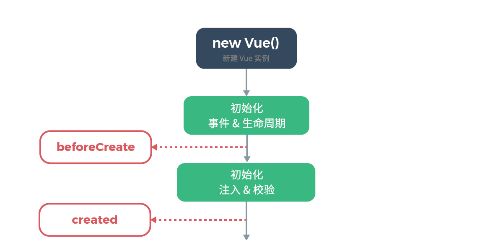
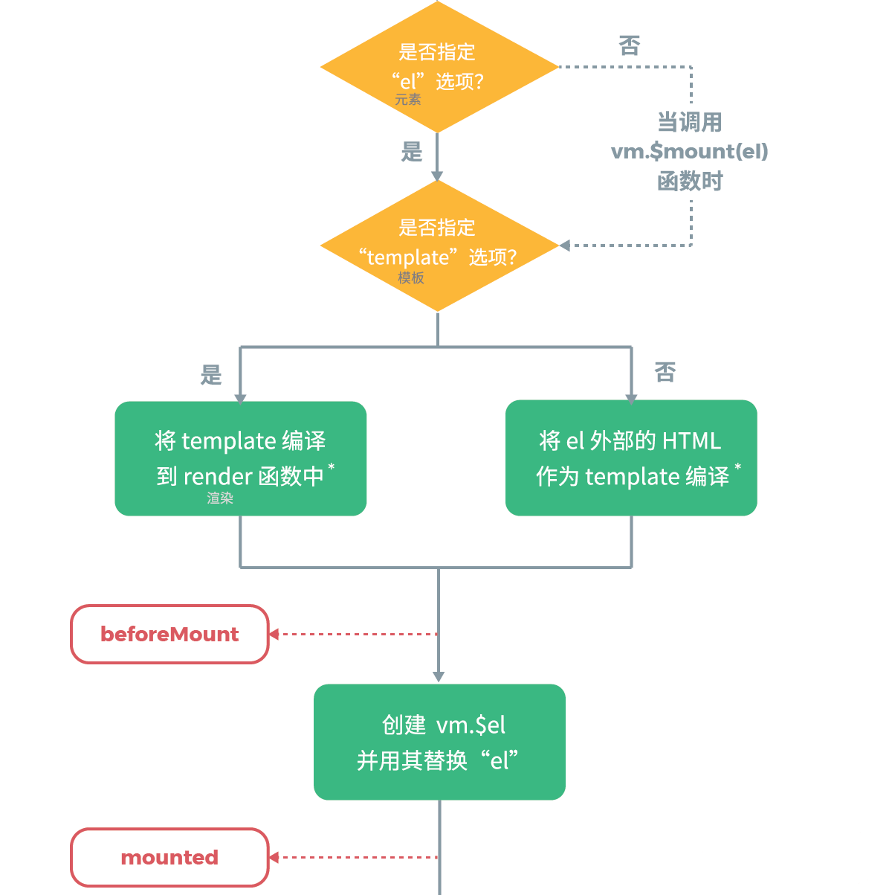
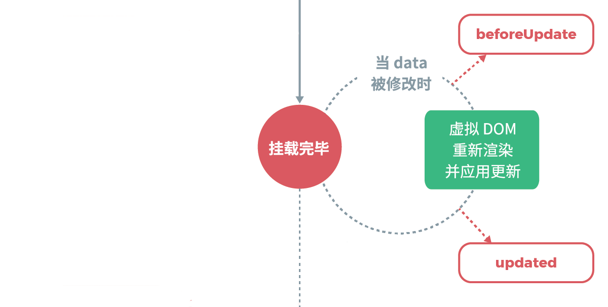

# Vue2.0源码阅读笔记（十二）：生命周期
&emsp;&emsp;在 Vue 中，除函数式组件外，所有组件都是 Vue 实例。每个 Vue 实例在被创建时都要经过一系列的初始化过程：数据监听、编译模板、将实例挂载到 DOM 并在数据变化时更新 DOM 等。<br/>
&emsp;&emsp;在生成 Vue 实例的过程中会运行一些叫做生命周期钩子的函数，这给了用户在不同阶段添加自己的代码的机会。本文从源码的角度来详细阐述组件生命周期的相关内容。<br/>
## 一、钩子函数的调用
&emsp;&emsp;生命周期钩子函数调用是通过 callHook 函数完成的，callHook 函数主要包含三个方面的内容。<br/>
```js
function callHook (vm, hook) {
  pushTarget()
  const handlers = vm.$options[hook]
  const info = `${hook} hook`
  if (handlers) {
    for (let i = 0, j = handlers.length; i < j; i++) {
      invokeWithErrorHandling(handlers[i], vm, null, vm, info)
    }
  }
  if (vm._hasHookEvent) {
    vm.$emit('hook:' + hook)
  }
  popTarget()
}
```
### 1、调用钩子函数
&emsp;&emsp;在生成 Vue 实例的过程中会调用 mergeOptions 函数对选项进行处理，生命周期钩子函数经过合并处理后会添加到实例对象的 \$options 属性上，合并后各生命周期函数存储在对应的数组中。具体细节可参看文章[《选项合并》](https://juejin.im/post/5c8f60f8e51d45768a6e95f0#heading-0)。<br/>
&emsp;&emsp;callHook 函数调用的形式如下所示：<br/>
```js
// 调用 created 生命周期钩子函数
callHook(vm, 'created')
```
&emsp;&emsp;此时 callHook 函数会循环遍历执行 vm.\$options.created 数组中的函数，以完成 created 生命周期钩子函数的调用。<br/>
### 2、防止收集冗余依赖
&emsp;&emsp;在函数首尾有如下代码：<br/>
```js
function callHook (vm, hook) {
  pushTarget()
  /* 省略... */
  popTarget()
}
```
&emsp;&emsp;这两个函数的源码如下所示：<br/>
```js
Dep.target = null
const targetStack = []

function pushTarget (target) {
  targetStack.push(target)
  Dep.target = target
}

function popTarget () {
  targetStack.pop()
  Dep.target = targetStack[targetStack.length - 1]
}
```
&emsp;&emsp;Vue 实例的当前观察者对象是唯一的，所谓当前观察者对象是指即将要收集依赖的目标，pushTarget 函数将观察者对象入栈而不是简单的赋值，是为了在当前观察者对象操作完成后恢复成之前的观察者对象。<br/>
&emsp;&emsp;在函数的首尾调用 pushTarget() 和 popTarget() 函数，是为了防止在生命周期钩子函数中使用 props 数据时收集冗余的依赖。具体详情可参看[《响应式原理》](https://juejin.im/post/5cb6ee28f265da03474df961#heading-10)。<br/>
### 3、hookEvent
&emsp;&emsp;在 callHook 函数中还有一部分代码：<br/>
```js
if (vm._hasHookEvent) {
  vm.$emit('hook:' + hook)
}
```
&emsp;&emsp;这行代码比较有意思，也就是说在执行生命周期钩子函数时，如果 vm.\_hasHookEvent 的值为 true，则会额外触发一个形如 hook:created 的事件。<br/>
&emsp;&emsp;那么什么时候实例的 \_hasHookEvent 属性值为真呢？还记得在上篇文章讲解 \$on 方式时有提过这点：<br/>
```js
const hookRE = /^hook:/
Vue.prototype.$on = function(event, fn){
  /* 省略... */
  if (hookRE.test(event)) {
    vm._hasHookEvent = true
  }
  /* 省略... */
}
```
&emsp;&emsp;上篇文章同时讲到，在组件上使用自定义指令最终会转化成调用 \$on 的形式，也就是说按照以下使用就能命中这种情况：<br/>
```js
<Child @hook:created = "doSomething"></Child>
```
&emsp;&emsp;这种形式的事件称为 hookEvent，在官方文档上没有找到 hookEvent 的说明，但是在 Vue 源码中有实现。所谓 hookEvent 就是特殊命名的事件—— hook: + 生命周期名称。这种事件会在子组件对应生命周期钩子函数调用时被调用。<br/>
&emsp;&emsp;那 hookEvent 有什么用呢？其实在使用第三方组件的时候能够用到，使用 hookEvent 可以在不破坏第三方组件代码的前提下，向其注入生命周期函数。<br/>
## 二、组件的生命周期
&emsp;&emsp;关于组件实例的生命周期，官网上面有一张很经典的图片：<br/>

&emsp;&emsp;这张图片包含的信息较多，下面我们通过拆解这张图片来逐步讲解组件实例的生命周期。<br/>
### 1、beforeCreate和created

&emsp;&emsp;Vue 的构造函数主要包含 \_init 方法，在组件实例化的过程中会通过该函数完成一系列初始化操作。<br/>
```js
function Vue (options) {
  /* 省略警告信息 */
  this._init(options)
}
```
&emsp;&emsp;\_init 方法首先进行合并选项，然后初始化生命周期、事件等，最后挂载 DOM 元素。代码如下所示：<br/>
```js
Vue.prototype._init = function (options) {
  const vm = this
  /*...*/
  if (options && options._isComponent) {
    initInternalComponent(vm, options)
  } else {
    vm.$options = mergeOptions(
      resolveConstructorOptions(vm.constructor),
      options || {},
      vm
    )
  }
  /*...*/
  initLifecycle(vm)
  initEvents(vm)
  initRender(vm)
  callHook(vm, 'beforeCreate')
  initInjections(vm)
  initState(vm)
  initProvide(vm)
  callHook(vm, 'created')
  /*...*/
  if (vm.$options.el) {
    vm.$mount(vm.$options.el)
  }
}
```
&emsp;&emsp;这里函数调用的**顺序**很重要，数据的处理都是在 beforeCreate 生命周期函数调用之后初始化的，也就是说在 beforeCreate 生命周期函数中，不能使用 props、methods、data、computed 和 watch 等数据，也不能使用 provide/inject 中的数据。一般从后端加载数据不用赋值给data中时，可以放在这个生命周期中。<br/>
&emsp;&emsp;在 beforeCreate 与 created 生命周期函数调用中间，调用初始化各个数据的函数。initState 函数代码如下所示：<br/>
```js
function initState (vm: Component) {
  vm._watchers = []
  const opts = vm.$options
  if (opts.props) initProps(vm, opts.props)
  if (opts.methods) initMethods(vm, opts.methods)
  if (opts.data) {
    initData(vm)
  } else {
    observe(vm._data = {}, true)
  }
  if (opts.computed) initComputed(vm, opts.computed)
  if (opts.watch && opts.watch !== nativeWatch) {
    initWatch(vm, opts.watch)
  }
}
```
&emsp;&emsp;注意 initState 函数中函数的调用顺序：initProps——initData——initComputed——initWatch。这样初始化顺序的结果是在 data 选项中可以使用 props；在 computed 选项中可以使用 data、props 中的数据；watch 选项可以监听 data、props、computed 数据的变化。methods 选项的组成是函数，在函数调用时这些初始化工作已经完成，所以可以使用全部的数据。<br/>
&emsp;&emsp;初始化 inject 的 initInjections 函数在 initState 之前调用，最后调用初始化 provide 的 initProvide 函数。这样就决定了在 data、props、computed 等选项中可以使用 inject 中的数据，provide 选项中可以使用 data、props、computed、inject 等的数据。<br/>
&emsp;&emsp;调用 created 生命周期函数之前，数据初始化已经完成，在函数中可以操作这些数据。向后端请求的数据需要赋值给 data 时，可以放在 created 生命周期函数中。<br/>
### 2、beforeMount和mounted

&emsp;&emsp;在 \_init 函数的最后执行 \$mount 方法来完成DOM挂载，下面以**运行时+编译器**的版本来阐述具体挂载过程。<br/>
&emsp;&emsp;编译器相关代码如下所示：<br/>
```js
const mount = Vue.prototype.$mount
Vue.prototype.$mount = function (el,hydrating){
  el = el && query(el)
  /* 省略... */
  if (!options.render) {
    let template = options.template
    if (template) {
      if (typeof template === 'string') {
        if (template.charAt(0) === '#') {
          template = idToTemplate(template)
          /* 省略... */
        }
      } else if (template.nodeType) {
        template = template.innerHTML
      } else {
        /* 省略... */
        return this
      }
    } else if (el) {
      template = getOuterHTML(el)
    }
    if (template) {
      /* 省略... */ 
      const { render, staticRenderFns } = compileToFunctions(template, {
        outputSourceRange: process.env.NODE_ENV !== 'production',
        shouldDecodeNewlines,
        shouldDecodeNewlinesForHref,
        delimiters: options.delimiters,
        comments: options.comments
      }, this)
      options.render = render
      options.staticRenderFns = staticRenderFns
      /* 省略... */
    }
  }
  return mount.call(this, el, hydrating)
}
```
&emsp;&emsp;该函数的作用是将 template/el 转化成渲染函数，具体的转化过程可参看[《模板编译》](https://juejin.im/post/5d4135336fb9a06b160f094d)一文。<br/>
&emsp;&emsp;根据渲染函数完成挂载的代码如下所示：<br/>
```js
Vue.prototype.$mount = function (el,hydrating){
  el = el && inBrowser ? query(el) : undefined
  return mountComponent(this, el, hydrating)
}

function mountComponent (vm,el,hydrating){
  vm.$el = el
  /* 省略渲染函数不存在的警告信息 */
  callHook(vm, 'beforeMount')

  let updateComponent
  /* 删除性能埋点相关 */
  updateComponent = () => {
    vm._update(vm._render(), hydrating)
  }

  new Watcher(vm, updateComponent, noop, {
    before () {
      if (vm._isMounted && !vm._isDestroyed) {
        callHook(vm, 'beforeUpdate')
      }
    }
  }, true /* isRenderWatcher */)
  hydrating = false
  if (vm.$vnode == null) {
    vm._isMounted = true
    callHook(vm, 'mounted')
  }
  return vm
}
```
&emsp;&emsp;可以看到 beforeMount 生命周期是在渲染函数生成之后、开始执行挂载之前调用的。beforeMount 钩子函数执行后，实例化一个渲染函数观察者对象，关于 Watcher 相关内容可以参看[《响应式原理》](https://juejin.im/post/5cb6ee28f265da03474df961)。<br/>
&emsp;&emsp;从渲染函数到生成真实DOM的过程由 updateComponent 函数来完成，其中 \_render 函数的作用是根据渲染函数生成 VNode，\_update 函数的作用是根据 VNode 生成真实DOM并插入到对应位置中。<br/>
&emsp;&emsp;在挂载完成后，会调用 mounted 生命周期钩子函数，在该生命周期内可以对DOM进行操作。<br/>
&emsp;&emsp;这里有个判断条件：vm.\$vnode == null，组件初始化的时候 \$vnode 不为空，当条件成立时，说明是通过 new Vue() 来进行初始化的。换而言之，组件初始化时，不会在此处执行 mounted 生命周期钩子函数，那么组件 mounted 生命周期函数在何处调用呢？<br/>
&emsp;&emsp;\_update 函数本质上是通过调用 patch 函数来完成真实DOM元素的生成与插入，在 patch 函数的最后有如下代码：<br/>
```js
function patch (oldVnode,vnode,hydrating,removeOnly){
  /* 省略... */
  invokeInsertHook(vnode,insertedVnodeQueue,isInitialPatch)
  return vnode.elm
}

function invokeInsertHook (vnode, queue, initial) {
  /* 省略... */
  for (let i = 0; i < queue.length; ++i) {
    queue[i].data.hook.insert(queue[i])
  }
}

function insert (vnode) {
  const { context, componentInstance } = vnode
  if (!componentInstance._isMounted) {
    componentInstance._isMounted = true
    callHook(componentInstance, 'mounted')
  }
  /* 省略 keep-alive 相关...*/
}
```
&emsp;&emsp;可以看到组件 mounted 生命周期钩子函数的调用是在 patch 的最后阶段进行的，另外 insertedVnodeQueue 是一个 VNode 数组，数组中 VNode 的顺序是子 VNode 在前，父 VNode 在后，因此 mounted 钩子函数的执行顺序也是子组件先执行，父组件后执行。<br/>
### 3、beforeUpdate和updated

&emsp;&emsp;beforeUpdate 与 updated 两个生命周期跟数据更新有关，数据响应式原理在本系列文章的第二篇已经详细阐述过，这里只说跟生命周期有关的部分。<br/>
&emsp;&emsp;上一小节提到，在实例挂载过程中有如下代码：<br/>
```js
new Watcher(vm, updateComponent, noop, {
  before () {
    if (vm._isMounted && !vm._isDestroyed) {
      callHook(vm, 'beforeUpdate')
    }
  }
}, true)
```
&emsp;&emsp;Watcher 构造函数代码如下所示：<br/>
```js
class Watcher {
  constructor (vm,expOrFn,cb,options,isRenderWatcher) {
    this.vm = vm
    if (isRenderWatcher) {
      vm._watcher = this
    }
    vm._watchers.push(this)
    if (options) {
      /* 省略... */
      this.before = options.before
    }
  }
  /* 省略... */
  update () {
    if (this.lazy) {
      this.dirty = true
    } else if (this.sync) {
      this.run()
    } else {
      queueWatcher(this)
    }
  }
  /* 省略... */
}
```
&emsp;&emsp;可以看到在实例化渲染函数观察者对象时，会将传入的 before 函数添加到观察者对象上。在数据更新时会执行 update 方法，在没有添加强制要求时，默认执行 queueWatcher 函数完成数据更新。<br/>
```js
export function queueWatcher (watcher: Watcher) {
  /* 省略... */
  flushSchedulerQueue()
  /* 省略... */
}

function flushSchedulerQueue () {
  /* 省略... */
  for (index = 0; index < queue.length; index++) {
    watcher = queue[index]
    if (watcher.before) {
      watcher.before()
    }
    id = watcher.id
    has[id] = null
    watcher.run()
    /* 省略... */
  }
  callUpdatedHooks(updatedQueue)
  /* 省略... */
}

function callUpdatedHooks (queue) {
  let i = queue.length
  while (i--) {
    const watcher = queue[i]
    const vm = watcher.vm
    if (vm._watcher === watcher && vm._isMounted && !vm._isDestroyed) {
      callHook(vm, 'updated')
    }
  }
}
```
&emsp;&emsp;数据更新是通过观察者对象的实例方法 run 完成的，从上代码可以看到：在数据更新前会调用实例对象上的 before 方法，从而执行 beforeUpdate 生命周期钩子函数；在数据更新完成后，通过执行 callUpdatedHooks 函数完成 updated 生命周期函数的调用。<br/>
### 4、beforeDestroy和destroyed

&emsp;&emsp;调用实例方法 \$destroy() 完全销毁一个实例。清理它与其它实例的连接，解绑它的全部指令及事件监听器。beforeDestroy 与 destroyed 生命周期函数就是在这期间被调用的。<br/>
```js
Vue.prototype.$destroy = function () {
  const vm = this
  if (vm._isBeingDestroyed) { return }
  callHook(vm, 'beforeDestroy')
  vm._isBeingDestroyed = true
  const parent = vm.$parent
  if (parent && !parent._isBeingDestroyed && !vm.$options.abstract){
    remove(parent.$children, vm)
  }
  if (vm._watcher){
    vm._watcher.teardown()
  }
  let i = vm._watchers.length
  while (i--){
    vm._watchers[i].teardown()
  }
  if (vm._data.__ob__){
    vm._data.__ob__.vmCount--
  }
  vm._isDestroyed = true
  vm.__patch__(vm._vnode, null)
  callHook(vm, 'destroyed')
  vm.$off()
  if (vm.$el) {
    vm.$el.__vue__ = null
  }
  if (vm.$vnode) {
    vm.$vnode.parent = null
  }
}
```
&emsp;&emsp;首先判断实例上 \_isBeingDestroyed 是否为 true，这是实例正在被销毁的标识，为了防止重复销毁组件。当正式开始执行销毁逻辑之前，调用 beforeDestroy 生命周期钩子函数。<br/>
&emsp;&emsp;销毁组件的具体步骤有：<br/>
> 1、将实例从其父级实例中删除。<br/>
> 2、移除实例的依赖。<br/>
> 3、移除实例内响应式数据的引用。<br/>
> 4、删除子组件实例。<br/>

&emsp;&emsp;完成上述操作后调用 destroyed 生命周期钩子函数，然后移除实例上的全部事件监听器。<br/>
## 三、keep-alive组件
&emsp;&emsp;当组件被 keep-alive 内置组件包裹时，组件实例会被缓存起来。这些组件在首次渲染时各生命周期与普通组件一样，再次渲染时 created、mounted 等钩子函数就不再生效。<br/>
&emsp;&emsp;被 keep-alive 包裹的组件被缓存之后有两个独有的生命周期： activated 和 deactivated。activated 生命周期在组件激活时调用、deactivated 生命周期在组件停用时调用。<br/>
&emsp;&emsp;上一节讲 mounted 生命周期时说过，组件的 mounted 的生命周期钩子函数是在 insert 方法中调用的。当时将函数中对 keep-alive 的处理省略了，这里重点阐述。<br/>
```js
insert (vnode) {
  /* 省略... */
  if (vnode.data.keepAlive) {
    if (context._isMounted) {
      queueActivatedComponent(componentInstance)
    } else {
      activateChildComponent(componentInstance, true)
    }
  }
}
```
&emsp;&emsp;queueActivatedComponent 函数的调用是为了修复 vue-router 中的一个问题：在更新过程中 keep-alive 的子组件可能会发生改变，直接遍历树结构可能会调用错误子组件实例的 activated 生命周期钩子函数，因此这里不做处理而是将组件实例放入队列中，等 patch 过程结束后再做处理。<br/>
&emsp;&emsp;queueActivatedComponent 最终也是调用 activateChildComponent 函数来执行 activated 生命周期钩子函数。<br/>
```js
function activateChildComponent(vm,direct){
  /* 省略... */
  if (vm._inactive || vm._inactive === null) {
    vm._inactive = false
    for (let i = 0; i < vm.$children.length; i++) {
      activateChildComponent(vm.$children[i])
    }
    callHook(vm, 'activated')
  }
}
```
&emsp;&emsp;可以看到就是在这里调用的 activated 生命周期钩子函数，并且会递归调用全部子组件的 activated 生命周期钩子函数。<br/>
&emsp;&emsp;deactivated 生命周期是在 destroy 钩子函数中调用的：<br/>
```js
destroy (vnode) {
  const { componentInstance } = vnode
  if (!componentInstance._isDestroyed) {
    if (!vnode.data.keepAlive) {
      componentInstance.$destroy()
    } else {
      deactivateChildComponent(componentInstance, true)
    }
  }
}
```
&emsp;&emsp;keep-alive 的子组件的子组件会走 else 分支，直接调用 deactivateChildComponent 函数。<br/>
```js
function deactivateChildComponent(vm, direct){
  /* 省略... */
  if (!vm._inactive) {
    vm._inactive = true
    for (let i = 0; i < vm.$children.length; i++) {
      deactivateChildComponent(vm.$children[i])
    }
    callHook(vm, 'deactivated')
  }
}
```
&emsp;&emsp;在该函数中，会调用的 deactivated 生命周期钩子函数，并且会递归调用全部子组件的 deactivated 生命周期钩子函数。<br/>
## 四、总结
&emsp;&emsp;生命周期钩子函数的是通过 callHook 来调用的，该函数不仅遍历执行对应的生命周期函数，还能防止收集冗余依赖和触发 hookEvent 事件。hookEvent 能够非侵入的向一个组件注入生命周期函数。<br/>
&emsp;&emsp;通过 new Vue() 实例化 Vue 对象会调用 \_init 方法完成一系列初始化操作，在初始化数据之前会调用 beforeCreate 钩子，在数据初始化后调用 created 钩子。在生成渲染函数之后，调用 beforeMount 钩子，接着根据渲染函数生成真实DOM并挂载，然后调用 mounted 钩子。数据更新时，在重新渲染之前调用 beforeUpdate 钩子，在完成渲染后调用 updated 钩子。在调用实例方法 \$destroy() 销毁实例时首先调用 beforeDestroy 钩子，然后执行销毁操作，最后调用 destroyed 钩子。<br/>
&emsp;&emsp;被 keep-alive 缓存起来的组件被激活时会调用 activated 钩子，在 patch 最后阶段的 insert 钩子函数中执行。组件停用时调用 deactivated 钩子，在 patch 的 destroy 钩子函数中执行。<br/>