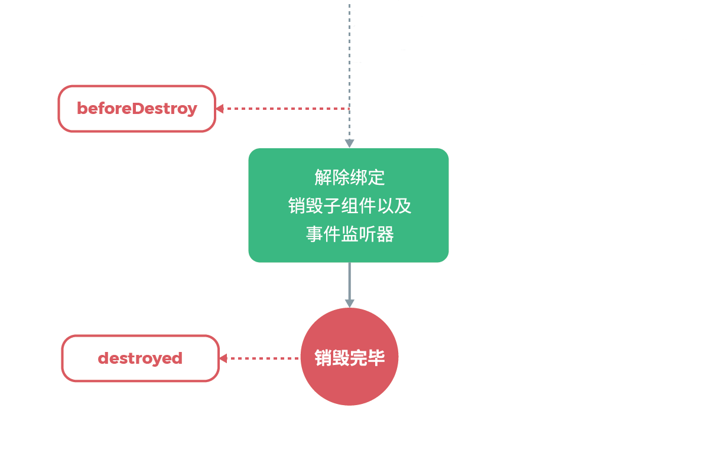

# Vue2.0源码阅读笔记（十二）：生命周期
&emsp;&emsp;在 Vue 中，除函数式组件外，所有组件都是 Vue 实例。每个 Vue 实例在被创建时都要经过一系列的初始化过程：数据监听、编译模板、将实例挂载到 DOM 并在数据变化时更新 DOM 等。<br/>
&emsp;&emsp;在生成 Vue 实例的过程中会运行一些叫做生命周期钩子的函数，这给了用户在不同阶段添加自己的代码的机会。本文从源码的角度来详细阐述组件生命周期的相关内容。<br/>
## 一、钩子函数的调用
&emsp;&emsp;生命周期钩子函数调用是通过 callHook 函数完成的，callHook 函数主要包含三个方面的内容。<br/>
```js
function callHook (vm, hook) {
  pushTarget()
  const handlers = vm.$options[hook]
  const info = `${hook} hook`
  if (handlers) {
    for (let i = 0, j = handlers.length; i < j; i++) {
      invokeWithErrorHandling(handlers[i], vm, null, vm, info)
    }
  }
  if (vm._hasHookEvent) {
    vm.$emit('hook:' + hook)
  }
  popTarget()
}
```
### 1、调用钩子函数
&emsp;&emsp;在生成 Vue 实例的过程中会调用 mergeOptions 函数对选项进行处理，生命周期钩子函数经过合并处理后会添加到实例对象的 $options 属性上，合并后各生命周期函数存储在对应的数组中。具体细节可参看文章[《选项合并》](https://juejin.im/post/5c8f60f8e51d45768a6e95f0#heading-0)。<br/>
&emsp;&emsp;callHook 函数调用的形式如下所示：<br/>
```js
// 调用 created 生命周期钩子函数
callHook(vm, 'created')
```
&emsp;&emsp;此时 callHook 函数会循环遍历执行 vm.$options.created 数组中的函数，以完成 created 生命周期钩子函数的调用。<br/>
### 2、防止收集冗余依赖
&emsp;&emsp;在函数首尾有如下代码：<br/>
```js
function callHook (vm, hook) {
  pushTarget()
  /* 省略... */
  popTarget()
}
```
&emsp;&emsp;这两个函数的源码如下所示：<br/>
```js
Dep.target = null
const targetStack = []

function pushTarget (target) {
  targetStack.push(target)
  Dep.target = target
}

function popTarget () {
  targetStack.pop()
  Dep.target = targetStack[targetStack.length - 1]
}
```
&emsp;&emsp;Vue 实例的当前观察者对象是唯一的，所谓当前观察者对象是指即将要收集依赖的目标，pushTarget 函数将观察者对象入栈而不是简单的赋值，是为了在当前观察者对象操作完成后恢复成之前的观察者对象。<br/>
&emsp;&emsp;在函数的首尾调用 pushTarget() 和 popTarget() 函数，是为了防止在执行生命周期钩子函数时收集冗余的依赖。具体详情可参看[《响应式原理》](https://juejin.im/post/5cb6ee28f265da03474df961#heading-10)。<br/>
### 3、hookEvent
&emsp;&emsp;在 callHook 函数中还有一部分代码：<br/>
```js
if (vm._hasHookEvent) {
  vm.$emit('hook:' + hook)
}
```
&emsp;&emsp;这行代码比较有意思，也就是说在执行生命周期钩子函数时，如果 vm._hasHookEvent 的值为 true，则会额外触发一个形如 hook:created 的事件。<br/>
&emsp;&emsp;那么什么时候实例的 _hasHookEvent 属性值为真呢？还记得在上篇文章讲解 $on 方式时有提过这点：<br/>
```js
const hookRE = /^hook:/
Vue.prototype.$on = function(event, fn){
  /* 省略... */
  if (hookRE.test(event)) {
    vm._hasHookEvent = true
  }
  /* 省略... */
}
```
&emsp;&emsp;上篇文章同时讲到，在组件上使用自定义指令最终会转化成调用 $on 的形式，也就是说按照以下使用就能命中这种情况：<br/>
```js
<Child @hook:created = "doSomething"></Child>
```
&emsp;&emsp;这种形式的事件称为 hookEvent，在官方文档上没有找到 hookEvent 的说明，但是在 Vue 源码中有实现。所谓 hookEvent 就是特殊命名的事件—— hook: + 生命周期名称。这种事件会在子组件对应生命周期钩子函数调用时被调用。<br/>
&emsp;&emsp;那 hookEvent 有什么用呢？其实在使用第三方组件的时候能够用到，使用 hookEvent 可以在不破坏第三方组件代码的前提下，向其注入生命周期函数。<br/>
## 二、组件的生命周期
&emsp;&emsp;关于组件实例的生命周期，官网上面有一张很经典的图片：<br/>

&emsp;&emsp;这张图片包含的信息较多，下面我们通过拆解这张图片来逐步讲解组件实例的生命周期。<br/>
### 1、beforeCreate和created

&emsp;&emsp;<br/>
```js
function Vue (options) {
  /* 省略警告信息 */
  this._init(options)
}
```
&emsp;&emsp;<br/>
```js
Vue.prototype._init = function (options) {
  const vm = this
  /*...*/
  if (options && options._isComponent) {
    initInternalComponent(vm, options)
  } else {
    vm.$options = mergeOptions(
      resolveConstructorOptions(vm.constructor),
      options || {},
      vm
    )
  }
  /*...*/
  initLifecycle(vm)
  initEvents(vm)
  initRender(vm)
  callHook(vm, 'beforeCreate')
  initInjections(vm)
  initState(vm)
  initProvide(vm)
  callHook(vm, 'created')
  /*...*/
  if (vm.$options.el) {
    vm.$mount(vm.$options.el)
  }
}
```
&emsp;&emsp;<br/>
&emsp;&emsp;<br/>
### 2、beforeMount和mounted
&emsp;&emsp;<br/>

&emsp;&emsp;<br/>
```js
const mount = Vue.prototype.$mount
Vue.prototype.$mount = function (el,hydrating){
  el = el && query(el)

  /* istanbul ignore if */
  if (el === document.body || el === document.documentElement) {
    process.env.NODE_ENV !== 'production' && warn(
      `Do not mount Vue to <html> or <body> - mount to normal elements instead.`
    )
    return this
  }

  const options = this.$options
  // resolve template/el and convert to render function
  if (!options.render) {
    let template = options.template
    if (template) {
      if (typeof template === 'string') {
        if (template.charAt(0) === '#') {
          template = idToTemplate(template)
          /* istanbul ignore if */
          if (process.env.NODE_ENV !== 'production' && !template) {
            warn(
              `Template element not found or is empty: ${options.template}`,
              this
            )
          }
        }
      } else if (template.nodeType) {
        template = template.innerHTML
      } else {
        if (process.env.NODE_ENV !== 'production') {
          warn('invalid template option:' + template, this)
        }
        return this
      }
    } else if (el) {
      template = getOuterHTML(el)
    }
    if (template) {
      /* istanbul ignore if */
      if (process.env.NODE_ENV !== 'production' && config.performance && mark) {
        mark('compile')
      }

      const { render, staticRenderFns } = compileToFunctions(template, {
        outputSourceRange: process.env.NODE_ENV !== 'production',
        shouldDecodeNewlines,
        shouldDecodeNewlinesForHref,
        delimiters: options.delimiters,
        comments: options.comments
      }, this)
      options.render = render
      options.staticRenderFns = staticRenderFns

      /* istanbul ignore if */
      if (process.env.NODE_ENV !== 'production' && config.performance && mark) {
        mark('compile end')
        measure(`vue ${this._name} compile`, 'compile', 'compile end')
      }
    }
  }
  return mount.call(this, el, hydrating)
}


Vue.prototype.$mount = function (el,hydrating){
  el = el && inBrowser ? query(el) : undefined
  return mountComponent(this, el, hydrating)
}


export function mountComponent (vm,el,hydrating){
  vm.$el = el
  if (!vm.$options.render) {
    vm.$options.render = createEmptyVNode
    if (process.env.NODE_ENV !== 'production') {
      /* istanbul ignore if */
      if ((vm.$options.template && vm.$options.template.charAt(0) !== '#') ||
        vm.$options.el || el) {
        warn(
          'You are using the runtime-only build of Vue where the template ' +
          'compiler is not available. Either pre-compile the templates into ' +
          'render functions, or use the compiler-included build.',
          vm
        )
      } else {
        warn(
          'Failed to mount component: template or render function not defined.',
          vm
        )
      }
    }
  }
  callHook(vm, 'beforeMount')

  let updateComponent
  /* 删除性能埋点相关 */
  updateComponent = () => {
    vm._update(vm._render(), hydrating)
  }

  new Watcher(vm, updateComponent, noop, {
    before () {
      if (vm._isMounted && !vm._isDestroyed) {
        callHook(vm, 'beforeUpdate')
      }
    }
  }, true /* isRenderWatcher */)
  hydrating = false

  if (vm.$vnode == null) {
    vm._isMounted = true
    callHook(vm, 'mounted')
  }
  return vm
}
```
&emsp;&emsp;<br/>
&emsp;&emsp;<br/>
### 3、beforeUpdate和updated
&emsp;&emsp;<br/>

&emsp;&emsp;<br/>
&emsp;&emsp;<br/>
### 4、beforeDestroy和destroyed
&emsp;&emsp;<br/>

&emsp;&emsp;<br/>
&emsp;&emsp;<br/>
## 三、keep-alive组件
&emsp;&emsp;<br/>
&emsp;&emsp;<br/>
&emsp;&emsp;<br/>
&emsp;&emsp;<br/>
&emsp;&emsp;<br/>
&emsp;&emsp;<br/>
## 四、捕获子孙组件错误
&emsp;&emsp;<br/>
&emsp;&emsp;<br/>
&emsp;&emsp;<br/>
&emsp;&emsp;<br/>
&emsp;&emsp;<br/>
&emsp;&emsp;<br/>
## 五、总结
&emsp;&emsp;<br/>
&emsp;&emsp;<br/>
&emsp;&emsp;<br/>
&emsp;&emsp;<br/>
&emsp;&emsp;<br/>
&emsp;&emsp;<br/>