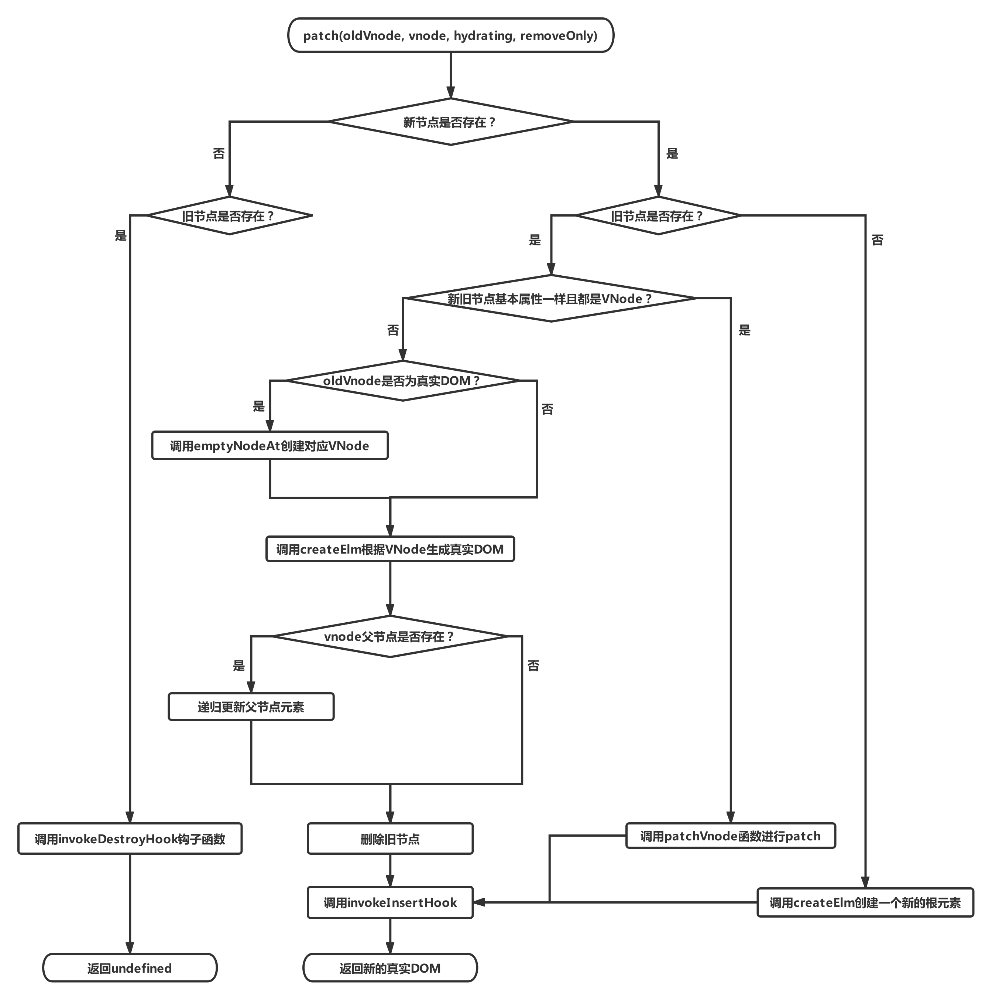

# Vue2.0源码阅读笔记（六）：Virtual DOM
&emsp;&emsp;<br/>
&emsp;&emsp;使用 Virtual DOM 的原因主要有两点：1、采取分层设计的思想，抽象渲染过程，使框架可以渲染到多个平台；2、比直接操作原生 DOM 性能更好。<br/>
## 一、挂载实例
&emsp;&emsp;*/src/core/instance/init.js*<br/>
```js
vm.$mount(vm.$options.el)
```
&emsp;&emsp;*vm.$mount* 方法在**只包含运行时**版本中是在 */src/platforms/web/runtime/index.js* 文件中添加到Vue原型的。<br/>
```js
Vue.prototype.$mount = function (el,hydrating) {
  el = el && inBrowser ? query(el) : undefined
  return mountComponent(this, el, hydrating)
}
```
&emsp;&emsp;而在**完整版**中，*vm.$mount* 方法是在 */src/platforms/web/entry-runtime-with-compiler.js* 文件中添加到Vue原型的。<br/>
```js
const mount = Vue.prototype.$mount
Vue.prototype.$mount = function (el,hydrating) {
  /**
   * 省略编译模板的代码...
   * 最终Vue实例vm的$options会添加两个属性：
   * 函数属性 render
   * 数组属性 staticRenderFns
  **/
  return mount.call(this, el, hydrating)
}
```
&emsp;&emsp;可以看到，完整版最终也是调用只包含运行时版本定义的 *$mount* 方法，只是在调用前将模板字符串编译渲染函数和静态根节点渲染函数而已。该方法主要功能就是调用 *mountComponent* 方法，*mountComponent* 定义在 */src/core/instance/lifecycle.js* 文件中。<br/>
```js
function mountComponent (vm,el,hydrating) {
  vm.$el = el
  /* 省略 render 函数不存在情况下的代码 */
  callHook(vm, 'beforeMount')

  let updateComponent
  /* 省略性能统计代码 */
  updateComponent = () => {
    vm._update(vm._render(), hydrating)
  }
  new Watcher(vm, updateComponent, noop, {
    before () {
      if (vm._isMounted && !vm._isDestroyed) {
        callHook(vm, 'beforeUpdate')
      }
    }
  }, true /* isRenderWatcher */)
  hydrating = false

  if (vm.$vnode == null) {
    vm._isMounted = true
    callHook(vm, 'mounted')
  }
  return vm
}
```
&emsp;&emsp;*mountComponent* 在实例挂载前调用生命周期 *beforeMount* 钩子函数数组中的函数，在实例挂载后调用生命周期 *mounted* 钩子函数数组中的函数。该方法核心代码是实例化一个渲染函数观察者对象，渲染函数观察者初次生成时与渲染函数中数据发生改变时均会调用 *updateComponent* 方法。<br/>
```js
updateComponent = () => {
  vm._update(vm._render(), hydrating)
}
```
&emsp;&emsp;*updateComponent* 方法完成了从渲染函数到生成真实DOM并挂载的过程：*_render* 方法的功能是根据渲染函数生成虚拟DOM；*_update* 方法在首次渲染时将虚拟DOM转化成真实DOM并挂载，在数据更新时对比虚拟DOM的变化来对真实DOM进行更新。<br/>
## 二、生成虚拟DOM
&emsp;&emsp;*_render* 方法根据渲染函数生成虚拟DOM，该方法定义在 *src/core/instance/render.js* 文件中。<br/>
```js
Vue.prototype._render = function () {
  const vm = this
  const { render, _parentVnode } = vm.$options
  /* 省略一些代码 */
  let vnode
  try {
    currentRenderingInstance = vm
    vnode = render.call(vm._renderProxy, vm.$createElement)
  } catch (e) {
    /* 省略异常处理代码 */
  } finally {
    currentRenderingInstance = null
  }
  /* 省略一些代码 */
  return vnode
}
```
&emsp;&emsp;*_render* 方法的核心代码为：<br/>
```js
vnode = render.call(vm._renderProxy, vm.$createElement)
```
&emsp;&emsp;在用户手写渲染函数时，会使用传入的 *vm.\$createElement* 函数。而根据上一篇文章 [《模板编译》](https://juejin.im/post/5d4135336fb9a06b160f094d) 可知，由模板编译而成的渲染函数是包裹在 *_c()* 函数中的。实际上*vm.\$createElement* 与 *_c()* 都是对 *createElement* 函数的调用。在 *src/core/instance/render.js* 文件的 *initRender* 函数中有如下代码：<br/>
```js
vm._c = (a, b, c, d) => createElement(vm, a, b, c, d, false)
vm.$createElement = (a, b, c, d) => createElement(vm, a, b, c, d, true)
```
&emsp;&emsp;在具体讲解生成虚拟DOM节点 VNode 的 *createElement*函数之前，先看一下 VNode 对象的格式与分类。<br/>
### 1、VNode
&emsp;&emsp;VNode 分为四种：组件类型、标签元素类型、注释类型、文本类型。还有一种克隆类型节点，是对这四种类型的复制，唯一的区别在于其 *isCloned* 属性为 *true*。关于组件类型的渲染会在下一篇文章《组件化》中详细介绍，本文会省略掉这一部分。<br/>
&emsp;&emsp;VNode 在 */src/core/vdom/vnode.js* 文件中定义。<br/>
```js
export default class VNode {
  constructor (tag,data,children,text,elm,context,componentOptions,asyncFactory) {
    this.tag = tag // 标签名
    this.data = data // 标签属性对象
    this.children = children // 子VNode数组
    this.text = text // 注释或文本节点的值
    this.elm = elm // 对真实DOM的引用
    this.ns = undefined // 命名空间
    this.context = context // 执行上下文
    this.fnContext = undefined
    this.fnOptions = undefined
    this.fnScopeId = undefined
    this.key = data && data.key // 节点key值，在diff算法中用于优化
    this.componentOptions = componentOptions
    this.componentInstance = undefined
    this.parent = undefined // 父节点
    this.raw = false // 是否为原始html
    this.isStatic = false // 是否为静态节点
    this.isRootInsert = true // 是否作为根节点插入
    this.isComment = false // 是否为注释节点
    this.isCloned = false // 是否为克隆节点
    this.isOnce = false // 是否使用了v-once指令
    this.asyncFactory = asyncFactory
    this.asyncMeta = undefined
    this.isAsyncPlaceholder = false
  }

  get child () {
    return this.componentInstance
  }
}
```
&emsp;&emsp;VNode 的对象上属性很多，各属性的作用可参看注释所说，这里说一下各种类型 VNode 对象的必要属性。<br/>
```js
/* 注释类型 */
emptyVNode = {
  tag: undefined,
  data: undefined,
  children: undefined,
  text: "注释内容",
  isComment: true
}
/* 文本类型 */
textVNode = {
  tag: undefined,
  data: undefined,
  children: undefined,
  text: "文本内容",
  isComment: false
}
/* 标签类型 */
tagVNode = {
  tag: "标签名",
  data: {/* 包含标签属性的对象 */},
  children: [/* 存放子 VNode 的数组 */]
}
```
### 2、createElement
&emsp;&emsp;*createElement* 函数定义在 */src/core/vdom/create-element.js* 文件中。<br/>
```js
function createElement (context,tag,data,children,normalizationType,alwaysNormalize) {
  if (Array.isArray(data) || isPrimitive(data)) {
    normalizationType = children
    children = data
    data = undefined
  }
  if (isTrue(alwaysNormalize)) {
    normalizationType = ALWAYS_NORMALIZE
  }
  return _createElement(context, tag, data, children, normalizationType)
}
```
&emsp;&emsp;*createElement* 在参数处理后调用 *_createElement*函数，*_createElement* 代码如下：<br/>
```js
function _createElement (context,tag,data,children,normalizationType) {
  /* 省略一些代码 */
  if (normalizationType === ALWAYS_NORMALIZE) {
    children = normalizeChildren(children)
  } else if (normalizationType === SIMPLE_NORMALIZE) {
    children = simpleNormalizeChildren(children)
  }
  let vnode, ns
  if (typeof tag === 'string') {
    let Ctor
    ns = (context.$vnode && context.$vnode.ns) || config.getTagNamespace(tag)
    if (config.isReservedTag(tag)) {
      if (process.env.NODE_ENV !== 'production' && isDef(data) && isDef(data.nativeOn)) {
        warn(
          `The .native modifier for v-on is only valid on components but it was used on <${tag}>.`,
          context
        )
      }
      vnode = new VNode(config.parsePlatformTagName(tag), data, children,undefined, undefined, context)
    } else if ((!data || !data.pre) && isDef(Ctor = resolveAsset(context.$options,'components', tag))) {
      vnode = createComponent(Ctor, data, context, children, tag)
    } else {
      vnode = new VNode(tag, data, children,undefined, undefined, context)
    }
  } else {
    vnode = createComponent(tag, data, context, children)
  }
  if (Array.isArray(vnode)) { return vnode}
  else if (isDef(vnode)) {
    if (isDef(ns)) applyNS(vnode, ns)
    if (isDef(data)) registerDeepBindings(data)
    return vnode
  } else {
    return createEmptyVNode()
  }
}
```
&emsp;&emsp;*_createElement*函数首先会做处理一些错误情况，比如属性对象是响应式的、存在不是基础类型的属性等。函数的核心功能有两点：<br/>
>1、规范化 children 属性。<br/>
>2、根据 tag 值的具体情况，生成对应的 VNode。<br/>

&emsp;&emsp;*children* 规范化有以下三种情况：<br/>
>1、渲染函数 *render* 是经过编译产生的，调用 *simpleNormalizeChildren* 处理。<br/>
>2、编译\<template\>、\<slot\>、v-for等产生嵌套数组时，调用 *normalizeChildren* 处理。<br/>
>3、在用户手写渲染函数时，调用 *normalizeChildren* 处理。<br/>

&emsp;&emsp;在渲染函数由编译生成的时，*simpleNormalizeChildren* 函数主要是处理函数式组件返回的是一个数组而不是根节点的情况，处理方式是将 *children* 调整为只有一层深度的数组。<br/>
```js
function simpleNormalizeChildren (children) {
  for (let i = 0; i < children.length; i++) {
    if (Array.isArray(children[i])) {
      return Array.prototype.concat.apply([], children)
    }
  }
  return children
}
```
&emsp;&emsp;*normalizeChildren* 函数在用户输入基本类型时，会将其转变成文本类型VNode。存在嵌套数组时，会调用 *normalizeArrayChildren* 函数。该函数会递归处理嵌套节点，最终生成VNode类型的数组。<br/>
```js
function normalizeChildren (children) {
  return isPrimitive(children)
    ? [createTextVNode(children)]
    : Array.isArray(children)
      ? normalizeArrayChildren(children)
      : undefined
}
```
&emsp;&emsp;在根据 *tag* 值生成对应的 VNode 的过程中，首先判断 *tag* 是否为字符串，若不是字符串，则调用 *createComponent* 函数生成组件 VNode。<br/>
&emsp;&emsp;*tag* 值是字符串又分为三种情况：<br/>
>1、如果是保留标签，首先在事件修饰符.native使用到非组件上时发出警告，然后生成标签VNode。<br/>
>2、如果是已经注册的标签名，则调用 *createComponent* 函数生成组件 VNode。<br/>
>3、如果标签未知，直接生成一个标签 VNode。<br/>
### 3、其它渲染帮助函数
&emsp;&emsp;由 [《模板编译》](https://juejin.im/post/5d4135336fb9a06b160f094d) 可知，模板编译之后的渲染函数中除了 *_C()* 之外还有一些内部函数。各种帮助渲染的内部函数如下所示：<br/>
```js
function installRenderHelpers (target) {
  target._o = markOnce
  target._n = toNumber
  target._s = toString
  target._l = renderList
  target._t = renderSlot
  target._q = looseEqual
  target._i = looseIndexOf
  target._m = renderStatic
  target._f = resolveFilter
  target._k = checkKeyCodes
  target._b = bindObjectProps
  target._v = createTextVNode
  target._e = createEmptyVNode
  target._u = resolveScopedSlots
  target._g = bindObjectListeners
  target._d = bindDynamicKeys
  target._p = prependModifier
}
```
&emsp;&emsp;依旧使用 [《模板编译》](https://juejin.im/post/5d4135336fb9a06b160f094d) 中的例子，模板字符串如下所示：<br/>
```html
  <div id="app" class="home" @click="showTitle">
    <div class="title">标题：{{title}}。</div>
    <div class="content">
      <span>456</span>
    </div>
  </div>
```
&emsp;&emsp;经过编译后生成的渲染函数以及静态根节点渲染函数数组如下所示：<br/>
```js
// 渲染函数
render = function() {
  with(this){
    return _c(
      'div',
      {
        staticClass:"home",
        attrs:{"id":"app"},
        on:{"click":showTitle}
      },
      [
        _c(
          'div',
          {staticClass:"title"},
          [_v("标题："+_s(title)+"。")]
        ),
        _v(" "),
        _m(0)
      ]
    )
  }
}

// 静态根节点渲染函数数组
staticRenderFns: [
  function() {
    with(this){
      return _c(
        'div',
        {staticClass:"content"},
        [
          _c(
            'span',
            [
              _v("456")
            ]
          )
        ]
      )
    }
  }
]
```
&emsp;&emsp;先讲解这里遇到的几个常规的内部函数：*_s()*、*_v()*、*_m()*，其余的比如循环列表的帮助渲染函数 *_l()* 等在讲解具体指令时详细阐述。<br/>
&emsp;&emsp;*_s()* 的作用是读取变量的字符串形式。如果变量为空，则返回空字符串；变量如果是数组或者纯对象，则调用 *JSON.stringify()* 方法处理；否则直接使用 *String()* 进行处理。<br/>
```js
export function toString (val) {
  return val == null
    ? ''
    : Array.isArray(val) || (isPlainObject(val) && val.toString === _toString)
      ? JSON.stringify(val, null, 2)
      : String(val)
}
```
&emsp;&emsp;*_v()* 的作用是创建文本类型VNode，该VNode的 *text* 属性为 *_v()* 参数的字符串形式。<br/>
```js
function createTextVNode (val) {
  return new VNode(undefined, undefined, undefined, String(val))
}
```
&emsp;&emsp;*_m()* 的作用是处理静态根节点，可以看到在渲染函数 *render* 中并不包含静态根节点的渲染函数，而是在对应位置放置 *_m()* 函数。*_m()* 的第一个参数是当前静态根节点渲染函数在 *staticRenderFns* 数组中的下标。<br/>
```js
function renderStatic (index,isInFor) {
  const cached = this._staticTrees || (this._staticTrees = [])
  let tree = cached[index]
  if (tree && !isInFor) { return tree }
  tree = cached[index] = this.$options.staticRenderFns[index].call(
    this._renderProxy, null, this
  )
  markStatic(tree, `__static__${index}`, false)
  return tree
}
```
&emsp;&emsp;*renderStatic* 函数的主要是一个缓存的功能，静态根节点渲染函数只需要渲染一次，然后存储到变量 *cached* 中，下次使用直接读取即可。静态根节点生成的VNode 的 *isStatic* 属性值为 *true*，*key* 属性值为 *\_\_static\_\_* 与 下标拼接的字符串。<br/>
## 三、生成真实DOM
&emsp;&emsp;*_update* 函数在初始渲染时根据虚拟DOM生成真实DOM、在数据改变时根据虚拟DOM调整真实DOM。<br/>
### 1、_update函数
&emsp;&emsp;*_update* 函数定义在 */src/core/instance/lifecycle.js* 文件中，代码如下所示：<br/>
```js
Vue.prototype._update = function (vnode, hydrating) {
    const vm = this
    const prevEl = vm.$el
    const prevVnode = vm._vnode
    const restoreActiveInstance = setActiveInstance(vm)
    vm._vnode = vnode
    if (!prevVnode) {
      vm.$el = vm.__patch__(vm.$el, vnode, hydrating, false)
    } else {
      vm.$el = vm.__patch__(prevVnode, vnode)
    }
    restoreActiveInstance()
    if (prevEl) { prevEl.__vue__ = null }
    if (vm.$el) { vm.$el.__vue__ = vm }
    if (vm.$vnode && vm.$parent && vm.$vnode === vm.$parent._vnode) {
      vm.$parent.$el = vm.$el
    }
  }
```
&emsp;&emsp;*_update* 方法的核心是对 *\_\_patch\_\_* 方法的调用，该方法在不同平台下的实现不同，在服务器端由于没有DOM，该方法为空。在web平台下，该方法在 */src/platforms/web/runtime/patch.js* 中定义。<br/>
```js
export const patch = createPatchFunction({ nodeOps, modules })
```
&emsp;&emsp;可以看到 *patch* 方法是向 *createPatchFunction* 中传入配置参数生成的。*createPatchFunction* 在 */src/core/vdom/patch.js* 中定义，返回值即为真正的 *patch* 方法。<br/>
&emsp;&emsp;另外，函数里使用的 *\$el* 都是真实的DOM，Vue原型上的 *\$mount* 方法中有如下代码：<br/>
```js
el = el ? query(el) : undefined;
```
&emsp;&emsp;*query* 函数根据 *el* 查找DOM元素，如果不存在则创建一个新的 *div* 元素，代码如下所示：<br/>
```js
function query (el) {
  if (typeof el === 'string') {
    var selected = document.querySelector(el);
    if (!selected) {
      warn('Cannot find element: ' + el);
      return document.createElement('div')
    }
    return selected
  } else { return el }
}
```
### 2、patch函数
&emsp;&emsp;*patch* 函数代码如下所示：<br/>
```js
function patch (oldVnode, vnode, hydrating, removeOnly) {
  if (isUndef(vnode)) {
    if (isDef(oldVnode)) invokeDestroyHook(oldVnode)
    return
  }
  let isInitialPatch = false
  const insertedVnodeQueue = []

  if (isUndef(oldVnode)) {
    isInitialPatch = true
    createElm(vnode, insertedVnodeQueue)
  } else {
    const isRealElement = isDef(oldVnode.nodeType)
    if (!isRealElement && sameVnode(oldVnode, vnode)) {
      patchVnode(oldVnode, vnode, insertedVnodeQueue, null, null, removeOnly)
    } else {
      if (isRealElement) {
        /* 省略与SSR有关的部分代码 */
        oldVnode = emptyNodeAt(oldVnode)
      }
      const oldElm = oldVnode.elm
      const parentElm = nodeOps.parentNode(oldElm)
      createElm(vnode,insertedVnodeQueue,
        oldElm._leaveCb ? null : parentElm,
        nodeOps.nextSibling(oldElm)
      )
      /* 省略递归更新父占位符节点元素的代码 */
      if (isDef(parentElm)) {
        removeVnodes([oldVnode], 0, 0)
      } else if (isDef(oldVnode.tag)) {
        invokeDestroyHook(oldVnode)
      }
    }
  }
  invokeInsertHook(vnode, insertedVnodeQueue, isInitialPatch)
  return vnode.elm
}
```
&emsp;&emsp;函数逻辑如图所示：<br/>

&emsp;&emsp;首先逐个讲解 *patch* 中调用的函数，然后阐述整体逻辑。<br/>
#### （一）、invokeDestroyHook
&emsp;&emsp;*invokeDestroyHook* 是在销毁节点之前调用的，代码如下：<br/>
```js
function invokeDestroyHook (vnode) {
  let i, j
  const data = vnode.data
  if (isDef(data)) {
    if (isDef(i = data.hook) && isDef(i = i.destroy)) i(vnode)
    for (i = 0; i < cbs.destroy.length; ++i) cbs.destroy[i](vnode)
  }
  if (isDef(i = vnode.children)) {
    for (j = 0; j < vnode.children.length; ++j) {
      invokeDestroyHook(vnode.children[j])
    }
  }
}
```
&emsp;&emsp;如果待销毁节点的 *vnode.data.hook.destroy* 方法存在，则调用该方法。否则循环调用 *cbs.destroy* 数组中的函数，该函数数组默认为：<br/>
```js
cbs.destroy = [
  function destroy (vnode) {
    registerRef(vnode, true);
  },
  function unbindDirectives (vnode) {
    updateDirectives(vnode, emptyNode);
  }
]
```
&emsp;&emsp;函数 *registerRef* 在第二个参数为 *false* 时，功能是注册 *ref*，即将父组件的 *vm.$refs.ref* 的值指向子组件真实DOM，其中 *ref* 的值为 VNode data对象中的 *ref* 属性；在第二个参数为 *true* 时，表示解除 *vm.$refs.ref* 对子组件真实DOM的引用。第二种情况下的代码如下所示：<br/>
```js
function registerRef (vnode, isRemoval) {
  var key = vnode.data.ref;
  if (!isDef(key)) { return }
  var vm = vnode.context;
  var ref = vnode.componentInstance || vnode.elm;
  var refs = vm.$refs;
  if (isRemoval) {
    if (Array.isArray(refs[key])) {
      remove(refs[key], ref);
    } else if (refs[key] === ref) {
      refs[key] = undefined;
    }
  }/* 省略一些代码 */
}
```
&emsp;&emsp;函数 *updateDirectives* 的功能是在DOM更新时触发自定义指令上的钩子函数。在与元素解绑时调用 *unbind* 钩子函数，相关代码如下：<br/>
```js
function updateDirectives (oldVnode, vnode) {
  if (oldVnode.data.directives || vnode.data.directives) {
    _update(oldVnode, vnode);
  }
}

function _update (oldVnode, vnode) {
  var isCreate = oldVnode === emptyNode;
  var isDestroy = vnode === emptyNode;
  var oldDirs = normalizeDirectives(oldVnode.data.directives, oldVnode.context);
  var newDirs = normalizeDirectives(vnode.data.directives, vnode.context);
  /* 省略一些代码 */
  if (!isCreate) {
    for (key in oldDirs) {
      if (!newDirs[key]) {
        callHook(oldDirs[key], 'unbind', oldVnode, oldVnode, isDestroy);
      }
    }
  }
}
```
&emsp;&emsp;如果该节点存在子节点，则各个子节点递归调用 *invokeDestroyHook* 函数处理。<br/>
&emsp;&emsp;总之，invokeDestroyHook 函数的作用有以下三点：
> 1、如果 *vnode.data.hook.destroy* 函数存在，则调用该函数。<br/>
> 2、解除父组件 *$refs.ref* 对要删除真实节点的引用。<br/>
> 3、自定义指令存在时，调用 *unbind* 钩子函数<br/>
#### （二）、createElm
&emsp;&emsp;*createElm* 函数主要作用是根据VNode创建真实DOM，并传入到正确的位置，代码如下：<br/>
```js
function createElm (vnode,insertedVnodeQueue,parentElm,refElm,nested,ownerArray,index) {
  /* 省略一些代码 */
  if (createComponent(vnode, insertedVnodeQueue, parentElm, refElm)) {
    return
  }

  const data = vnode.data
  const children = vnode.children
  const tag = vnode.tag
  if (isDef(tag)) {
    /* 省略一些代码 */
    vnode.elm = vnode.ns
      ? nodeOps.createElementNS(vnode.ns, tag)
      : nodeOps.createElement(tag, vnode)
    setScope(vnode)

    if (__WEEX__) {
      /* 省略一些代码 */
    } else {
      createChildren(vnode, children, insertedVnodeQueue)
      if (isDef(data)) {
        invokeCreateHooks(vnode, insertedVnodeQueue)
      }
      insert(parentElm, vnode.elm, refElm)
    }
    /* 省略一些代码 */
  } else if (isTrue(vnode.isComment)) {
    vnode.elm = nodeOps.createComment(vnode.text)
    insert(parentElm, vnode.elm, refElm)
  } else {
    vnode.elm = nodeOps.createTextNode(vnode.text)
    insert(parentElm, vnode.elm, refElm)
  }
}
```
&emsp;&emsp;*createElm* 函数的基本逻辑如下：<br/>
> 1、VNode是组件类型，调用 *createComponent* 函数处理。<br/>
> 2、VNode是标签类型，ns属性若存在，调用 *createElementNS*，否则调用 *createElement* 处理。经过一系列处理后，调用 *insert* 将真实DOM插入正确位置。<br/>
> 3、VNode是注释类型，调用 *createComment* 函数处理，然后调用 *insert* 将真实DOM插入正确位置。<br/>
> 4、VNode是文本类型，调用 *createTextNode* 函数处理，然后调用 *insert* 将真实DOM插入正确位置。<br/>

&emsp;&emsp;创建标签类型真实DOM若 *ns* 属性则调用 *createElementNS*函数，否则调用 *createElement* 函数进行处理。实质分别是对 *document.createElementNS* 与 *document.createElement* 方法的调用。<br/>
```js
function createElementNS (namespace, tagName) {
  return document.createElementNS(namespaceMap[namespace], tagName)
}

function createElement (tagName, vnode) {
  var elm = document.createElement(tagName);
  if (tagName !== 'select') { return elm }
  if (vnode.data && vnode.data.attrs && vnode.data.attrs.multiple !== undefined) {
    elm.setAttribute('multiple', 'multiple');
  }
  return elm
}
```
&emsp;&emsp;接着通过 *setScope* 函数设置作用域CSS的作用域id属性，这是作为一种特殊情况实现的，以避免通过常规属性 *patch* 过程的开销。<br/>
&emsp;&emsp;然后调用 *createChildren* 函数创建该DOM的子节点， *createChildren* 在 *children* 属性为数组时，递归调用 *createElm* 方法创建真实节点。如果是一个基本类型，则使用 *text* 属性值创建一个文本类型的真实节点，并将其通过真实DOM上的 *appendChild* 方法作为子节点添加。<br/>
```js
function createChildren (vnode, children, insertedVnodeQueue) {
  if (Array.isArray(children)) {
    {
      checkDuplicateKeys(children);
    }
    for (var i = 0; i < children.length; ++i) {
      createElm(children[i], insertedVnodeQueue, vnode.elm, null, true, children, i);
    }
  } else if (isPrimitive(vnode.text)) {
    nodeOps.appendChild(vnode.elm, nodeOps.createTextNode(String(vnode.text)));
  }
}
```
&emsp;&emsp;<br/>
#### （三）、patchVnode
&emsp;&emsp;<br/>
&emsp;&emsp;<br/>
#### （四）、removeVnodes
&emsp;&emsp;<br/>
&emsp;&emsp;<br/>
#### （五）、invokeInsertHook
&emsp;&emsp;<br/>
&emsp;&emsp;<br/>
&emsp;&emsp;<br/>
#### （六）、小结
&emsp;&emsp;<br/>
&emsp;&emsp;<br/>
&emsp;&emsp;<br/>
## 四、diff算法
&emsp;&emsp;<br/>
&emsp;&emsp;<br/>
## 五、总结
&emsp;&emsp;<br/>
&emsp;&emsp;<br/>