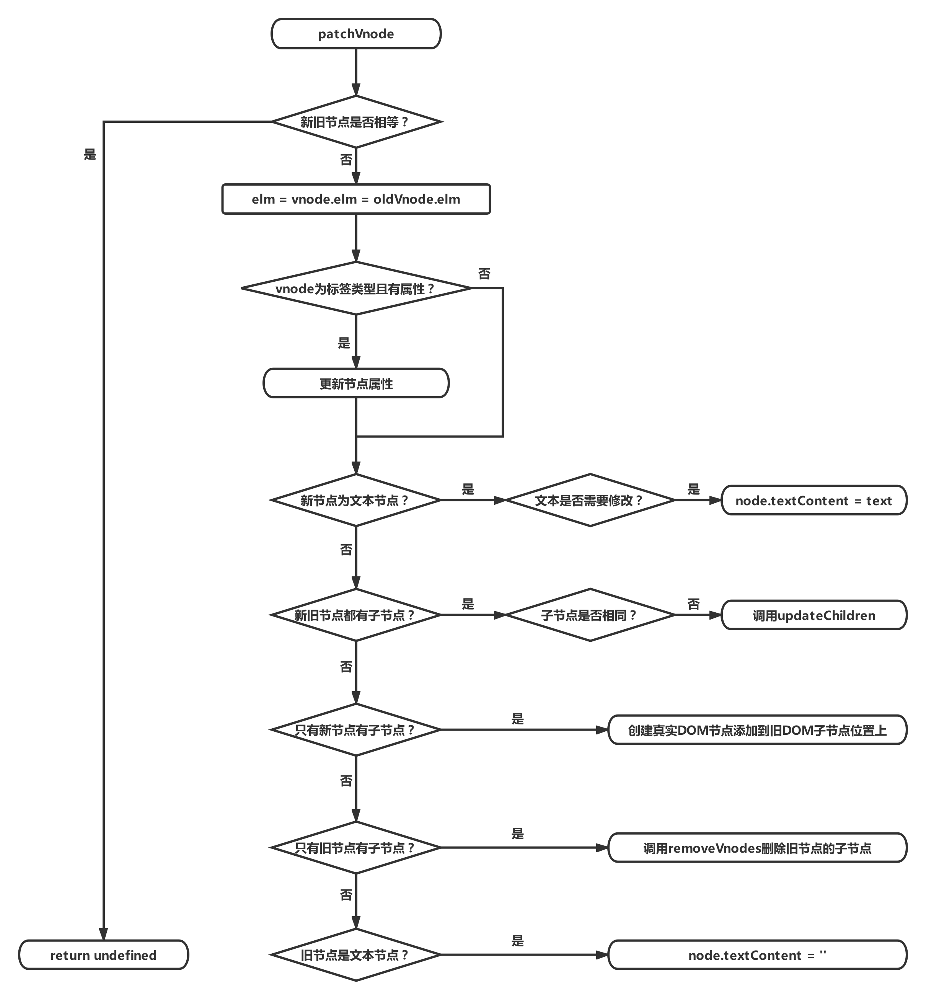
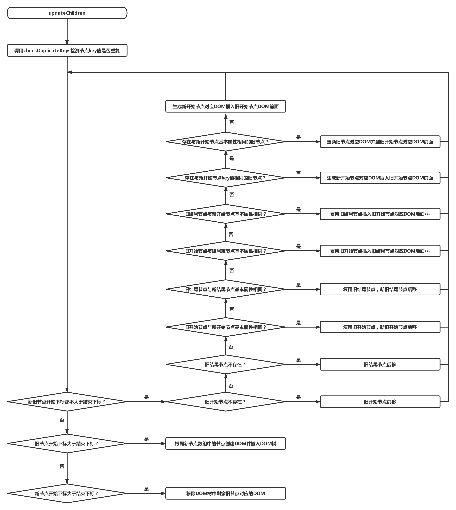
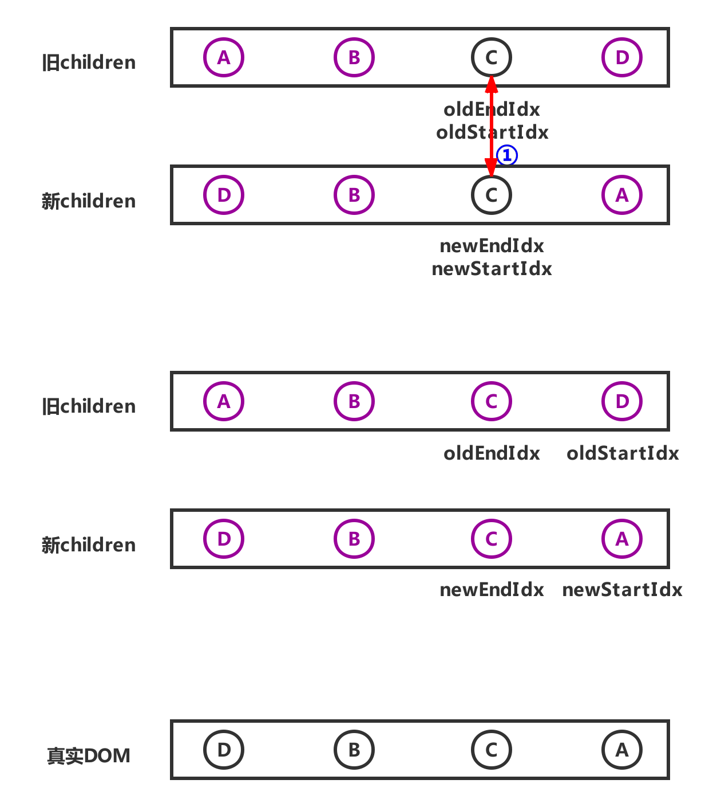

# Vue2.0源码阅读笔记（六）：Virtual DOM
&emsp;&emsp;Vue2.0 与 Vue1.0最大的区别就是使用了 Virtual DOM 。使用虚拟DOM的好处主要有两点：<br/>
> 1、采取分层设计的思想，抽象渲染过程，使框架可以渲染到多个平台。<br/>
> 1、很多时候使用虚拟DOM性能不是最好，但是能在性能和可维护性之间达到一个平衡。<br/>

&emsp;&emsp;在具体介绍虚拟DOM之前，先找到DOM挂载方法的位置与生成的过程。<br/>
## 一、DOM挂载方法
&emsp;&emsp;Vue的DOM挂载是在一系列初始化之后进行的，初始化方法 *\_init* 定义在 */src/core/instance/init.js* 中，在 *\_init* 方法最后调用挂载方法。<br/>
```js
vm.$mount(vm.$options.el)
```
&emsp;&emsp;*vm.$mount* 方法在**只包含运行时**版本中是在 */src/platforms/web/runtime/index.js* 文件中添加到Vue原型的。<br/>
```js
Vue.prototype.$mount = function (el,hydrating) {
  el = el && inBrowser ? query(el) : undefined
  return mountComponent(this, el, hydrating)
}
```
&emsp;&emsp;而在**完整版**中，*vm.$mount* 方法是在 */src/platforms/web/entry-runtime-with-compiler.js* 文件中添加到Vue原型的。<br/>
```js
const mount = Vue.prototype.$mount
Vue.prototype.$mount = function (el,hydrating) {
  /**
   * 省略编译模板的代码...
   * 最终Vue实例vm的$options会添加两个属性：
   * 函数属性 render
   * 数组属性 staticRenderFns
  **/
  return mount.call(this, el, hydrating)
}
```
&emsp;&emsp;可以看到，完整版最终也是调用只包含运行时版本定义的 *$mount* 方法，只是在调用前将模板字符串编译渲染函数和静态根节点渲染函数而已。该方法主要功能就是调用 *mountComponent* 方法，*mountComponent* 定义在 */src/core/instance/lifecycle.js* 文件中。<br/>
```js
function mountComponent (vm,el,hydrating) {
  vm.$el = el
  /* 省略 render 函数不存在情况下的代码 */
  callHook(vm, 'beforeMount')

  let updateComponent
  /* 省略性能统计代码 */
  updateComponent = () => {
    vm._update(vm._render(), hydrating)
  }
  new Watcher(vm, updateComponent, noop, {
    before () {
      if (vm._isMounted && !vm._isDestroyed) {
        callHook(vm, 'beforeUpdate')
      }
    }
  }, true /* isRenderWatcher */)
  hydrating = false

  if (vm.$vnode == null) {
    vm._isMounted = true
    callHook(vm, 'mounted')
  }
  return vm
}
```
&emsp;&emsp;*mountComponent* 在实例挂载前调用生命周期 *beforeMount* 钩子函数数组中的函数，在实例挂载后调用生命周期 *mounted* 钩子函数数组中的函数。该方法核心代码是实例化一个渲染函数观察者对象，渲染函数观察者初次生成时与渲染函数中数据发生改变时均会调用 *updateComponent* 方法。<br/>
```js
updateComponent = () => {
  vm._update(vm._render(), hydrating)
}
```
&emsp;&emsp;*updateComponent* 方法完成了从渲染函数到生成真实DOM并挂载的过程：*_render* 方法的功能是根据渲染函数生成虚拟DOM；*_update* 方法在首次渲染时将虚拟DOM转化成真实DOM并挂载，在数据更新时对比虚拟DOM的变化来对真实DOM进行更新。<br/>
## 二、生成虚拟DOM
&emsp;&emsp;*_render* 方法根据渲染函数生成虚拟DOM，该方法定义在 *src/core/instance/render.js* 文件中。<br/>
```js
Vue.prototype._render = function () {
  const vm = this
  const { render, _parentVnode } = vm.$options
  /* 省略一些代码 */
  let vnode
  try {
    currentRenderingInstance = vm
    vnode = render.call(vm._renderProxy, vm.$createElement)
  } catch (e) {
    /* 省略异常处理代码 */
  } finally {
    currentRenderingInstance = null
  }
  /* 省略一些代码 */
  return vnode
}
```
&emsp;&emsp;*_render* 方法的核心代码为：<br/>
```js
vnode = render.call(vm._renderProxy, vm.$createElement)
```
&emsp;&emsp;在用户手写渲染函数时，会使用传入的 *vm.\$createElement* 函数。而根据上一篇文章 [《模板编译》](https://juejin.im/post/5d4135336fb9a06b160f094d) 可知，由模板编译而成的渲染函数是包裹在 *_c()* 函数中的。实际上*vm.\$createElement* 与 *_c()* 都是对 *createElement* 函数的调用。在 *src/core/instance/render.js* 文件的 *initRender* 函数中有如下代码：<br/>
```js
vm._c = (a, b, c, d) => createElement(vm, a, b, c, d, false)
vm.$createElement = (a, b, c, d) => createElement(vm, a, b, c, d, true)
```
&emsp;&emsp;在具体讲解生成虚拟DOM节点 VNode 的 *createElement*函数之前，先看一下 VNode 对象的格式与分类。<br/>
### 1、VNode
&emsp;&emsp;VNode 分为四种：组件类型、标签元素类型、注释类型、文本类型。还有一种克隆类型节点，是对这四种类型的复制，唯一的区别在于其 *isCloned* 属性为 *true*。关于组件类型的渲染会在下一篇文章《组件化》中详细介绍，本文会省略掉这一部分。<br/>
&emsp;&emsp;VNode 在 */src/core/vdom/vnode.js* 文件中定义。<br/>
```js
export default class VNode {
  constructor (tag,data,children,text,elm,context,componentOptions,asyncFactory) {
    this.tag = tag // 标签名
    this.data = data // 标签属性对象
    this.children = children // 子VNode数组
    this.text = text // 注释或文本节点的值
    this.elm = elm // 对真实DOM的引用
    this.ns = undefined // 命名空间
    this.context = context // 执行上下文
    this.fnContext = undefined
    this.fnOptions = undefined
    this.fnScopeId = undefined
    this.key = data && data.key // 节点key值，在diff算法中作用节点复用的依据
    this.componentOptions = componentOptions
    this.componentInstance = undefined
    this.parent = undefined // 父节点
    this.raw = false // 是否为原始html
    this.isStatic = false // 是否为静态节点
    this.isRootInsert = true // 是否作为根节点插入
    this.isComment = false // 是否为注释节点
    this.isCloned = false // 是否为克隆节点
    this.isOnce = false // 是否使用了v-once指令
    this.asyncFactory = asyncFactory
    this.asyncMeta = undefined
    this.isAsyncPlaceholder = false
  }

  get child () {
    return this.componentInstance
  }
}
```
&emsp;&emsp;VNode 的对象上属性很多，各属性的作用可参看注释所说，这里说一下各种类型 VNode 对象的必要属性。<br/>
```js
/* 注释类型 */
emptyVNode = {
  tag: undefined,
  data: undefined,
  children: undefined,
  text: "注释内容",
  isComment: true
}
/* 文本类型 */
textVNode = {
  tag: undefined,
  data: undefined,
  children: undefined,
  text: "文本内容",
  isComment: false
}
/* 标签类型 */
tagVNode = {
  tag: "标签名",
  data: {/* 包含标签属性的对象 */},
  children: [/* 存放子 VNode 的数组 */]
}
```
### 2、createElement
&emsp;&emsp;*createElement* 函数定义在 */src/core/vdom/create-element.js* 文件中。<br/>
```js
function createElement (context,tag,data,children,normalizationType,alwaysNormalize) {
  if (Array.isArray(data) || isPrimitive(data)) {
    normalizationType = children
    children = data
    data = undefined
  }
  if (isTrue(alwaysNormalize)) {
    normalizationType = ALWAYS_NORMALIZE
  }
  return _createElement(context, tag, data, children, normalizationType)
}
```
&emsp;&emsp;*createElement* 在参数处理后调用 *_createElement*函数，*_createElement* 代码如下：<br/>
```js
function _createElement (context,tag,data,children,normalizationType) {
  /* 省略一些代码 */
  if (normalizationType === ALWAYS_NORMALIZE) {
    children = normalizeChildren(children)
  } else if (normalizationType === SIMPLE_NORMALIZE) {
    children = simpleNormalizeChildren(children)
  }
  let vnode, ns
  if (typeof tag === 'string') {
    let Ctor
    ns = (context.$vnode && context.$vnode.ns) || config.getTagNamespace(tag)
    if (config.isReservedTag(tag)) {
      if (process.env.NODE_ENV !== 'production' && isDef(data) && isDef(data.nativeOn)) {
        warn(
          `The .native modifier for v-on is only valid on components but it was used on <${tag}>.`,
          context
        )
      }
      vnode = new VNode(config.parsePlatformTagName(tag), data, children,undefined, undefined, context)
    } else if ((!data || !data.pre) && isDef(Ctor = resolveAsset(context.$options,'components', tag))) {
      vnode = createComponent(Ctor, data, context, children, tag)
    } else {
      vnode = new VNode(tag, data, children,undefined, undefined, context)
    }
  } else {
    vnode = createComponent(tag, data, context, children)
  }
  if (Array.isArray(vnode)) { return vnode}
  else if (isDef(vnode)) {
    if (isDef(ns)) applyNS(vnode, ns)
    if (isDef(data)) registerDeepBindings(data)
    return vnode
  } else {
    return createEmptyVNode()
  }
}
```
&emsp;&emsp;*_createElement*函数首先会做处理一些错误情况，比如属性对象是响应式的、存在不是基础类型的属性等。函数的核心功能有两点：<br/>
>1、规范化 children 属性。<br/>
>2、根据 tag 值的具体情况，生成对应的 VNode。<br/>

&emsp;&emsp;*children* 规范化有以下三种情况：<br/>
>1、渲染函数 *render* 是经过编译产生的，调用 *simpleNormalizeChildren* 处理。<br/>
>2、编译\<template\>、\<slot\>、v-for等产生嵌套数组时，调用 *normalizeChildren* 处理。<br/>
>3、在用户手写渲染函数时，调用 *normalizeChildren* 处理。<br/>

&emsp;&emsp;在渲染函数由编译生成的时，*simpleNormalizeChildren* 函数主要是处理函数式组件返回的是一个数组而不是根节点的情况，处理方式是将 *children* 调整为只有一层深度的数组。<br/>
```js
function simpleNormalizeChildren (children) {
  for (let i = 0; i < children.length; i++) {
    if (Array.isArray(children[i])) {
      return Array.prototype.concat.apply([], children)
    }
  }
  return children
}
```
&emsp;&emsp;*normalizeChildren* 函数在用户输入基本类型时，会将其转变成文本类型VNode。存在嵌套数组时，会调用 *normalizeArrayChildren* 函数。该函数会递归处理嵌套节点，最终生成VNode类型的数组。<br/>
```js
function normalizeChildren (children) {
  return isPrimitive(children)
    ? [createTextVNode(children)]
    : Array.isArray(children)
      ? normalizeArrayChildren(children)
      : undefined
}
```
&emsp;&emsp;在根据 *tag* 值生成对应的 VNode 的过程中，首先判断 *tag* 是否为字符串，若不是字符串，则调用 *createComponent* 函数生成组件 VNode。<br/>
&emsp;&emsp;*tag* 值是字符串又分为三种情况：<br/>
>1、如果是保留标签，首先在事件修饰符.native使用到非组件上时发出警告，然后生成标签VNode。<br/>
>2、如果是已经注册的标签名，则调用 *createComponent* 函数生成组件 VNode。<br/>
>3、如果标签未知，直接生成一个标签 VNode。<br/>
### 3、其它渲染帮助函数
&emsp;&emsp;由 [《模板编译》](https://juejin.im/post/5d4135336fb9a06b160f094d) 可知，模板编译之后的渲染函数中除了 *_c()* 之外还有一些内部函数。各种帮助渲染的内部函数如下所示：<br/>
```js
function installRenderHelpers (target) {
  target._o = markOnce
  target._n = toNumber
  target._s = toString
  target._l = renderList
  target._t = renderSlot
  target._q = looseEqual
  target._i = looseIndexOf
  target._m = renderStatic
  target._f = resolveFilter
  target._k = checkKeyCodes
  target._b = bindObjectProps
  target._v = createTextVNode
  target._e = createEmptyVNode
  target._u = resolveScopedSlots
  target._g = bindObjectListeners
  target._d = bindDynamicKeys
  target._p = prependModifier
}
```
&emsp;&emsp;依旧使用 [《模板编译》](https://juejin.im/post/5d4135336fb9a06b160f094d) 中的例子，模板字符串如下所示：<br/>
```html
  <div id="app" class="home" @click="showTitle">
    <div class="title">标题：{{title}}。</div>
    <div class="content">
      <span>456</span>
    </div>
  </div>
```
&emsp;&emsp;经过编译后生成的渲染函数以及静态根节点渲染函数数组如下所示：<br/>
```js
// 渲染函数
render = function() {
  with(this){
    return _c(
      'div',
      {
        staticClass:"home",
        attrs:{"id":"app"},
        on:{"click":showTitle}
      },
      [
        _c(
          'div',
          {staticClass:"title"},
          [_v("标题："+_s(title)+"。")]
        ),
        _v(" "),
        _m(0)
      ]
    )
  }
}

// 静态根节点渲染函数数组
staticRenderFns: [
  function() {
    with(this){
      return _c(
        'div',
        {staticClass:"content"},
        [
          _c(
            'span',
            [
              _v("456")
            ]
          )
        ]
      )
    }
  }
]
```
&emsp;&emsp;先讲解这里遇到的几个常规的内部函数：*_s()*、*_v()*、*_m()*，其余的比如循环列表的帮助渲染函数 *_l()* 等在讲解具体指令时详细阐述。<br/>
&emsp;&emsp;*_s()* 的作用是读取变量的字符串形式。如果变量为空，则返回空字符串；变量如果是数组或者纯对象，则调用 *JSON.stringify()* 方法处理；否则直接使用 *String()* 进行处理。<br/>
```js
export function toString (val) {
  return val == null
    ? ''
    : Array.isArray(val) || (isPlainObject(val) && val.toString === _toString)
      ? JSON.stringify(val, null, 2)
      : String(val)
}
```
&emsp;&emsp;*_v()* 的作用是创建文本类型VNode，该VNode的 *text* 属性为 *_v()* 参数的字符串形式。<br/>
```js
function createTextVNode (val) {
  return new VNode(undefined, undefined, undefined, String(val))
}
```
&emsp;&emsp;*_m()* 的作用是处理静态根节点，可以看到在渲染函数 *render* 中并不包含静态根节点的渲染函数，而是在对应位置放置 *_m()* 函数。*_m()* 的第一个参数是当前静态根节点渲染函数在 *staticRenderFns* 数组中的下标。<br/>
```js
function renderStatic (index,isInFor) {
  const cached = this._staticTrees || (this._staticTrees = [])
  let tree = cached[index]
  if (tree && !isInFor) { return tree }
  tree = cached[index] = this.$options.staticRenderFns[index].call(
    this._renderProxy, null, this
  )
  markStatic(tree, `__static__${index}`, false)
  return tree
}
```
&emsp;&emsp;*renderStatic* 函数的主要是一个缓存的功能，静态根节点渲染函数只需要渲染一次，然后存储到变量 *cached* 中，下次使用直接读取即可。静态根节点生成的VNode 的 *isStatic* 属性值为 *true*，*key* 属性值为 *\_\_static\_\_* 与 下标拼接的字符串。<br/>
## 三、生成真实DOM
&emsp;&emsp;*_update* 函数在初始渲染时根据虚拟DOM生成真实DOM、在数据改变时根据虚拟DOM调整真实DOM。<br/>
### 1、_update函数
&emsp;&emsp;*_update* 函数定义在 */src/core/instance/lifecycle.js* 文件中，代码如下所示：<br/>
```js
Vue.prototype._update = function (vnode, hydrating) {
    const vm = this
    const prevEl = vm.$el
    const prevVnode = vm._vnode
    const restoreActiveInstance = setActiveInstance(vm)
    vm._vnode = vnode
    if (!prevVnode) {
      vm.$el = vm.__patch__(vm.$el, vnode, hydrating, false)
    } else {
      vm.$el = vm.__patch__(prevVnode, vnode)
    }
    restoreActiveInstance()
    if (prevEl) { prevEl.__vue__ = null }
    if (vm.$el) { vm.$el.__vue__ = vm }
    if (vm.$vnode && vm.$parent && vm.$vnode === vm.$parent._vnode) {
      vm.$parent.$el = vm.$el
    }
  }
```
&emsp;&emsp;*_update* 方法的核心是对 *\_\_patch\_\_* 方法的调用，该方法在不同平台下的实现不同，在服务器端由于没有DOM，该方法为空。在web平台下，该方法在 */src/platforms/web/runtime/patch.js* 中定义。<br/>
```js
export const patch = createPatchFunction({ nodeOps, modules })
```
&emsp;&emsp;可以看到 *patch* 方法是向 *createPatchFunction* 中传入配置参数生成的。*createPatchFunction* 在 */src/core/vdom/patch.js* 中定义，返回值即为真正的 *patch* 方法。<br/>
&emsp;&emsp;另外，函数里使用的 *\$el* 都是真实的DOM，Vue原型上的 *\$mount* 方法中有如下代码：<br/>
```js
el = el ? query(el) : undefined;
```
&emsp;&emsp;*query* 函数根据 *el* 查找DOM元素，如果不存在则创建一个新的 *div* 元素，代码如下所示：<br/>
```js
function query (el) {
  if (typeof el === 'string') {
    var selected = document.querySelector(el);
    if (!selected) {
      warn('Cannot find element: ' + el);
      return document.createElement('div')
    }
    return selected
  } else { return el }
}
```
### 2、createPatchFunction局部变量
&emsp;&emsp;*createPatchFunction* 返回 *patch*，在 *patch* 中会闭包使用函数局部变量，因此在具体研究 *patch* 之前先分析这些局部变量。<br/>
#### （一）、参数nodeOps
&emsp;&emsp;*nodeOps* 对象的代码如下所示：<br/>
```js
nodeOps = {
  // 将一个节点添加到指定父节点的子节点列表末尾。
  appendChild：function(node, child) {
    node.appendChild(child);
  },
  // 创建并返回一个注释节点。
  createComment：function(text) {
    return document.createComment(text)
  },
  // 创建由 tagName 指定的HTML元素
  createElement：function(tagName, vnode) {
    var elm = document.createElement(tagName);
    if (tagName !== 'select') { return elm }
    if (vnode.data && vnode.data.attrs && vnode.data.attrs.multiple !== undefined) {
      elm.setAttribute('multiple', 'multiple');
    }
    return elm
  },
  // 创建一个具有指定的命名空间URI和限定名称的元素。
  createElementNS：function(namespace, tagName) {
    return document.createElementNS(namespaceMap[namespace], tagName)
  },
  // 创建一个新的文本节点。
  createTextNode：function(text) {
    return document.createTextNode(text)
  },
  // 在参考节点之前插入一个拥有指定父节点的子节点。
  insertBefore：function(parentNode, newNode, referenceNode) {
    parentNode.insertBefore(newNode, referenceNode);
  },
  // 返回其父节点的 childNodes 列表中紧跟在其后面的节点。
  nextSibling：function(node) {
    return node.nextSibling
  },
  // 返回指定的节点在DOM树中的父节点。
  parentNode：function(node) {
    return node.parentNode
  },
  // 从DOM中删除一个子节点，返回删除的节点。
  removeChild：function(node, child) {
    node.removeChild(child);
  },
  // 设置指定元素上的某个属性值。
  setStyleScope：function(node, scopeId) {
    node.setAttribute(scopeId, '');
  },
  // 设置一个节点及其后代的文本内容。
  setTextContent：function(node, text) {
    node.textContent = text;
  },
  // 返回元素的标签名称。
  tagName：function(node) {
    return node.tagName
  }
}
```
&emsp;&emsp;可以看出 *nodeOps* 对象上的函数属性都是对原生DOM操作的封装，Vue通过调用这些原生操作方法完成从虚拟DOM到真实DOM的过程。<br/>
#### （二）、参数modules
&emsp;&emsp;*modules* 对象数组代码如下所示：<br/>
```js
modules = [
  {
    create: function updateAttrs (oldVnode, vnode) {/*省略*/},
    update: function updateAttrs (oldVnode, vnode) {/*省略*/}
  },
  {
    create: function updateClass (oldVnode, vnode) {/*省略*/},
    update: function updateClass (oldVnode, vnode) {/*省略*/}
  },
  {
    create: function updateDOMListeners (oldVnode, vnode) {/*省略*/},
    update: function updateDOMListeners (oldVnode, vnode) {/*省略*/}
  },
  {
    create: function updateDOMProps (oldVnode, vnode) {/*省略*/},
    update: function updateDOMProps (oldVnode, vnode) {/*省略*/}
  },
  {
    create: function updateStyle (oldVnode, vnode) {/*省略*/},
    update: function updateStyle (oldVnode, vnode) {/*省略*/}
  },
  {
    activate: function _enter (_, vnode) {
      if (vnode.data.show !== true) { enter(vnode);}
    },
    create: function _enter (_, vnode) {
      if (vnode.data.show !== true) { enter(vnode); }
    },
    remove: function remove (vnode, rm) {
      if (vnode.data.show !== true) {
        leave(vnode, rm);
      } else { rm(); }
    }
  },
  {
    create: function create (_, vnode) {
      registerRef(vnode);
    },
    destroy: function destroy (vnode) {
      registerRef(vnode, true);
    },
    update: function update (oldVnode, vnode) {
      if (oldVnode.data.ref !== vnode.data.ref) {
        registerRef(oldVnode, true);
        registerRef(vnode);
      }
    }
  },
  {
    create: function updateDirectives (oldVnode, vnode) {
      if (oldVnode.data.directives || vnode.data.directives) {
        _update(oldVnode, vnode);
      }
    },
    destroy: function unbindDirectives (vnode) {
      updateDirectives(vnode, emptyNode);
    },
    update: function updateDirectives (oldVnode, vnode) {
      if (oldVnode.data.directives || vnode.data.directives) {
        _update(oldVnode, vnode);
      }
    }
  }
]
```
&emsp;&emsp;*modules* 数组的每个元素代表处理一类的问题，下面分别介绍处理各个问题使用函数的作用：<br/>
> 1、*updateAttrs* 函数的作用是对比新旧VNode的 *data.attrs* 属性，来更新真实DOM上的属性值。<br/>
> 2、*updateClass* 函数的作用是更新真实DOM的 *class* 值。<br/>
> 3、*updateDOMListeners* 函数的作用是对比新旧VNode的 *data.on* 属性，来更新真实DOM上绑定的事件。<br/>
> 4、*updateDOMProps* 函数是更新一些特殊的属性：不能通过 *setAttribute* 设置，而是应该直接通过 DOM 元素设置的属性。比如：*value*、*checked*等。<br/>
> 5、*updateStyle* 函数的作用是更新真实DOM的 *style* 值。<br/>
> 6、数组第六个元素对象中的方法是与过渡相关的部分，后续文章会有一篇专门用来讲解过渡，这里先忽略。<br/>
> 7、*registerRef* 函数在第二个参数为 *false* 时，功能是注册 *ref*，即将父组件的 *vm.$refs.ref* 的值指向子组件真实DOM，其中 *ref* 的值为 VNode的 *data.ref* 属性；在第二个参数为 *true* 时，表示解除 *vm.$refs.ref* 对子组件真实DOM的引用。<br/>
> 8、*updateDirectives* 函数的作用是在DOM更新时触发自定义指令上的钩子函数。<br/>
#### （三）、局部变量cbs
&emsp;&emsp;局部变量 *cbs* 是 *modules* 的另外一种形式，*modules* 数组是按照处理问题的方面来分类的，*cbs* 是按照调用的时机来分类的。<br/>
```js
const hooks = ['create', 'activate', 'update', 'remove', 'destroy']
const cbs = {}
  for (i = 0; i < hooks.length; ++i) {
    cbs[hooks[i]] = []
    for (j = 0; j < modules.length; ++j) {
      if (isDef(modules[j][hooks[i]])) {
        cbs[hooks[i]].push(modules[j][hooks[i]])
      }
    }
  }
```
&emsp;&emsp;经过转换后，*cbs* 对象如下所示：<br/>
```js
cbs = {
  create: [
    function updateAttrs (oldVnode, vnode) {/*省略具体代码*/},
    function updateClass (oldVnode, vnode) {/*省略具体代码*/},
    function updateDOMListeners (oldVnode, vnode) {/*省略具体代码*/},
    function updateDOMProps (oldVnode, vnode) {/*省略具体代码*/},
    function updateStyle (oldVnode, vnode) {/*省略具体代码*/},
    function _enter (_, vnode) {/*省略具体代码*/},
    function create (_, vnode) { registerRef(vnode); },
    function updateDirectives (oldVnode, vnode) {/*省略具体代码*/}
  ],
  activate: [
    function _enter (_, vnode) {/*省略具体代码*/}
  ],
  update: [
    function updateAttrs (oldVnode, vnode) {/*省略具体代码*/},
    function updateClass (oldVnode, vnode) {/*省略具体代码*/},
    function updateDOMListeners (oldVnode, vnode) {/*省略具体代码*/},
    function updateDOMProps (oldVnode, vnode) {/*省略具体代码*/},
    function updateStyle (oldVnode, vnode) {/*省略具体代码*/},
    function update (oldVnode, vnode) {/*省略具体代码*/}
    function updateDirectives (oldVnode, vnode) {/*省略具体代码*/}
  ],
  remove: [
    function remove (vnode, rm) {/*省略具体代码*/}
  ],
  destroy: [
    function destroy (vnode) { registerRef(vnode, true); },
    function unbindDirectives (vnode) {
      updateDirectives(vnode, emptyNode);
    }
  ]
}
```
### 3、patch函数
&emsp;&emsp;*patch* 函数代码如下所示：<br/>
```js
function patch (oldVnode, vnode, hydrating, removeOnly) {
  if (isUndef(vnode)) {
    if (isDef(oldVnode)) invokeDestroyHook(oldVnode)
    return
  }
  let isInitialPatch = false
  const insertedVnodeQueue = []

  if (isUndef(oldVnode)) {
    isInitialPatch = true
    createElm(vnode, insertedVnodeQueue)
  } else {
    const isRealElement = isDef(oldVnode.nodeType)
    if (!isRealElement && sameVnode(oldVnode, vnode)) {
      patchVnode(oldVnode, vnode, insertedVnodeQueue, null, null, removeOnly)
    } else {
      if (isRealElement) {
        /* 省略与SSR有关的部分代码 */
        oldVnode = emptyNodeAt(oldVnode)
      }
      const oldElm = oldVnode.elm
      const parentElm = nodeOps.parentNode(oldElm)
      createElm(vnode,insertedVnodeQueue,
        oldElm._leaveCb ? null : parentElm,
        nodeOps.nextSibling(oldElm)
      )
      /* 省略递归更新父占位符节点元素的代码 */
      if (isDef(parentElm)) {
        removeVnodes([oldVnode], 0, 0)
      } else if (isDef(oldVnode.tag)) {
        invokeDestroyHook(oldVnode)
      }
    }
  }
  invokeInsertHook(vnode, insertedVnodeQueue, isInitialPatch)
  return vnode.elm
}
```
&emsp;&emsp;函数逻辑如图所示：<br/>

&emsp;&emsp;首先讲解 *patch* 中几个比较重要的函数，然后阐述整体逻辑。<br/>
#### （一）、invokeDestroyHook
&emsp;&emsp;*invokeDestroyHook* 是在销毁节点之前调用的，代码如下：<br/>
```js
function invokeDestroyHook (vnode) {
  let i, j
  const data = vnode.data
  if (isDef(data)) {
    if (isDef(i = data.hook) && isDef(i = i.destroy)) i(vnode)
    for (i = 0; i < cbs.destroy.length; ++i) cbs.destroy[i](vnode)
  }
  if (isDef(i = vnode.children)) {
    for (j = 0; j < vnode.children.length; ++j) {
      invokeDestroyHook(vnode.children[j])
    }
  }
}
```
&emsp;&emsp;如果待销毁节点的 *vnode.data.hook.destroy* 方法存在，则调用该方法。否则循环调用 *cbs.destroy* 数组中的函数，*cbs* 数组在上一节详细介绍过。<br/>
&emsp;&emsp;如果该节点存在子节点，则各个子节点递归调用 *invokeDestroyHook* 函数处理。<br/>
&emsp;&emsp;总之，invokeDestroyHook 函数的作用有以下三点：
> 1、如果 *vnode.data.hook.destroy* 函数存在，则调用该函数。<br/>
> 2、解除父组件 *$refs.ref* 对要删除真实节点的引用。<br/>
> 3、自定义指令存在时，调用 *unbind* 钩子函数。<br/>
#### （二）、createElm
&emsp;&emsp;*createElm* 函数主要作用是根据VNode创建真实DOM，并插入到正确的位置，代码如下：<br/>
```js
function createElm (vnode,insertedVnodeQueue,parentElm,refElm,nested,ownerArray,index) {
  /* 省略一些代码 */
  if (createComponent(vnode, insertedVnodeQueue, parentElm, refElm)) {
    return
  }

  const data = vnode.data
  const children = vnode.children
  const tag = vnode.tag
  if (isDef(tag)) {
    /* 省略一些代码 */
    vnode.elm = vnode.ns
      ? nodeOps.createElementNS(vnode.ns, tag)
      : nodeOps.createElement(tag, vnode)
    setScope(vnode)

    if (__WEEX__) {
      /* 省略一些代码 */
    } else {
      createChildren(vnode, children, insertedVnodeQueue)
      if (isDef(data)) {
        invokeCreateHooks(vnode, insertedVnodeQueue)
      }
      insert(parentElm, vnode.elm, refElm)
    }
    /* 省略一些代码 */
  } else if (isTrue(vnode.isComment)) {
    vnode.elm = nodeOps.createComment(vnode.text)
    insert(parentElm, vnode.elm, refElm)
  } else {
    vnode.elm = nodeOps.createTextNode(vnode.text)
    insert(parentElm, vnode.elm, refElm)
  }
}
```
&emsp;&emsp;*createElm* 函数的基本逻辑如下：<br/>
> 1、VNode是组件类型，调用 *createComponent* 函数处理。<br/>
> 2、VNode是标签类型，ns属性若存在，调用 *createElementNS*，否则调用 *createElement* 处理。经过一系列处理后，调用 *insert* 将真实DOM插入正确位置。<br/>
> 3、VNode是注释类型，调用 *createComment* 函数处理，然后调用 *insert* 将真实DOM插入正确位置。<br/>
> 4、VNode是文本类型，调用 *createTextNode* 函数处理，然后调用 *insert* 将真实DOM插入正确位置。<br/>

&emsp;&emsp;创建标签类型时首先创建标签元素，接着通过 *setScope* 函数设置作用域CSS的作用域id属性，这是作为一种特殊情况实现的，以避免通过常规属性 *patch* 过程的开销。<br/>
&emsp;&emsp;然后调用 *createChildren* 函数创建该DOM的子节点， *createChildren* 在 *children* 属性为数组时，递归调用 *createElm* 方法创建真实节点。如果是一个基本类型，则使用 *text* 属性值创建一个文本类型的真实节点，并将其通过真实DOM上的 *appendChild* 方法作为子节点添加。<br/>
```js
function createChildren (vnode, children, insertedVnodeQueue) {
  if (Array.isArray(children)) {
    {
      checkDuplicateKeys(children);
    }
    for (var i = 0; i < children.length; ++i) {
      createElm(children[i], insertedVnodeQueue, vnode.elm, null, true, children, i);
    }
  } else if (isPrimitive(vnode.text)) {
    nodeOps.appendChild(vnode.elm, nodeOps.createTextNode(String(vnode.text)));
  }
}
```
&emsp;&emsp;在创建标签元素子节点后，调用 *invokeCreateHooks* 函数来对 *create* 中各钩子函数完成调用，具体过程是通过循环调用 *cbs.create* 数组中的各个函数完成的。<br/>
&emsp;&emsp;最后执行元素插入函数 *insert*，根据元素要插入位置的父节点和下一个兄弟节点来完成插入。<br/>
```js
function insert (parent, elm, ref) {
  if (isDef(parent)) {
    if (isDef(ref)) {
      if (nodeOps.parentNode(ref) === parent) {
        nodeOps.insertBefore(parent, elm, ref);
      }
    } else {
      nodeOps.appendChild(parent, elm);
    }
  }
}
```
#### （三）、removeVnodes
&emsp;&emsp;删除节点的函数 *removeVnodes* 代码如下所示：<br/>
```js
function removeVnodes (vnodes, startIdx, endIdx) {
  for (; startIdx <= endIdx; ++startIdx) {
    const ch = vnodes[startIdx]
    if (isDef(ch)) {
      if (isDef(ch.tag)) {
        removeAndInvokeRemoveHook(ch)
        invokeDestroyHook(ch)
      } else {
        removeNode(ch.elm)
      }
    }
  }
}
```
&emsp;&emsp;删除文本节点直接调用 *removeNode* 函数完成，删除元素节点则先调用 *removeAndInvokeRemoveHook* 然后调用 *invokeDestroyHook* 完成。<br/>
&emsp;&emsp;*removeNode* 方法主要是调用DOM节点原生方法 *removeChild* 完成对节点的删除。<br/>
```js
function removeNode (el) {
  const parent = nodeOps.parentNode(el)
  if (isDef(parent)) {
    nodeOps.removeChild(parent, el)
  }
}
```
&emsp;&emsp;*removeAndInvokeRemoveHook* 主要作用是在删除节点之前调用 *cbs.remove* 数组中的钩子函数。<br/>
#### （四）、递归更新父节点元素
&emsp;&emsp;在新的真实DOM创建并插入后，会执行如下代码：<br/>
```js
if (isDef(vnode.parent)) {
  let ancestor = vnode.parent
  const patchable = isPatchable(vnode)
  while (ancestor) {
    for (let i = 0; i < cbs.destroy.length; ++i) {
      cbs.destroy[i](ancestor)
    }
    ancestor.elm = vnode.elm
    if (patchable) {
      for (let i = 0; i < cbs.create.length; ++i) {
        cbs.create[i](emptyNode, ancestor)
      }
      const insert = ancestor.data.hook.insert
      if (insert.merged) {
        for (let i = 1; i < insert.fns.length; i++) {
          insert.fns[i]()
        }
      }
    } else {
      registerRef(ancestor)
    }
    ancestor = ancestor.parent
  }
}

```
&emsp;&emsp;主要依据是如果DOM树中有一个节点发生改变，则认为其父节点以及祖先节点都发生了改变。在此处的提现是父节点以及祖先节点调用相应的钩子函数，并且更新组件实例上 *$refs.ref* 属性的指向。<br/>
#### （五）、小结
&emsp;&emsp;*patch* 函数的逻辑如下：<br/>
> 1、如果新节点不存在，旧节点存在，则在调用 *invokeDestroyHook* 函数后直接销毁旧节点。<br/>
> 2、如果新节点存在，旧节点不存在，则调用 *createElm* 创建新真实DOM节点并插入到正确位置。<br/>
> 3、如果新旧节点基本属性一样且都是VNode类型，则调用 *patchVnode* 函数进行 *patch*。<br/>
> 4、如果新旧节点基本属性不一样或者旧节点是真实DOM类型，根据新VNode创建一个真实DOM节点，插入到旧节点的位置，将旧节点替换掉。<br/>
## 四、diff算法
&emsp;&emsp;在讲述 *patch* 的大致流程时，有一个很核心的地方没说，那就是当新旧节点是基础属性相同且都是VNode类型时如何对新旧节点进行比对。在 *patch* 函数中的其它分支基本不存在新旧节点比对的情况，因此可以说只有在该情况下才会使用 *diff* 算法。整个比对过程是在 *patchVnode* 函数中进行的。<br/>
### 1、patchVnode函数
&emsp;&emsp;需要特别强调的是：**patchVnode 函数的主要功能就是复用节点。**<br/>
&emsp;&emsp;节点是否可以被复用是通过 *sameVnode* 方法判定的，两个VNode的 *key* 属性、*tag* 属性、*isComment* 属性等都相同，则被判定为相同节点，可以复用。可以复用的VNode一般仅仅是 *children* 与 *VNodeData* 属性不同。<br/>
&emsp;&emsp;*patchVnode* 函数复用节点核心为三步：<br/>
> 1、*vnode.el* 与 *oldVnode.el* 都指向的旧的真实DOM节点。<br/>
> 2、根据 *vnode* 属性更新真实DOM的属性。<br/>
> 3、根据 *vnode* 的子节点属性来更新真实DOM的子节点。<br/>

&emsp;&emsp;*patchVnode* 函数代码如下所示：<br/>
```js
function patchVnode (oldVnode,vnode,insertedVnodeQueue,ownerArray,index,removeOnly) {
  if (oldVnode === vnode) { return }
  if (isDef(vnode.elm) && isDef(ownerArray)) {
    vnode = ownerArray[index] = cloneVNode(vnode)
  }
  const elm = vnode.elm = oldVnode.elm
  if (isTrue(oldVnode.isAsyncPlaceholder)) {
    if (isDef(vnode.asyncFactory.resolved)) {
      hydrate(oldVnode.elm, vnode, insertedVnodeQueue)
    } else {
      vnode.isAsyncPlaceholder = true
    }
    return
  }
  if (isTrue(vnode.isStatic) && isTrue(oldVnode.isStatic) &&
    vnode.key === oldVnode.key && (isTrue(vnode.isCloned) || isTrue(vnode.isOnce))
  ) {
    vnode.componentInstance = oldVnode.componentInstance
    return
  }

  let i
  const data = vnode.data
  if (isDef(data) && isDef(i = data.hook) && isDef(i = i.prepatch)) {
    i(oldVnode, vnode)
  }

  const oldCh = oldVnode.children
  const ch = vnode.children
  if (isDef(data) && isPatchable(vnode)) {
    for (i = 0; i < cbs.update.length; ++i) cbs.update[i](oldVnode, vnode)
    if (isDef(i = data.hook) && isDef(i = i.update)) i(oldVnode, vnode)
  }
  if (isUndef(vnode.text)) {
    if (isDef(oldCh) && isDef(ch)) {
      if (oldCh !== ch) updateChildren(elm, oldCh, ch, insertedVnodeQueue, removeOnly)
    } else if (isDef(ch)) {
      if (process.env.NODE_ENV !== 'production') {
        checkDuplicateKeys(ch)
      }
      if (isDef(oldVnode.text)) nodeOps.setTextContent(elm, '')
      addVnodes(elm, null, ch, 0, ch.length - 1, insertedVnodeQueue)
    } else if (isDef(oldCh)) {
      removeVnodes(oldCh, 0, oldCh.length - 1)
    } else if (isDef(oldVnode.text)) {
      nodeOps.setTextContent(elm, '')
    }
  } else if (oldVnode.text !== vnode.text) {
    nodeOps.setTextContent(elm, vnode.text)
  }
  if (isDef(data)) {
    if (isDef(i = data.hook) && isDef(i = i.postpatch)) i(oldVnode, vnode)
  }
}
```
&emsp;&emsp;*patchVnode* 函数的主要逻辑如图所示：<br/>

&emsp;&emsp;当 vnode 为标签类型且有属性时会循环调用 *cbs.update* 数组中的函数，完成节点各种属性的更新。<br/>
&emsp;&emsp;*patchVnode* 函数对节点的比较主要有以下六种情况：<br/>
> 1、如果新旧节点一样，则不做比较。<br/>
> 2、如果新节点是文本节点，继续判断文本是否需要修改，如需修改则调用 *setTextContent* 方法完成。<br/>
> 3、如果新旧节点都有子节点且不相同，则调用 *updateChildren* 函数进行子节点对比。<br/>
> 4、如果只有新节点有子节点，则创建真实DOM节点添加到子节点位置。<br/>
> 5、如果只有旧节点有子节点，则直接删除旧节点的子节点。<br/>
> 6、如果旧节点文本节点而新节点文本属性为空，则将节点文本内容置空。<br/>

&emsp;&emsp;其中，当新旧节点都有子节点并且子节点不同时，会调用 *updateChildren* 函数对子节点进行比较，该函数是 *diff* 算法的核心，下面专门介绍这一部分。<br/>
### 2、updateChildren函数
&emsp;&emsp;子节点对比函数 *updateChildren* 的代码如下所示：<br/>
```js
function updateChildren (parentElm, oldCh, newCh, insertedVnodeQueue, removeOnly) {
  let oldStartIdx = 0
  let newStartIdx = 0
  let oldEndIdx = oldCh.length - 1
  let oldStartVnode = oldCh[0]
  let oldEndVnode = oldCh[oldEndIdx]
  let newEndIdx = newCh.length - 1
  let newStartVnode = newCh[0]
  let newEndVnode = newCh[newEndIdx]
  let oldKeyToIdx, idxInOld, vnodeToMove, refElm
  const canMove = !removeOnly

  if (process.env.NODE_ENV !== 'production') {
    checkDuplicateKeys(newCh)
  }

  while (oldStartIdx <= oldEndIdx && newStartIdx <= newEndIdx) {
    if (isUndef(oldStartVnode)) {
      oldStartVnode = oldCh[++oldStartIdx]
    } else if (isUndef(oldEndVnode)) {
      oldEndVnode = oldCh[--oldEndIdx]
    } else if (sameVnode(oldStartVnode, newStartVnode)) {
      patchVnode(oldStartVnode, newStartVnode, insertedVnodeQueue, newCh, newStartIdx)
      oldStartVnode = oldCh[++oldStartIdx]
      newStartVnode = newCh[++newStartIdx]
    } else if (sameVnode(oldEndVnode, newEndVnode)) {
      patchVnode(oldEndVnode, newEndVnode, insertedVnodeQueue, newCh, newEndIdx)
      oldEndVnode = oldCh[--oldEndIdx]
      newEndVnode = newCh[--newEndIdx]
    } else if (sameVnode(oldStartVnode, newEndVnode)) { // Vnode moved right
      patchVnode(oldStartVnode, newEndVnode, insertedVnodeQueue, newCh, newEndIdx)
      canMove && nodeOps.insertBefore(parentElm, oldStartVnode.elm, nodeOps.nextSibling(oldEndVnode.elm))
      oldStartVnode = oldCh[++oldStartIdx]
      newEndVnode = newCh[--newEndIdx]
    } else if (sameVnode(oldEndVnode, newStartVnode)) { // Vnode moved left
      patchVnode(oldEndVnode, newStartVnode, insertedVnodeQueue, newCh, newStartIdx)
      canMove && nodeOps.insertBefore(parentElm, oldEndVnode.elm, oldStartVnode.elm)
      oldEndVnode = oldCh[--oldEndIdx]
      newStartVnode = newCh[++newStartIdx]
    } else {
      if (isUndef(oldKeyToIdx)) oldKeyToIdx = createKeyToOldIdx(oldCh, oldStartIdx, oldEndIdx)
      idxInOld = isDef(newStartVnode.key)
        ? oldKeyToIdx[newStartVnode.key]
        : findIdxInOld(newStartVnode, oldCh, oldStartIdx, oldEndIdx)
      if (isUndef(idxInOld)) { // New element
        createElm(newStartVnode, insertedVnodeQueue, parentElm, oldStartVnode.elm, false, newCh, newStartIdx)
      } else {
        vnodeToMove = oldCh[idxInOld]
        if (sameVnode(vnodeToMove, newStartVnode)) {
          patchVnode(vnodeToMove, newStartVnode, insertedVnodeQueue, newCh, newStartIdx)
          oldCh[idxInOld] = undefined
          canMove && nodeOps.insertBefore(parentElm, vnodeToMove.elm, oldStartVnode.elm)
        } else {
          // same key but different element. treat as new element
          createElm(newStartVnode, insertedVnodeQueue, parentElm, oldStartVnode.elm, false, newCh, newStartIdx)
        }
      }
      newStartVnode = newCh[++newStartIdx]
    }
  }
  if (oldStartIdx > oldEndIdx) {
    refElm = isUndef(newCh[newEndIdx + 1]) ? null : newCh[newEndIdx + 1].elm
    addVnodes(parentElm, refElm, newCh, newStartIdx, newEndIdx, insertedVnodeQueue)
  } else if (newStartIdx > newEndIdx) {
    removeVnodes(oldCh, oldStartIdx, oldEndIdx)
  }
}
```
&emsp;&emsp;*updateChildren* 函数的主要逻辑如图所示：<br/>

&emsp;&emsp;如果按照图中这种以代码为主导的分析方式会比较繁琐，下面按照 *diff* 算法对不同情况的处理情况来加以分析。<br/>
#### （一）、节点复用
&emsp;&emsp;首先要说明Vue的 *diff* 算法在比较节点时，只会进行同级比较，不会跨层比较。如下图所示：<br/>

&emsp;&emsp;在同级比较子节点时，可以采取的方式有很多，如下图这种情况：<br/>

&emsp;&emsp;在这种情况下，可以将旧的子节点全部删除，然后根据新的子节点生成对应的DOM。采用这种简单粗暴的方式，性能会非常差。因为新建和删除真实DOM节点性能开销都是比较大的，应该尽量复用DOM节点。<br/>
&emsp;&emsp;很简单可以看出，如图所示的情况只要将节点C移至节点A之前即可，一步操作即可完成。这样复用节点的性能很高。<br/>

#### （二）、双端比较
&emsp;&emsp;Vue 采用双端比较算法来进行节点复用，会定义四个数组下标变量：旧开始节点下标oldStartIdx、旧结尾节点下标oldEndIdx、新开始节点下标newStartIdx、新结尾节点下标newEndIdx。同时定义四个指向新旧首尾节点的变量：旧开始节点oldStartVnode、旧结尾节点oldEndVnode、新开始节点newStartVnode、新结尾节点newEndVnode。<br/>
&emsp;&emsp;双端比较算法会逐步比较这四个节点，旧节点数组中有可复用节点则依照如下规则处理：<br/>
> 1、若 *oldStartVnode* 与 *newStartVnode* 为一组可复用节点，则调用 *patchVnode* 函数复用旧开始节点，然后将新旧开始节点前移。<br/>
> 2、若 *oldEndVnode* 与 *newEndVnode* 为一组可复用节点，则调用 *patchVnode* 函数复用旧结尾节点，然后将新旧结尾节点后移。<br/>
> 3、若 *oldStartVnode* 与 *newEndVnode* 为一组可复用节点，则调用 *patchVnode* 函数复用旧开始节点，然后将该真实DOM节点插入到 *oldEndVnode* 对应DOM节点的后面，最后前移旧开始节点、后移新结尾节点。<br/>
> 4、若 *oldEndVnode* 与 *newStartVnode* 为一组可复用节点，则用 *patchVnode* 函数复用旧结尾节点，然后将该真实DOM节点插入到 *oldStartVnode* 对应DOM节点的前面，最后后移旧结束节点、前移新开始节点。<br/>

&emsp;&emsp;在 *updateChildren* 函数代码中的体现如下：<br/>
```js
if (sameVnode(oldStartVnode, newStartVnode)) {
  patchVnode(oldStartVnode, newStartVnode, insertedVnodeQueue, newCh, newStartIdx)
  oldStartVnode = oldCh[++oldStartIdx]
  newStartVnode = newCh[++newStartIdx]
} else if (sameVnode(oldEndVnode, newEndVnode)) {
  patchVnode(oldEndVnode, newEndVnode, insertedVnodeQueue, newCh, newEndIdx)
  oldEndVnode = oldCh[--oldEndIdx]
  newEndVnode = newCh[--newEndIdx]
} else if (sameVnode(oldStartVnode, newEndVnode)) {
  patchVnode(oldStartVnode, newEndVnode, insertedVnodeQueue, newCh, newEndIdx)
  canMove && nodeOps.insertBefore(parentElm, oldStartVnode.elm, nodeOps.nextSibling(oldEndVnode.elm))
  oldStartVnode = oldCh[++oldStartIdx]
  newEndVnode = newCh[--newEndIdx]
} else if (sameVnode(oldEndVnode, newStartVnode)) {
  patchVnode(oldEndVnode, newStartVnode, insertedVnodeQueue, newCh, newStartIdx)
  canMove && nodeOps.insertBefore(parentElm, oldEndVnode.elm, oldStartVnode.elm)
  oldEndVnode = oldCh[--oldEndIdx]
  newStartVnode = newCh[++newStartIdx]
}
```
&emsp;&emsp;举个节点全部都可以复用的例子，这是双端比较算法最理想的情况。双端比较的顺序为：<br/>
> 1、比较新旧开始节点。<br/>
> 2、比较新旧结尾节点。<br/>
> 3、比较旧开始节点与新结尾节点。<br/>
> 4、比较旧结尾节点与新开始节点。<br/>


&emsp;&emsp;第一轮双端比较在第三次比对时找到可复用节点A，改造A对应的真实DOM节点然后插入到 *oldEndVnode* 对应DOM节点D的后面，最后前移旧开始节点、后移新结尾节点。<br/>

&emsp;&emsp;第二轮双端比较在第四次比对时找到可复用节点D，改造D对应的真实DOM节点然后插入到 *oldStartVnode* 对应DOM节点B的前面，最后前移新开始节点、后移旧结尾节点。<br/>

&emsp;&emsp;第三轮双端比较在第一次比对时找到可复用节点B，改造B对应的真实DOM节点，然后前移新旧开始节点。<br/>

&emsp;&emsp;第四轮双端比较在第一次比对时找到可复用节点C，改造C对应的真实DOM节点，然后前移新旧开始节点。<br/>

&emsp;&emsp;经过四轮双端比较之后，全部节点都已比对，并且节点的复用以及位置调整都已完成。<br/>
#### （三）、双端比较未成功
&emsp;&emsp;<br/>
&emsp;&emsp;<br/>
&emsp;&emsp;<br/>
&emsp;&emsp;<br/>
#### （四）、添加新节点
&emsp;&emsp;<br/>
&emsp;&emsp;<br/>
&emsp;&emsp;<br/>
&emsp;&emsp;<br/>
#### （五）、删除旧节点
&emsp;&emsp;<br/>
&emsp;&emsp;<br/>
&emsp;&emsp;<br/>
&emsp;&emsp;<br/>
### 3、小结
&emsp;&emsp;<br/>
&emsp;&emsp;<br/>
&emsp;&emsp;<br/>
## 五、总结
&emsp;&emsp;<br/>
&emsp;&emsp;<br/>