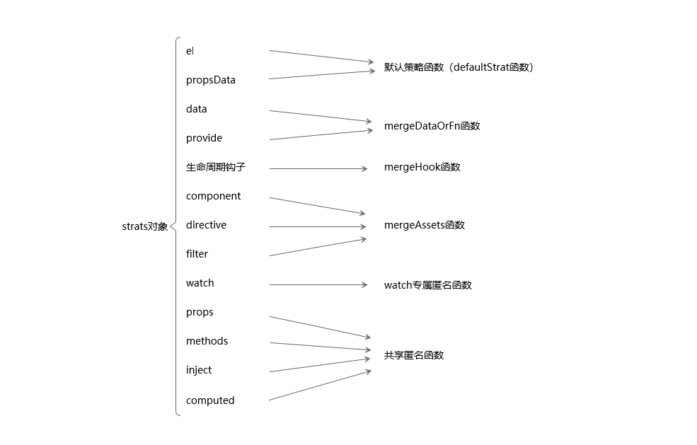

# Vue2.0源码阅读笔记（一）：选项合并
&emsp;&emsp;Vue本质是上来说是一个函数，在其通过new关键字构造调用时，会完成一系列初始化过程。通过Vue框架进行开发，基本上是通过向Vue函数中传入不同的参数选项来完成的。参数选项往往需要加以合并，主要有两种情况：
> 1、Vue函数本身拥有一些静态属性，在实例化时开发者会传入同名的属性。<br/>
> 2、在使用继承的方式使用Vue时，需要将父类和子类上同名属性加以合并。<br/>

&emsp;&emsp;Vue函数定义在 */src/core/instance/index.js*中。<br/>
```js
function Vue (options) {
  if (process.env.NODE_ENV !== 'production' &&
    !(this instanceof Vue)
  ) {
    warn('Vue is a constructor and should be called with the `new` keyword')
  }
  this._init(options)
}

initMixin(Vue)
```
&emsp;&emsp;在Vue实例化时会将选项集 *options* 传入到实例原型上的 *_init* 方法中加以初始化。 *initMixin* 函数的作用就是向Vue实例的原型对象上添加 *_init* 方法， *initMixin* 函数在 */src/core/instance/init.js* 中定义。<br/>
&emsp;&emsp;在 *_init* 函数中，会对传入的选项集进行合并处理。<br/>
```js
// merge options
if (options && options._isComponent) {
    initInternalComponent(vm, options)
} else {
    vm.$options = mergeOptions(
      resolveConstructorOptions(vm.constructor),
      options || {},
      vm
    )
}
```
&emsp;&emsp;在开发过程中基本不会传入 *_isComponent* 选项，因此在实例化时走 *else* 分支。通过 *mergeOptions* 函数来返回合并处理之后的选项并将其赋值给实例的 *$options* 属性。 *mergeOptions* 函数接收三个参数，其中第一个参数是将生成实例的构造函数传入 *resolveConstructorOptions* 函数中处理之后的返回值。<br/>
```js
export function resolveConstructorOptions (Ctor: Class<Component>) {
  let options = Ctor.options
  if (Ctor.super) {
    const superOptions = resolveConstructorOptions(Ctor.super)
    const cachedSuperOptions = Ctor.superOptions
    if (superOptions !== cachedSuperOptions) {
      // super option changed,
      // need to resolve new options.
      Ctor.superOptions = superOptions
      // check if there are any late-modified/attached options (#4976)
      const modifiedOptions = resolveModifiedOptions(Ctor)
      // update base extend options
      if (modifiedOptions) {
        extend(Ctor.extendOptions, modifiedOptions)
      }
      options = Ctor.options = mergeOptions(superOptions, Ctor.extendOptions)
      if (options.name) {
        options.components[options.name] = Ctor
      }
    }
  }
  return options
}
```
&emsp;&emsp;*resolveConstructorOptions* 函数的参数为实例的构造函数，在构造函数的没有父类时，简单的返回构造函数的 *options* 属性。反之，则走 *if* 分支，合并处理构造函数及其父类的 *options* 属性，如若构造函数的父类仍存在父类则递归调用该方法，最终返回唯一的 *options* 属性。在研究实例化合并选项时，为行文方便，将该函数返回的值统一称为选项合并的**父选项集合**，实例化时传入的选项集合称为**子选项集合**。<br/>
### 一、Vue构造函数的静态属性options
&emsp;&emsp;在合并选项时，在没有继承关系存在的情况，传入的第一个参数为Vue构造函数上的静态属性 *options* ，那么这个静态属性到底包含什么呢？为了弄清楚这个问题，首先要搞清楚运行 *npm run dev* 命令来生成 */dist/vue.js* 文件的过程中发生了什么。<br/>
&emsp;&emsp;在 *package.json* 文件中 *scripts* 对象中有：
```js
"dev": "rollup -w -c scripts/config.js --environment TARGET:web-full-dev",
```
&emsp;&emsp;在使用rollup打包时，依据 *scripts/config.js* 中的配置，并将 *web-full-dev* 作为环境变量TARGET的值。<br/>
```js
// Runtime+compiler development build (Browser)
'web-full-dev': {
    entry: resolve('web/entry-runtime-with-compiler.js'),
    dest: resolve('dist/vue.js'),
    format: 'umd',
    env: 'development',
    alias: { he: './entity-decoder' },
    banner
},
```
&emsp;&emsp;上述文件路径是在 *scripts/alias.js* 文件中配置过别名的。由此可知，执行 *npm run dev* 命令时，入口文件为 *src/platforms/web/entry-runtime-with-compiler.js* ，生成符合 *umd* 规范的 *vue.js* 文件。依照该入口文件对Vue函数的引用，按图索骥，逐步找到Vue构造函数所在的文件。如下图所示：<br/>

&emsp;&emsp;Vue构造函数定义在 */src/core/instance/index.js*中。在该js文件中，通过各种Mixin向 *Vue.prototype* 上挂载一些属性和方法。之后在 */src/core/index.js* 中，通过 *initGlobalAPI* 函数向Vue构造函数上添加静态属性和方法。<br/>
```js
import Vue from './instance/index'
import { initGlobalAPI } from './global-api/index'
import { isServerRendering } from 'core/util/env'
import { FunctionalRenderContext } from 'core/vdom/create-functional-component'

initGlobalAPI(Vue)
```
&emsp;&emsp;在*initGlobalAPI* 函数中有向Vue构造函数中添加 *options* 属性的定义。<br/>
```js
Vue.options = Object.create(null)
ASSET_TYPES.forEach(type => {
    Vue.options[type + 's'] = Object.create(null)
})

// this is used to identify the "base" constructor to extend all plain-object
// components with in Weex's multi-instance scenarios.
Vue.options._base = Vue

extend(Vue.options.components, builtInComponents)
```
&emsp;&emsp;经过这段代码处理以后，*Vue.options* 变成这样：<br/>
```js
Vue.options = {
	components: {
		KeepAlive
	},
	directives: Object.create(null),
	filters: Object.create(null),
  _base: Vue
}
```
&emsp;&emsp;在 */src/platforms/web/runtime/index.js* 中，通过如下代码向 *Vue.options* 属性上添加平台化指令以及内置组件。<br/>
```js
import platformDirectives from './directives/index'
import platformComponents from './components/index'

// install platform runtime directives & components
extend(Vue.options.directives, platformDirectives)
extend(Vue.options.components, platformComponents)
```
&emsp;&emsp;最终 *Vue.options* 属性内容如下所示：<br/>
```js
Vue.options = {
	components: {
    KeepAlive,
    Transition,
    TransitionGroup
	},
	directives: {
    model,
    show
  },
  filters: Object.create(null),
  _base: Vue
}
```
### 二、选项合并函数mergeOptions
&emsp;&emsp;合并选项的函数 *mergeOptions* 在 */src/core/util/options.js* 中定义。<br/>
```js
export function mergeOptions ( parent: Object, child: Object, vm?: Component): Object {
  if (process.env.NODE_ENV !== 'production') {
    checkComponents(child)
  }

  if (typeof child === 'function') {
    child = child.options
  }

  normalizeProps(child, vm)
  normalizeInject(child, vm)
  normalizeDirectives(child)

  if (!child._base) {
    if (child.extends) {
      parent = mergeOptions(parent, child.extends, vm)
    }
    if (child.mixins) {
      for (let i = 0, l = child.mixins.length; i < l; i++) {
        parent = mergeOptions(parent, child.mixins[i], vm)
      }
    }
  }

  const options = {}
  let key
  for (key in parent) {
    mergeField(key)
  }
  for (key in child) {
    if (!hasOwn(parent, key)) {
      mergeField(key)
    }
  }
  function mergeField (key) {
    const strat = strats[key] || defaultStrat
    options[key] = strat(parent[key], child[key], vm, key)
  }
  return options
}
```
#### 1、组件命名规则
&emsp;&emsp;合并选项时，在非生产环境下首先检测声明的组件名称是否合乎标准：<br/>
```js
if (process.env.NODE_ENV !== 'production') {
  checkComponents(child)
}
```
&emsp;&emsp; *checkComponents* 函数是 对**子选项集合**的 *components* 属性中每个属性使用 *validateComponentName* 函数进行命名有效性检测。<br/>
```js
function checkComponents (options: Object) {
  for (const key in options.components) {
    validateComponentName(key)
  }
}
```
&emsp;&emsp;*validateComponentName* 函数定义了组件命名的规则：<br/>
```js
export function validateComponentName (name: string) {
  if (!/^[a-zA-Z][\w-]*$/.test(name)) {
    warn(
      'Invalid component name: "' + name + '". Component names ' +
      'can only contain alphanumeric characters and the hyphen, ' +
      'and must start with a letter.'
    )
  }
  if (isBuiltInTag(name) || config.isReservedTag(name)) {
    warn(
      'Do not use built-in or reserved HTML elements as component ' +
      'id: ' + name
    )
  }
}
```
&emsp;&emsp;由上述代码可知，有效性命名规则有两条：<br/>
> 1、组件名称可以使用字母、数字、符号 **_**、符号 **-** ，且必须以字母为开头。<br/>
> 2、组件名称不能是Vue内置标签 *slot* 和 *component*；不能是 html内置标签；
不能使用部分SVG标签。<br/>
#### 2、选项规范化
&emsp;&emsp;传入Vue的选项形式往往有多种，这给开发者提供了便利。在Vue内部合并选项时却要把各种形式进行标准化，最终转化成一种形式加以合并。<br/>
```js
normalizeProps(child, vm)
normalizeInject(child, vm)
normalizeDirectives(child)
```
&emsp;&emsp;上述三条函数调用分别标准化选项 *props* 、*inject* 、*directives* 。<br/>
##### （一）、props选项的标准化
&emsp;&emsp;*props* 选项有两种形式：数组、对象，最终都会转化成对象的形式。<br/>
&emsp;&emsp;如果*props* 选项是数组，则数组中的值必须都为字符串。如果字符串拥有连字符则转成驼峰命名的形式。比如:<br/>
```js
props: ['propOne', 'prop-two']
```
&emsp;&emsp;该props将被规范成：<br/>
```js
props: {
  propOne:{
    type: null
  },
  propTwo:{
    type: null
  }
}
```
&emsp;&emsp;如果*props* 选项是对象，其属性有两种形式：字符串、对象。属性名有连字符则转成驼峰命名的形式。如果属性是对象，则不变；如果属性是字符串则转变成对象，属性值变成新对象的 *type* 属性。比如：<br/>
```js
props: {
  propOne: Number,
  "prop-two": Object,
  propThree: {
    type: String,
    default: ''
  }
}
```
&emsp;&emsp;该props将被规范成：<br/>
```js
props: {
  propOne: {
    type: Number
  },
  propTwo: {
    type: Object
  },
  propThree: {
    type: String,
    default: ''
  }
}
```
&emsp;&emsp;*props*对象的属性值为对象时，该对象的属性值有效的有四种：<br/>
> 1、type：基础的类型检查。<br/>
> 2、required: 是否为必须传入的属性。<br/>
> 3、default：默认值。<br/>
> 4、validator：自定义验证函数。<br/>
##### （二）、inject选项的标准化
&emsp;&emsp;*inject* 选项有两种形式：数组、对象，最终都会转化成对象的形式。<br/>
&emsp;&emsp;如果*inject* 选项是数组，则转化为对象，对象的属性名为数组的值，属性的值为仅拥有 *from* 属性的对象， *from* 属性的值为与数组对应的值相同。比如:<br/>
```js
inject: ['test']
```
&emsp;&emsp;该 *inject* 将被规范成：<br/>
```js
inject: {
  test: {
    from: 'test'
  }
}
```
&emsp;&emsp;如果*inject* 选项是对象，其属性有三种形式：字符串、symbol、对象。如果是对象，则添加属性 *from* ，其值与属性名相等。如果是字符串或者symbol，则转化为对象，对象拥有属性 *from* ，其值等于该字符串或symbol。比如：<br/>
```js
inject: {
  a: 'value1',
  b: {
    default: 'value2'
  }
}
```
&emsp;&emsp;该 *inject* 将被规范成：<br/>
```js
inject: {
  a: {
    from: 'value1'
  },
  b: {
    from: 'b',
    default: 'value2'
  }
}
```
##### （三）、directives选项的标准化
&emsp;&emsp;**自定义指令**选项 *directives* 只接受对象类型。一般具体的**自定义指令**是一个对象。 *directives* 选项的写法较为统一，那么为什么还会有这个规范化的步骤呢？那是因为具体的**自定义指令**对象的属性一般是各个钩子函数。但是Vue提供了一种简写的形式：在 *bind* 和 *update* 时触发相同行为，而不关心其它的钩子时，可以直接定义**自定义指令**为一个函数，而不是对象。<br/>
&emsp;&emsp;Vue内部合并 *directives* 选项时，要将这种函数简写，转化成对象的形式。如下：<br/>
```js
directive：{
  'color'：function (el, binding) {
    el.style.backgroundColor = binding.value
  })
}
```
&emsp;&emsp;该 *directive* 将被规范成：<br/>
```js
directive：{
  'color'：{
    bind：function (el, binding) {
      el.style.backgroundColor = binding.value
    }),
    update: function (el, binding) {
      el.style.backgroundColor = binding.value
    })
  }
}
```
#### 3、选项extends、mixins的处理
&emsp;&emsp;*mixins* 选项接受一个混入对象的数组。这些混入实例对象可以像正常的实例对象一样包含选项。如下所示：<br/>
```js
var mixin = {
  created: function () { console.log(1) }
}
var vm = new Vue({
  created: function () { console.log(2) },
  mixins: [mixin]
})
// => 1
// => 2
```
&emsp;&emsp;*extends* 选项允许声明扩展另一个组件，可以是一个简单的选项对象或构造函数。如下所示：<br/>
```js
var CompA = { ... }

// 在没有调用 `Vue.extend` 时候继承 CompA
var CompB = {
  extends: CompA,
  ...
}
```
&emsp;&emsp;Vue内部在处理选项extends或mixins时，会先通过递归调用 *mergeOptions* 函数，将extends对象或mixins数组中的对象作为**子选项集合**与**父选项集合中**合并。这就是选项extends和mixins中的内容与并列的其他选项有冲突时的合并规则的依据。<br/>
#### 4、使用策略模式合并选项
&emsp;&emsp;选项的数量比较多，合并规则也不尽相同。Vue内部采用**策略模式**来合并选项。各种**策略方法**在 *mergeOptions* 函数外实现，**环境对象**为 *strats* 对象。<br/>
&emsp;&emsp;*strats* 对象是在 */src/core/config.js* 文件中的 *optionMergeStrategies* 对象的基础上，进行一系列策略函数添加而得到的对象。**环境对象**接受请求，来决定委托哪一个策略来处理。这也是用户可以通过全局配置 *optionMergeStrategies* 来自定义选项合并规则的原因。<br/>
### 三、选项合并策略
&emsp;&emsp;环境对象 *strats* 上拥有的属性以及属性对应的函数如下图所示：<br/>

#### 1、选项el、propsData以及strats对象不包括的属性对象的合并策略
&emsp;&emsp;选项 *el*、 *propsData*以及图中没有的选项都采用默认策略函数 *defaultStrat* 进行合并。<br/>
```js
const defaultStrat = function (parentVal: any, childVal: any): any {
  return childVal === undefined
    ? parentVal
    : childVal
}
```
&emsp;&emsp;默认策略比较简单：如果子选项集合中有相应的选项，则直接使用子选项的值；否则使用父选项的值。<br/>
#### 2、选项data、provide的合并策略
&emsp;&emsp;选项 *data* 与 *provide* 的策略函数虽然都是 *mergeDataOrFn*，但是选项 *provide* 合并时是向 *mergeDataOrFn*函数中传入三个参数：父选项、子选项、实例。选项 *data* 的合并分两种情况：通过Vue.extends()处理子组件选项时、正常实例化时。前一种情况没有实例 *vm*,向 *mergeDataOrFn*函数传入两个参数：父选项和子选项；后一种情况则跟选项 *provide* 传入的参数一样。<br/>
&emsp;&emsp;*mergeDataOrFn*函数代码如下所示，只有在合并 *data* 选项，且是通过Vue.extends()处理子组件选项时，才会走 *if* 分支。处理正常的实例化选项 *data* 、 *provide* 时，都是走 *else* 分支。
```js
export function mergeDataOrFn (parentVal: any,childVal: any,vm?: Component): ?Function 
{
  if (!vm) {
    if (!childVal) {
      return parentVal
    }
    if (!parentVal) {
      return childVal
    }
    return function mergedDataFn () {
      return mergeData(
        typeof childVal === 'function' ? childVal.call(this, this) : childVal,
        typeof parentVal === 'function' ? parentVal.call(this, this) : parentVal
      )
    }
  } else {
    return function mergedInstanceDataFn () {
      const instanceData = typeof childVal === 'function'
        ? childVal.call(vm, vm)
        : childVal
      const defaultData = typeof parentVal === 'function'
        ? parentVal.call(vm, vm)
        : parentVal
      if (instanceData) {
        return mergeData(instanceData, defaultData)
      } else {
        return defaultData
      }
    }
  }
}
```
&emsp;&emsp;在实例 *vm* 不存在的情况下，有三种情况：
> 1、子选项不存在，则返回父选项。<br/>
> 2、父选项不存在，则返回子选项。<br/>
> 3、如果父子选项都存在，则返回函数 *mergedDataFn* 。<br/>

&emsp;&emsp;函数 *mergedDataFn*将分别提取父子选项函数的返回值，将该纯对象传入 *mergeData* 函数，最终返回 *mergeData* 函数的返回值。如果父子选项都不存在，则不会走到这个函数中，因此不加以考虑。<br/>
&emsp;&emsp;为什么前面说在 *if* 分支中的父子选项都为函数呢？因为走该分支，只能是通过Vue.extends()处理子组件 *data* 选项时。而当一个组件被定义时， *data* 必须声明为返回一个纯对象的函数，这样能防止多个组件实例共享一个数据对象。定义组件时， *data* 选项是一个纯对象，在非生产环境下，Vue会有错误警告。<br/>
&emsp;&emsp;在 *else* 分支中，返回函数 *mergedInstanceDataFn* ，在该函数中，如果子选项存在则分别提取父子选项函数的返回值，将该纯对象传入 *mergeData* 函数；否则，将返回纯对象形式的父选项。<br/>
&emsp;&emsp;在该场景下 *mergeData* 函数的作用是将父选项对象中有而子选项对象没有的属性，通过 *set* 方法将该属性添加到子选项对象上并改成响应式数据属性。<br/>
&emsp;&emsp;分析完各种情况，发现选项 *data* 与 *provide* 策略函数是一个高阶函数，返回值是一个返回合并对象的函数。这是为什么呢？这个原因前面说过，是为了保证各组件实例有唯一的数据副本，防止组件实例共享同一数据对象。<br/>
&emsp;&emsp;选项 *data* 或 *provide*选项合并处理的结果是一个函数，而且该函数在合并阶段并没有执行，而是在初始化的时候执行的，这又是为什么呢？在 */src/core/instance/init.js* 进行初始化时有如下代码：<br/>
```js
initInjections(vm)
initState(vm)
initProvide(vm) 
```
&emsp;&emsp; 函数 *initState* 有如下代码：<br/>
```js
if (opts.props) initProps(vm, opts.props)
if (opts.methods) initMethods(vm, opts.methods)
if (opts.data) {
  initData(vm)
} else {
  observe(vm._data = {}, true /* asRootData */)
}
```
&emsp;&emsp;由上述代码可知： *data* 与 *provide* 的初始化是在 *inject* 与 *props* 之后进行的。在初始化时执行合并函数的返回函数，能够使用 *inject* 与 *props* 的值来初始化 *data* 与 *provide* 的值。<br/>
#### 3、生命周期钩子选项的合并策略
&emsp;&emsp;生命周期钩子选项使用 *mergeHook* 函数合并。<br/>
```js
function mergeHook (
  parentVal: ?Array<Function>,
  childVal: ?Function | ?Array<Function>
): ?Array<Function> {
  const res = childVal
    ? parentVal
      ? parentVal.concat(childVal)
      : Array.isArray(childVal)
        ? childVal
        : [childVal]
    : parentVal
  return res
    ? dedupeHooks(res)
    : res
}
```
&emsp;&emsp;Vue官方API文档上说生命周期钩子选项只能是函数类型的，从这段源码中可以看出，开发者可以传入函数数组类型的生命周期选项。因为可以将数组中各函数加以合并，因此传入函数数组实用性不大。<br/>
&emsp;&emsp;还有一个点比较有意思：如果父选项存在，必定是一个数组。虽然生命周期选项可以是数组，但是开发者一般传入的都是函数，那么为什么这里父选项必定是数组呢？<br/>
&emsp;&emsp;这是因为生命周期父选项存在的情况有两种：Vue.extends()、Mixins。在上面 **选项extends、mixins的处理** 部分已经说过，处理这两种情况时，会将其中的选项作为子选项递归调用 *mergeOptions* 函数进行合并。也就说声明周期父选项都是经过 *mergeHook* 函数处理之后的返回值，所以如果生命周期父选项存在，必定是函数数组。<br/>
&emsp;&emsp;函数 *mergeHook* 返回值如果存在，会将返回值传入 *dedupeHooks* 函数进行处理，目的是为了剔除选项合并数组中的重复值。<br/>
```js
function dedupeHooks (hooks) {
  const res = []
  for (let i = 0; i < hooks.length; i++) {
    if (res.indexOf(hooks[i]) === -1) {
      res.push(hooks[i])
    }
  }
  return res
}
```
&emsp;&emsp;生命周期钩子数组按顺序执行，因此先执行父选项中的钩子函数，后执行子选项中的钩子函数。<br/>
#### 4、资源选项（components、directives、filters）的合并策略
&emsp;&emsp;组件 *components* ，指令 *directives* ，过滤器 *filters* ，被称为**资源**，因为这些都可以作为第三方应用来提供。<br/>
&emsp;&emsp;资源选项通过 *mergeAssets* 函数进行合并，逻辑比较简单。<br/>
```js
function mergeAssets (
  parentVal: ?Object,
  childVal: ?Object,
  vm?: Component,
  key: string
): Object {
  const res = Object.create(parentVal || null)
  if (childVal) {
    process.env.NODE_ENV !== 'production' && assertObjectType(key, childVal, vm)
    return extend(res, childVal)
  } else {
    return res
  }
}
```
&emsp;&emsp;先定义合并后选项为空对象。如果父选项存在，则以父选项为原型，否则没有原型。如果子选项为纯对象，则将子选项上的各属性复制到合并后的选项对象上。<br/>
&emsp;&emsp;前面说过 *Vue.options* 属性内容如下所示：<br/>
```js
Vue.options = {
	components: {
    KeepAlive,
    Transition,
    TransitionGroup
	},
	directives: {
    model,
    show
  },
  filters: Object.create(null),
  _base: Vue
}
```
&emsp;&emsp;*KeepAlive* 、 *Transition* 、 *TransitionGroup* 为内置组件，*model* ， *show* 为内置指令，不用注册就可以直接使用。<br/>
#### 5、选项watch的合并策略
&emsp;&emsp;选项 *watch* 是一个对象，但是对象的属性却可以是多种形式：字符串、函数、对象以及数组。<br/>
```js
// work around Firefox's Object.prototype.watch...
if (parentVal === nativeWatch) parentVal = undefined
if (childVal === nativeWatch) childVal = undefined
/* istanbul ignore if */
if (!childVal) return Object.create(parentVal || null)
if (process.env.NODE_ENV !== 'production') {
  assertObjectType(key, childVal, vm)
}
if (!parentVal) return childVal
const ret = {}
extend(ret, parentVal)
for (const key in childVal) {
  let parent = ret[key]
  const child = childVal[key]
  if (parent && !Array.isArray(parent)) {
    parent = [parent]
  }
  ret[key] = parent
    ? parent.concat(child)
    : Array.isArray(child) ? child : [child]
}
return ret
```
&emsp;&emsp;因为火狐浏览器 *Object* 原型对象上拥有watch属性，因此在合并前需要检查选项集合 *options* 上是否有开发者添加的 *watch*属性，如果没有，不做合并处理。<br/>
&emsp;&emsp;如果子选项不存在，则返回以父选项为原型的空对象。<br/>
&emsp;&emsp;如果父选项不存在，先检查子选项是否为纯对象，再返回子选项。<br/>
&emsp;&emsp;如果父子选项都存在，则先将父选项各属性复制到合并对象上，然后检查子选项上的各个属性。<br/>
&emsp;&emsp;在子选项上而不在父选项上的属性，是数组则直接添加到合并对象上。如果不是数组，则填充到新数组中，将该数组添加到合并对象上。<br/>
&emsp;&emsp;父子选项上都存在的属性，将父选项上该属性变成数组格式，再向数组中添加子选项上的对应属性。<br/>
#### 6、选项props、methods、inject、computed的合并策略
&emsp;&emsp;选项 *props* 、 *methods* 、 *inject* 、 *computed* 采用相同的合并策略。选项   *methods* 与 *computed* 传入时只接受对象形式，而选项 *props* 与 *inject* 经过前面的标准化之后也是纯对象的形式。<br/>
```js
if (childVal && process.env.NODE_ENV !== 'production') {
  assertObjectType(key, childVal, vm)
}
if (!parentVal) return childVal
const ret = Object.create(null)
extend(ret, parentVal)
if (childVal) extend(ret, childVal)
return ret
```
&emsp;&emsp;首先检查子选项是否为纯对象，如果不是纯对象，在非生产环境报错。<br/>
&emsp;&emsp;如果父选项不存在，则直接返回子选项。<br/>
&emsp;&emsp;如果父选项存在，先创建一个没有原型的空对象作为合并选项对象，将父选项上的各属性复制到合并选项对象上。如果子选项存在，则将子选项对象上的全部属性复制到合并对象上，因此父子选项上有相同属性则以取子选项上该属性的值。最后返回合并选项对象。<br/>
#### 7、选项合并策略总结
> 1、*el* 、 *propsData* 以及采用默认策略合并的选项：有子选项就选用子选项的值，否则选用父选项的值。<br/>
> 2、选项 *data* 、 *provide* ：返回一个函数，该函数的返回值是合并之后的对象。以子选项对象为基础，如果存在子选项上没有而父选项上有的属性，则将该属性转变成响应式属性后加入到子选项对象上。<br/>
> 3、生命周期钩子选项：合并成函数数组，父选项排在子选项之前，按顺序执行。<br/>
> 4、资源选项（components、directives、filters）：定义一个没有原型的空合并对象，子选项存在，则将子选项上的属性复制到合并对象；父选项存在，则以父选项对象为原型。<br/>
> 5、选项 *watch* ：子选项不存在，则返回以父选项为原型的空对象；父选项不存在，返回子选项；父子选项都存在，则和生命周期合并策略类似，以子选项属性为主，转化成数组形式，父选项也存在该属性，则推入数组中。<br/>
> 6、选项props、methods、inject、computed：将父子选项上的属性添加到一个没有原型的空对象上，父子选项上有相同属性的则取子选项的值。<br/>
> 7、子选项中 *extends* 、 *mixins* ：将这两项的值作为子选项与父选项合并，合并规则依照上述规则合并，最后再分项与子选项的同名属性按上述规则合并。<br/>

### 四、总结
&emsp;&emsp;在合并选项前，先对选项 *inject* 、 *props* 和 *directives* 进行标准化处理。然后将子选项集合中的extends、mixins作为子选项递归调用合并函数与父选项合并。最后使用策略模式合并各个选项。<br/> 