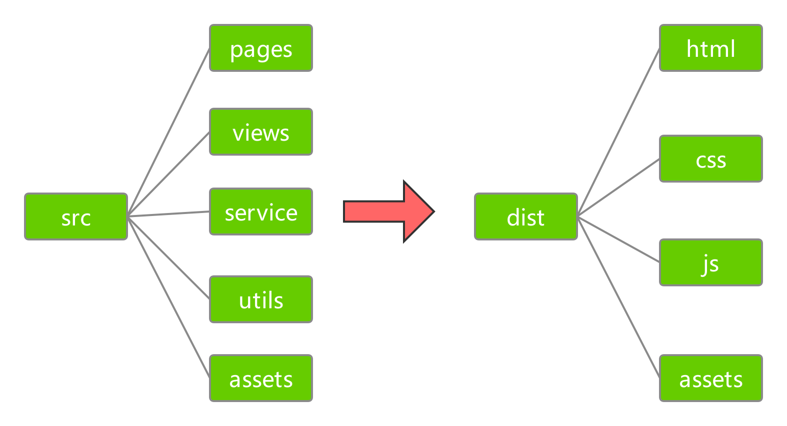

# 深入理解webpack4（一）：多页应用的构建
&emsp;&emsp;webpack 是一个现代 JavaScript 应用程序的静态模块打包器，也可以说是现在前端生态中最为流行的构建工具。webpack4 的文档较为完备，但是由于 webpack 基于事件流的特性，导致其内容较为散乱零碎。本文在从零开始构建一个仿京东电商多页应用的过程中来阐述 webpack 的使用。<br/>
&emsp;&emsp;首先在项目目录下执行 *npm init -y* 命令完成项目初始化，此时文件夹下会多出 *package.json* 文件。<br/>
&emsp;&emsp;然后安装 webpack，由于 webpack4 版本中 webpack-cli 不再作为其依赖，需要单独安装，因此执行以下命令：<br/>
```js
npm install webpack webpack-cli --save-dev
```
## 一、基础配置
&emsp;&emsp;在项目根目录下创建 webpack.config.js 文件，webpack 运行时默认读取该文件作为配置，然后修改 *package.json* 的 scripts 部分。<br/>
```js
"scripts": {
  "dev": "webpack --mode=development",
  "build": "webpack --mode=production"
},
```
&emsp;&emsp;现在执行 *npm run dev* 命令会以**开发模式**读取配置，执行 *npm run build* 命令会以**生产模式**读取配置。<br/>
### 1、项目结构及出入口配置
&emsp;&emsp;在实现多页应用的具体配置之前，先明确开发环境与生产环境下的目录结构，如下所示：<br/>

&emsp;&emsp;开发环境下目录的含义：<br/>
> pages：样式和脚本文件。<br/>
> views：html模板。<br/>
> service：数据层文件。<br/>
> utils：工具层文件。<br/>
> assets：项目所需资源文件。<br/>

&emsp;&emsp;入口配置通过 entry 属性完成，entry 可以有三种类型：字符串、字符串数组、对象，多页应用一般使用对象类型。<br/>
&emsp;&emsp;output 对象包括了一组选项，指示 webpack 如何去输出、以及在哪里输出，常用的属性有：决定输出名称的 filename、决定输出路径的 path、影响资源引用路径的 publicPath 等。<br/>
&emsp;&emsp;示例项目中先实现首页与登录两个页面，增加入口和出口配置之后的 webpack.config.js 文件内容如下所示：<br/>
```js
const path = require('path');

const config = {
  entry: {
    index: path.resolve(__dirname, 'pages/index/index.js'),
    login: path.resolve(__dirname, 'pages/login/index.js')
  },
  output: {
    filename: 'js/[name].js',
    publicPath: '../',
    path: __dirname + '/dist'
  }
}

module.exports = config;
```
### 2、处理html
&emsp;&emsp;webpack 对 html 的处理主要是通过 HtmlWebpackPlugin 插件来完成的。HtmlWebpackPlugin 使用模板来创建 html 文件，通过配置可以使创建的 html 文件自动引用构建出来的 js、css等文件。<br/>
&emsp;&emsp;首先安装 HtmlWebpackPlugin ：<br/>
```js
npm install --save-dev html-webpack-plugin
```
&emsp;&emsp;然后在配置文件中添加如下代码：<br/>
```js
var HtmlWebpackPlugin = require('html-webpack-plugin');

const config = {
  /* ... */
  plugins: [
    new HtmlWebpackPlugin({
      filename: '/html/index.html',
      template: './views/index.html',
      title: '在线电商—首页',
      chunks: ['index']
    }),
    new HtmlWebpackPlugin({
      filename: '/html/login.html',
      template: './views/login.html',
      title: '在线电商—登录',
      chunks: ['login']
    }),
  ]
}
```
&emsp;&emsp;HtmlWebpackPlugin 参数对象上属性的含义如下所示：<br/>
> title：生成html文件的标题，在模板中可以通过 htmlWebpackPlugin.options.title 访问。<br/>
> filename：输出的html的文件名称。<br/>
> template：html模板所在的文件路径。<br/>
> templateParameters：允许覆盖在模板中使用的参数。<br/>
> inject：注入选项，默认为 true，生成文件中 script 标签位于html文件的 body 底部；若为 body 则与 true情况相同；为 head 则 script 标签位于 head 标签内；为false 则不插入生成的 js 文件，只是单纯的生成一个 html 文件。<br/>
> favicon： favicon 文件所在的路径名。<br/>
> meta：允许注入meta标签。<br/>
> base：注入base标签。<br/>
> minify：对 html 文件的压缩配置。<br/>
> hash：给生成的 js 文件一个独特的 hash 值。<br/>
> cache：只有在内容变化时才会重新更新文件。<br/>
> showErrors：编译错误时，会在html内写入详细错误信息。<br/>
> chunks：在生成的html中加入多入口文件。<br/>
> chunksSortMode：引入模块的排序方式。<br/>
> excludeChunks：排除掉一些入口文件。<br/>
> xhtml：生成的模板文档中标签是否自动关闭，在xhtml中会要求标签都关闭。<br/>

&emsp;&emsp;在实际项目中，有些公共部分是在多个模板中都存在，没有必要重复编写。可以使用 html-loader 来输出公共 html 模板。<br/>
&emsp;&emsp;首先安装 html-loader:<br/>
```js
npm install --save-dev html-loader
```
&emsp;&emsp;html-loader 会将 html 作为字符串输出，因此不能在配置文件中全局配置 html-loader 处理 html 类型的文件。只是在模板中引入公共部分时，用 *html-loader!* 的方式使用。<br/>
&emsp;&emsp;htmlWebpackPlugin 默认支持 ejs 语法，因此可以使用 ejs 的语法来帮助完成 html 的构建。<br/>
&emsp;&emsp;示例项目中添加 */views/index.html* 与 */views/common/head-common.html* 文件：<br/>
```html
<!--/views/index.html-->
<!DOCTYPE html>
<html lang="en">
<head>
  <%= require('html-loader!./common/head-common.html') %>
  <title><%= htmlWebpackPlugin.options.title%></title>
</head>
<body>
  <div>首页</div>
</body>
</html>

<!--/views/common/head-common.html-->
<meta charset="utf-8">
<meta http-equiv="x-ua-compatible" content="ie=edge">
<meta name="keywords" content="在线商城，放心购物，网上购物，网上商城，数码产品，手机，笔记本，相机，手表，耳机">
<meta name="description" content="一个提供数码通讯、手机、电脑、家居百货、服装服饰、母婴、图书、食品等数万种优质商品，最优质、最便捷的网上购物平台。">
```
&emsp;&emsp;执行 *npm run dev* 命令，自动构建出如下代码：<br/>
<!--/dist/html/index.html-->
```html
<!DOCTYPE html>
<html lang="en">
<head>
  <meta charset="utf-8">
  <meta http-equiv="x-ua-compatible" content="ie=edge">
  <meta name="keywords" content="在线商城，放心购物，网上购物，网上商城，数码产品，手机，笔记本，相机，手表，耳机">
  <meta name="description" content="一个提供数码通讯、手机、电脑、家居百货、服装服饰、母婴、图书、食品等数万种优质商品，最优质、最便捷的网上购物平台。">
  <title>在线电商—首页</title>
</head>
<body>
  <div>首页</div>
  <script type="text/javascript" src="../js/index.js"></script>
</body>
</html>
```
### 3、处理css
&emsp;&emsp;<br/>
&emsp;&emsp;<br/>
&emsp;&emsp;<br/>
&emsp;&emsp;<br/>
&emsp;&emsp;<br/>
&emsp;&emsp;<br/>
### 4、处理资源
&emsp;&emsp;<br/>
&emsp;&emsp;<br/>
&emsp;&emsp;<br/>
&emsp;&emsp;<br/>
&emsp;&emsp;<br/>
&emsp;&emsp;<br/>
### 5、处理javaScript
&emsp;&emsp;<br/>
&emsp;&emsp;<br/>
&emsp;&emsp;<br/>
&emsp;&emsp;<br/>
&emsp;&emsp;<br/>
&emsp;&emsp;<br/>
## 二、基础配置
&emsp;&emsp;<br/>
&emsp;&emsp;<br/>
&emsp;&emsp;<br/>
&emsp;&emsp;<br/>
&emsp;&emsp;<br/>
&emsp;&emsp;<br/>
&emsp;&emsp;<br/>
&emsp;&emsp;<br/>
## 三、基础配置
&emsp;&emsp;<br/>
&emsp;&emsp;<br/>
&emsp;&emsp;<br/>
&emsp;&emsp;<br/>
&emsp;&emsp;<br/>
&emsp;&emsp;<br/>
&emsp;&emsp;<br/>
&emsp;&emsp;<br/>
## 四、根据环境拆分配置文件
&emsp;&emsp;<br/>
&emsp;&emsp;<br/>
&emsp;&emsp;<br/>
&emsp;&emsp;<br/>
&emsp;&emsp;<br/>
&emsp;&emsp;<br/>